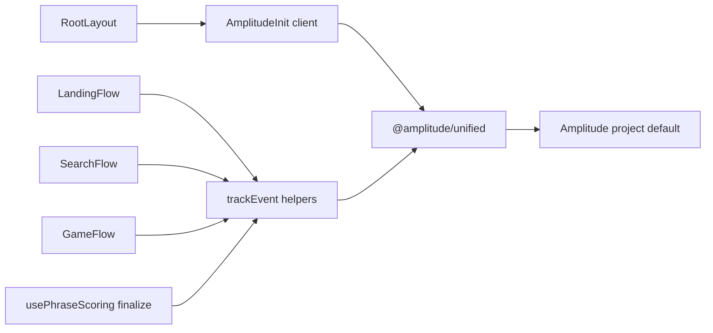
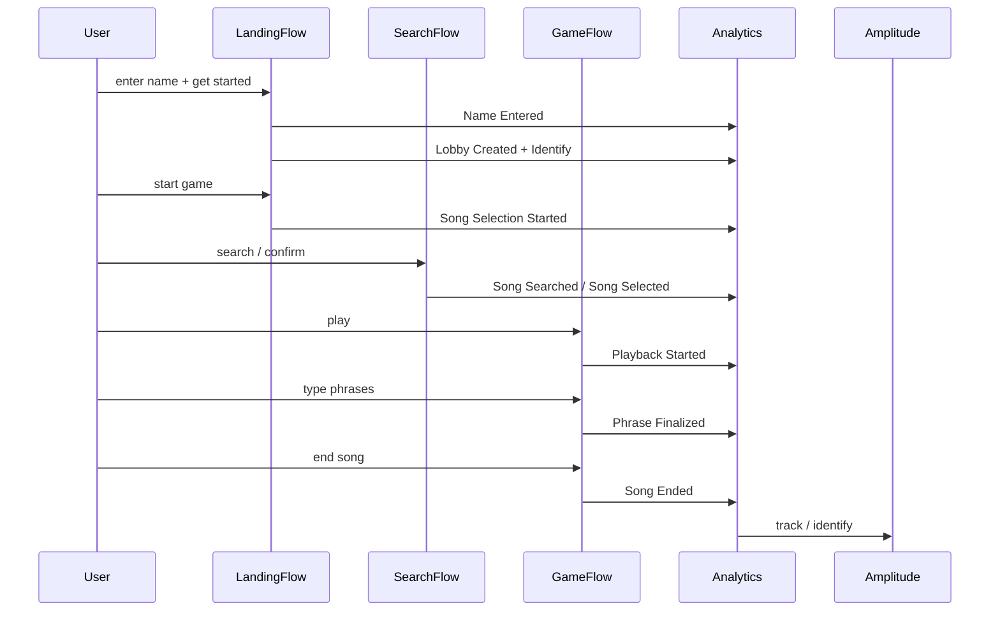

# Amplitude Analytics Setup for kar-no-key

## Context

**Product:** Multiplayer lyric-typing race — create/join a lobby, host picks a song, everyone races by typing synced lyric phrases for points.

**Identity today:** Anonymous `player_id` in `localStorage` ([`src/lib/player/identity.ts`](src/lib/player/identity.ts)); lobby session in `sessionStorage` ([`src/lib/player/session.ts`](src/lib/player/session.ts)). No auth.

**SDK already installed:** `@amplitude/unified` `^1.1.25` in [`package.json`](package.json). No analytics code yet. Amplitude org `green-grass-809610`, project **default** (`842143`) — empty tracking plan, one environment.

**Routes / instrumentation surfaces:**
- `/` → [`LandingFlow`](src/components/LandingFlow/LandingFlow.tsx) (create lobby, join, start song selection, leave)
- `/search` → [`SearchFlow`](src/components/SearchFlow/SearchFlow.tsx) (search, load more, select song, leave)
- `/game` → [`GameFlow`](src/components/GameFlow/GameFlow.tsx) (play/pause/end, scoring, leave)
- `/countdown` redirects to `/game` (no separate tracking)

**Default decisions (locked for this plan):**
- Client-side only (no Node/server SDK) — all product actions live in Flow components
- Amplitude project: **default** (`842143`)
- Analytics only for v1: Session Replay / Experiment / Guides **off** (quota + typed lyric text privacy)
- Autocapture: `pageViews` + `sessions` on; element/form autocapture **off** (avoid noisy UI click spam; custom events own product truth)
- User ID = `player_id` (UUID). Do **not** send display names as event props (treat as PII)
- High-volume typing progress submits are **not** tracked; only phrase **finalize** outcomes and round-level outcomes

---

## Architecture



**Code layout:**
- [`src/lib/analytics/amplitude.ts`](src/lib/analytics/amplitude.ts) — `initAmplitude()`, `identifyPlayer()`, `setLobbyGroup()`, typed `trackEvent()`
- [`src/lib/analytics/events.ts`](src/lib/analytics/events.ts) — event name constants + property types
- [`src/components/AmplitudeInit/AmplitudeInit.tsx`](src/components/AmplitudeInit/AmplitudeInit.tsx) — client component that inits once; mounted from [`src/app/layout.tsx`](src/app/layout.tsx)
- Env: `NEXT_PUBLIC_AMPLITUDE_API_KEY` in [`.env.local`](.env.local) + [`.env.local.example`](.env.local.example)

Init pattern (Next.js App Router, per Amplitude docs):

```ts
// amplitude.ts — "use client"
import * as amplitude from "@amplitude/unified";

export async function initAmplitude() {
  const apiKey = process.env.NEXT_PUBLIC_AMPLITUDE_API_KEY;
  if (!apiKey || typeof window === "undefined") return;

  await amplitude.initAll(apiKey, {
    analytics: {
      autocapture: { pageViews: true, sessions: true, elementInteractions: false, formInteractions: false },
      defaultTracking: false,
    },
    // sessionReplay / experiment / engagement intentionally omitted
  });
}
```

On first client mount: `getPlayerId()` → `setUserId(playerId)` + `Identify` with `is_host` when session exists.

---

## Event taxonomy

Naming: **Title Case past tense** (Amplitude UI default; project has no naming convention enforced).

### Shared event properties
| Property | Type | Notes |
|---|---|---|
| `lobby_id` | string | Always when in a lobby |
| `is_host` | boolean | Caller role at event time |
| `player_count` | number | Roster size when known |
| `lobby_status` | string | `waiting` / `ready` / `countdown` / `playing` when relevant |
| `source_screen` | string | `landing` / `lobby` / `search` / `game` |

### User properties (Identify)
| Property | When |
|---|---|
| `is_host` | After create/join and on host transfer sync |
| `has_active_lobby` | true after create/join; false after leave |
| `last_lobby_id` | On create/join |
| `has_display_name` | true after `Name Entered` / successful create or join |

### Lobby group (optional v1.1, include in same PR if `setGroup` is straightforward)
- Group type: `lobby` · Group value: `lobby_id`
- Enables lobby-level funnels (host creates → guests join → song selected)

### Core events

**Acquisition / lobby**
| Event | Trigger (success path) | Key props | File |
|---|---|---|---|
| `Name Entered` | User clicks **get started** with a non-empty trimmed name (before `createLobby`) | `name_length` only — never the raw display name | `LandingFlow.handleGetStarted` |
| `Lobby Created` | `createLobby` succeeds | `lobby_id` | `LandingFlow.handleGetStarted` |
| `Lobby Joined` | `joinLobby` succeeds | `lobby_id`, `join_code_length` (not the code itself) | `LandingFlow.handleJoinLobby` |
| `Lobby Left` | `leaveLobby` succeeds | `lobby_id`, `source_screen`, `lobby_closed` | Landing/Search/Game exit handlers |
| `Song Selection Started` | `startSongSelection` succeeds | `lobby_id`, `player_count`, `is_solo` | `LandingFlow.handleStartGame` |
| `Lobby Create Failed` / `Lobby Join Failed` | API error | `error_message` (sanitized) | same handlers |

`Name Entered` fires once per get-started attempt with a valid name (not on every keystroke). Empty-name validation failures are not tracked.

**Song discovery (host)**
| Event | Trigger | Key props | File |
|---|---|---|---|
| `Song Searched` | `searchSongs` returns | `query_length`, `result_count`, `has_more` | `SearchFlow.handleSearch` |
| `Song Search Failed` | search error | `query_length` | same |
| `Songs Loaded More` | load-more success | `mode`=`search`\|`recommended`, `result_count` | `SearchFlow.handleLoadMore` |
| `Song Selected` | `selectSong` succeeds | `song_id`, `song_title`, `duration_sec`, `lyrics_source` | `SearchFlow.handleConfirmSelection` |
| `Song Selection Failed` | select fails | `song_id`, `has_lyrics` | same |

**Gameplay**
| Event | Trigger | Key props | File |
|---|---|---|---|
| `Playback Started` | `startCountdown` succeeds | `lobby_id`, `song_id`, `player_count` | `GameFlow.handlePlay` |
| `Playback Paused` | `pausePlayback` succeeds | `lobby_id`, `playback_elapsed_ms` | `GameFlow.handlePause` |
| `Song Ended` | `endSong` succeeds | `lobby_id`, `song_id`, `final_score`, `phrases_completed`, `player_count` | `GameFlow.handleEndSong` |
| `Phrase Finalized` | `submitPhraseProgress` with `finalize: true` and success | `phrase_index`, `points_awarded`, `score`, `phrases_completed` | [`usePhraseScoring`](src/lib/game/usePhraseScoring.ts) |

**Do not track:** debounced mid-phrase progress submits, roster poll ticks, score broadcast receipts, raw lobby codes, raw display names, typed lyric text.

---

## Metrics & funnels (create in Amplitude after events exist)

Register via MCP `create_metric` against project `842143` once events are in the tracking plan (and preferably after first local ingest so charts populate).

| Metric | Type | Definition |
|---|---|---|
| Daily Active Players | UNIQUES | `_active` or any custom event |
| Lobbies Created | TOTALS | `Lobby Created` |
| Songs Selected | TOTALS | `Song Selected` |
| Playback Starts | TOTALS | `Playback Started` |
| Avg Final Score | PROPAVG | `Song Ended` → `final_score` |
| Activation Funnel | CONVERSION | `Name Entered` → `Lobby Created` → `Song Selection Started` → `Song Selected` → `Playback Started` → `Song Ended` (ordered, 1-day window) |
| Name → Lobby Conversion | CONVERSION | `Name Entered` → `Lobby Created` (ordered, 1-hour window) — catches create failures after name submit |
| Join Funnel | CONVERSION | `Lobby Created` → `Lobby Joined` (7-day; interpret as guest join rate vs host creates — pair with lobby group later) |
| No-Lyrics Failure Rate | FORMULA | `TOTALS(Song Selection Failed w/ has_lyrics=false) / TOTALS(Song Selected + that failure)` |
| D1 Retention | RETENTION | start `Lobby Created` or `_active`, return `_active`, 1 day |

Dashboard (via `create_dashboard`): **kar-no-key Product Health** with the activation funnel (starting at `Name Entered`), name→lobby conversion, DAU, lobbies created, songs selected, playback starts, avg final score.

---

## Implementation steps

1. **Env** — Add `NEXT_PUBLIC_AMPLITUDE_API_KEY` (from Amplitude Project Settings → API Key for **default**). Document in `.env.local.example`.
2. **Analytics module** — Create `events.ts` + `amplitude.ts` with typed wrappers; no-op safely when API key missing (dev without key should not crash).
3. **Init** — `AmplitudeInit` client component in root layout; identify `player_id` immediately after init.
4. **Tracking plan in Amplitude** — `create_events` + `create_properties` on project `842143` for the event list above (main branch; single environment, no branch approval required).
5. **Instrument Flows** — In `LandingFlow.handleGetStarted`, fire `Name Entered` once the trimmed name passes validation (before the API call), then `Lobby Created` / `Lobby Create Failed` on the response. Wire the rest of LandingFlow, SearchFlow, GameFlow; call from `usePhraseScoring` only on finalize success; update Identify/`is_host` after create/join/host sync.
6. **Metrics + dashboard** — Create the metrics table above and a Product Health dashboard once events are registered.
7. **Verify** — Run `npm run dev`, walk create → join (second browser) → start → search → select → play → type → end; confirm events in Amplitude Live / User Lookup for `player_id`.

---

## Instrumentation touchpoints (exact)



---

## Out of scope for this pass

- Session Replay, Experiment, Guides & Surveys
- Server-side / Edge Function tracking
- Ampli codegen CLI
- Tracking every character/progress debounce
- Sending lobby codes or display names as properties
