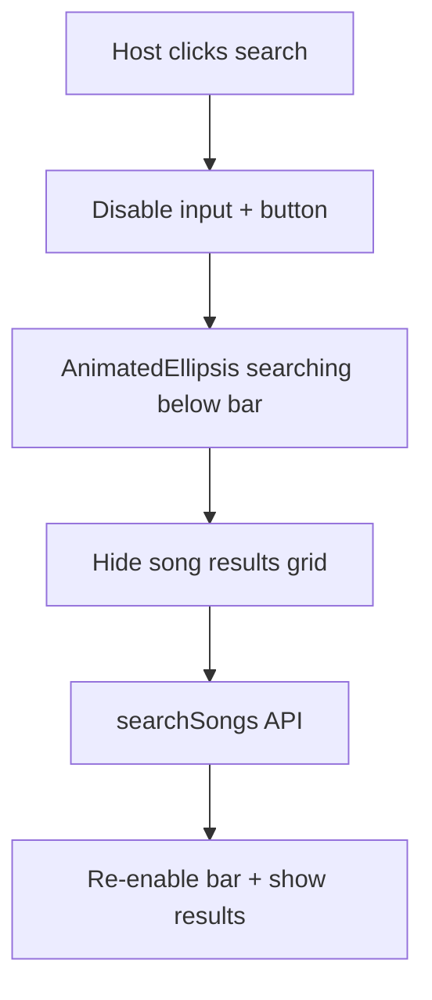

# Animated Ellipsis Loading (Figma 2104:2648)

## Goal

When the host searches on `/search`, show **searching...** below the search bar (Figma 2104:2648) with each dot pulsing in sequence. Apply the same animation to **all loading/progress** copy ending in `...` across the app. Keep **static status** copy (player waiting messages, etc.) unchanged.

## Figma 2104:2648 — host searching state

| Element | Spec |
|---|---|
| Search header + bar | Remain visible |
| Input + button | **Disabled** during search |
| Button label | Stays **search** (not "searching...") |
| Song grid | Hidden while loading (already gated by `!isGridLoading`) |
| Status line | `searching...` below header, **20px** (`text-heading-3`), `--neutral-400`, left-aligned in main column |

## Bug to fix first

In [`SearchScreen.tsx`](src/components/SearchScreen/SearchScreen.tsx), loading message logic is wrong on the **first** search:

```ts
const isGridLoading = hasSearched ? isSearching : isLoadingRecommendations;
```

`hasSearched` is only set **after** the request completes, so the first click never shows `searching...`. Fix:

```ts
const showSearchLoading = isSearching;
const showRecommendationsLoading = !hasSearched && isLoadingRecommendations;
```

Render `searching...` when `showSearchLoading`; render `loading recommendations...` when `showRecommendationsLoading`.

## New reusable component

Create [`AnimatedEllipsis`](src/components/AnimatedEllipsis/AnimatedEllipsis.tsx) + [`AnimatedEllipsis.css`](src/components/AnimatedEllipsis/AnimatedEllipsis.css).

**API:**

```tsx
<AnimatedEllipsis label="searching" className="text-heading-3" />
// renders: searching<span aria-hidden>.</span><span>.</span><span>.</span>
```

**Animation (CSS keyframes):**
- Each dot pulses opacity (e.g. `0.3 → 1 → 0.3`) on a ~1.2s loop
- Stagger delays: dot 1 → 0ms, dot 2 → ~200ms, dot 3 → ~400ms (sequential wave)
- `@media (prefers-reduced-motion: reduce)`: static full-opacity dots, no animation (match [`LandingFlow`](src/components/LandingFlow/LandingFlow.tsx) / [`MusicNoteDecorations`](src/components/MusicNoteDecorations/MusicNoteDecorations.tsx) pattern)

**Accessibility:** `aria-live="polite"` on the wrapper when used for status messages; `aria-hidden` on decorative dot spans.

## SearchScreen changes

[`SearchScreen.tsx`](src/components/SearchScreen/SearchScreen.tsx):
- Button: always `"search"`, `disabled={isSearching}`
- Input: already `disabled={isSearching}` — keep
- Replace plain `"searching..."` / `"loading recommendations..."` strings with `<AnimatedEllipsis />`
- Replace `"confirming..."` in confirm button with `<AnimatedEllipsis label="confirming" />` (button stays disabled while confirming; label animates per app-wide rule)

[`SearchScreen.css`](src/components/SearchScreen/SearchScreen.css):
- Add `.search-screen__loading-status` using `text-heading-3` + muted color for the Figma searching line (distinct from generic `.search-screen__message` which is 18px body)

## App-wide rollout (loading states only)

| Location | Current | Change |
|---|---|---|
| [`SearchScreen.tsx`](src/components/SearchScreen/SearchScreen.tsx) | searching..., loading recommendations..., confirming... | `AnimatedEllipsis` |
| [`LandingFlow.tsx`](src/components/LandingFlow/LandingFlow.tsx) | creating... | `AnimatedEllipsis` in button |
| [`JoinCodeModal.tsx`](src/components/JoinCodeModal/JoinCodeModal.tsx) | wait... | `AnimatedEllipsis` in joining phase |
| [`LobbyScreen.tsx`](src/components/LobbyScreen/LobbyScreen.tsx) | loading lobby... | `AnimatedEllipsis` |
| [`CountdownScreen.tsx`](src/components/CountdownScreen/CountdownScreen.tsx) | starting... | `AnimatedEllipsis` in button |
| [`GameScreen.tsx`](src/components/GameScreen/GameScreen.tsx) | get ready... | `AnimatedEllipsis` |

**Excluded (static copy, no animation):**
- `WAITING FOR THE HOST TO SELECT A SONG...` (player search waiting)
- Join modal waiting/error prose
- `GET READY...` on countdown (instructional, not a loading spinner)

## Architecture



## Test plan

1. Host `/search` → click Search → input/button disabled, button reads **search**, animated **searching...** appears below bar (works on **first** search too)
2. Dots pulse one-after-another; with reduced motion, static `...` shows
3. Initial load shows animated **loading recommendations...**
4. Confirm selection shows animated **confirming...** on button
5. Spot-check: lobby loading, join modal wait, landing creating, countdown starting, game get ready
