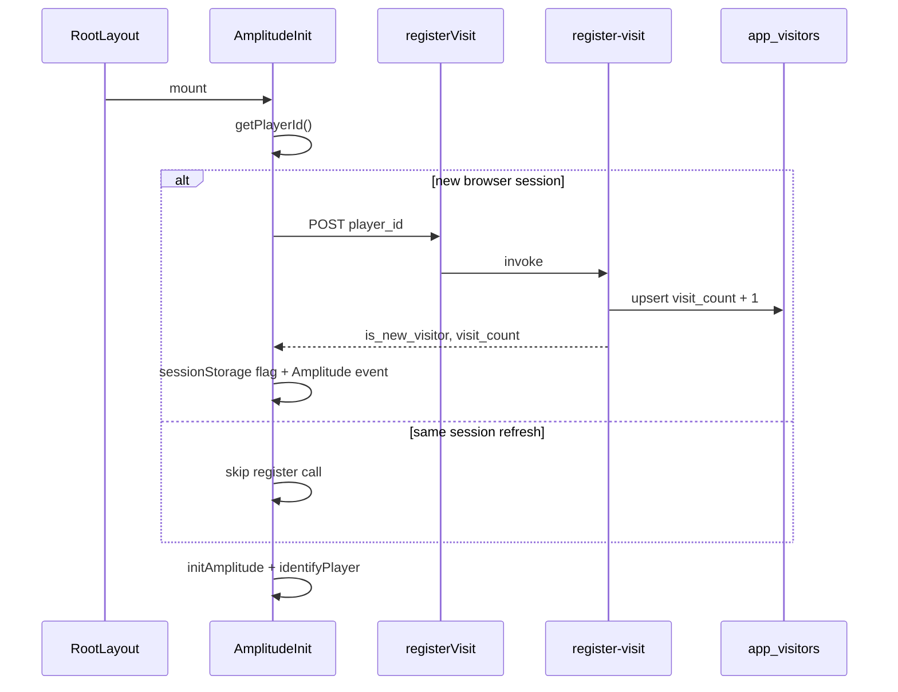

# Anonymous app visitor tracking (UUID + Supabase)

## Goal

Persist **unique browsers** and **session visit counts** in Supabase using the existing [`getPlayerId()`](src/lib/player/identity.ts) UUID — no auth required, no changes to lobby `players` lifecycle.

**Visit definition (locked):** increment `visit_count` **once per browser session** (`sessionStorage` gate).

## Architecture



## Step 0 — Linear ticket

Create a **Feature** (or **Improvement**) issue under project **kar-no-key**:

- **Title:** `[FE+BE] Persist anonymous app visitors with session visit counts`
- **Labels:** `Frontend`, `Backend`
- **Description:** Summary, scope, acceptance criteria, note that identity = browser UUID (not person-level)
- **Related to:** existing identity/analytics issues if applicable (e.g. player identity / Amplitude instrumentation)

Implementation proceeds after ticket is created (record issue ID/URL in PR description).

---

## 1. Database migration

**New file:** [`supabase/migrations/011_app_visitors.sql`](supabase/migrations/011_app_visitors.sql)

```sql
create table app_visitors (
  id             uuid primary key,
  first_seen_at  timestamptz not null default now(),
  last_seen_at   timestamptz not null default now(),
  visit_count    int not null default 1,
  constraint app_visitors_visit_count_positive check (visit_count >= 1)
);

create index app_visitors_last_seen_at_idx on app_visitors (last_seen_at);

alter table app_visitors enable row level security;
-- no policies: Edge Functions use service role (same as lobbies/players)
```

**Optional one-time backfill** (run manually or as commented SQL in migration):

```sql
insert into app_visitors (id, first_seen_at, last_seen_at, visit_count)
select id, min(joined_at), max(last_seen_at), 1
from players
group by id
on conflict (id) do nothing;
```

Keeps historical lobby players without affecting live lobby rows.

---

## 2. Edge function: `register-visit`

**New file:** [`supabase/functions/register-visit/index.ts`](supabase/functions/register-visit/index.ts)

Mirror the public, no-auth pattern from [`validate-lobby-code/index.ts`](supabase/functions/validate-lobby/index.ts):

| Check | Implementation |
|-------|----------------|
| Method | POST only |
| Body | `{ player_id: string }` |
| Validation | [`isValidPlayerId`](supabase/functions/_shared/player-id.ts) |
| Rate limit | IP-based via [`checkRateLimit`](supabase/functions/_shared/rate-limit.ts) — e.g. 60/min |
| DB write | Service role upsert |

**Upsert logic:**

```sql
insert into app_visitors (id, first_seen_at, last_seen_at, visit_count)
values ($id, now(), now(), 1)
on conflict (id) do update set
  last_seen_at = now(),
  visit_count = app_visitors.visit_count + 1
returning visit_count, first_seen_at, (xmax = 0) as is_new_visitor;
```

**Response (200):**

```json
{ "player_id": "...", "visit_count": 3, "first_seen_at": "...", "is_new_visitor": false }
```

Client only calls this once per session, so each call = +1 visit. No `increment_visit` flag needed.

**Non-breaking:** new function only; no changes to existing edge functions or `players` table writes.

---

## 3. Client wrapper

**[`src/lib/supabase/functions.ts`](src/lib/supabase/functions.ts)**

- Add `RegisterVisitResult` type
- Add `registerVisit(playerId)` → `invokeFunction("register-visit", { player_id }, { includeSessionToken: false })`

**New file:** [`src/lib/player/visitor.ts`](src/lib/player/visitor.ts)

```ts
const VISIT_REGISTERED_KEY = "visit_registered";

export function hasRegisteredVisitThisSession(): boolean { ... }
export function markVisitRegisteredThisSession(): void { ... }

export async function registerVisitIfNewSession(playerId: string): Promise<RegisterVisitResult | null> {
  if (hasRegisteredVisitThisSession()) return null;
  const { data, error } = await registerVisit(playerId);
  if (error || !data || "error" in data) return null; // silent fail
  markVisitRegisteredThisSession();
  return data;
}
```

Fire-and-forget: errors must not block app load or lobby flows.

---

## 4. App init hook

**Extend [`src/components/AmplitudeInit/AmplitudeInit.tsx`](src/components/AmplitudeInit/AmplitudeInit.tsx)** (keep single init point in [`layout.tsx`](src/app/layout.tsx)):

```ts
useEffect(() => {
  void (async () => {
    const playerId = getPlayerId();
    const visitResult = await registerVisitIfNewSession(playerId);
    await initAmplitude();
    identifyPlayer(playerId, {
      ...sessionProps,
      visit_count: visitResult?.visit_count,
      is_new_visitor: visitResult?.is_new_visitor,
    });
    if (visitResult) {
      trackEvent(AnalyticsEvent.AppVisitRegistered, { ... });
    }
  })();
}, []);
```

Order: register visit → init Amplitude → identify with enriched props → track session event.

---

## 5. Amplitude changes (minimal, additive)

**[`src/lib/analytics/events.ts`](src/lib/analytics/events.ts)**

- Add `AppVisitRegistered: "App Visit Registered"`
- Properties: `{ visit_count: number; is_new_visitor: boolean; is_returning_visitor: boolean }`

**[`src/lib/analytics/amplitude.ts`](src/lib/analytics/amplitude.ts)**

- Extend `identifyPlayer` optional properties: `visit_count?`, `is_new_visitor?`

**No changes** to existing funnel events (`Lobby Created`, etc.) — they already use the same `playerId` via `setUserId`.

Amplitude autocapture (`pageViews`, `sessions`) stays as-is; `App Visit Registered` is the Supabase-aligned session signal for dashboards.

---

## 6. Safety / non-breaking guarantees

| Risk | Mitigation |
|------|------------|
| Blocks page load | Async fire-and-forget; swallow errors |
| Breaks lobby APIs | Separate table + new function; no `players` schema changes |
| Double-count visits | `sessionStorage` gate on client |
| Spam | IP rate limit on edge function |
| RLS exposure | Deny-all RLS; service role only |

Existing [`getPlayerId()`](src/lib/player/identity.ts) unchanged — lobby create/join still use the same UUID.

---

## 7. Deploy checklist

1. Apply migration: `supabase db push` (or remote migration)
2. Deploy function: `supabase functions deploy register-visit`
3. Verify: open app in fresh session → row in `app_visitors`; refresh same tab → `visit_count` unchanged; new tab/session → `visit_count + 1`

---

## Files touched

| File | Action |
|------|--------|
| Linear | Create `[FE+BE] Persist anonymous app visitors...` |
| [`supabase/migrations/011_app_visitors.sql`](supabase/migrations/011_app_visitors.sql) | Create |
| [`supabase/functions/register-visit/index.ts`](supabase/functions/register-visit/index.ts) | Create |
| [`src/lib/supabase/functions.ts`](src/lib/supabase/functions.ts) | Add `registerVisit` |
| [`src/lib/player/visitor.ts`](src/lib/player/visitor.ts) | Create session gate + helper |
| [`src/components/AmplitudeInit/AmplitudeInit.tsx`](src/components/AmplitudeInit/AmplitudeInit.tsx) | Wire register + Amplitude |
| [`src/lib/analytics/events.ts`](src/lib/analytics/events.ts) | Add `AppVisitRegistered` |
| [`src/lib/analytics/amplitude.ts`](src/lib/analytics/amplitude.ts) | Extend identify props |

No changes to [`LandingFlow`](src/components/LandingFlow/LandingFlow.tsx), lobby edge functions, or `players` table.

---

## Test plan

1. **New browser** — first session creates `app_visitors` row with `visit_count = 1`; Amplitude fires `App Visit Registered` with `is_new_visitor: true`
2. **Same session refresh** — no second API call; count unchanged
3. **New session** (close tab, reopen) — `visit_count` increments by 1; `is_new_visitor: false`
4. **Lobby flow regression** — create lobby, join, play unchanged
5. **API failure** — app loads normally; no user-visible error
6. **SQL sanity** — `select count(*) from app_visitors` and `select sum(visit_count) from app_visitors` return expected values
