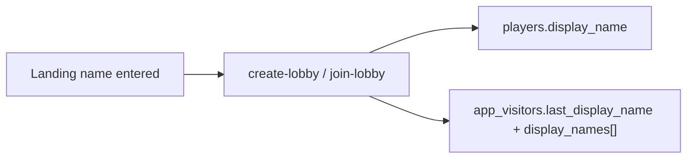

# Persist usernames on `app_visitors`

## Context

- Lobby nicknames already live on [`players.display_name`](supabase/migrations/001_initial_schema.sql).
- [`app_visitors`](supabase/migrations/011_app_visitors.sql) only tracks `id`, visit timestamps, and `visit_count` — no names.
- Visits are registered early via [`register-visit`](supabase/functions/register-visit/index.ts) (no name yet). Names are known later in [`create-lobby`](supabase/functions/create-lobby/index.ts) / [`join-lobby`](supabase/functions/join-lobby/index.ts).

## Approach

Accumulate **unique** display names per visitor UUID so you can see different usernames in the Supabase table editor, plus a latest-name column for quick scanning.

### Schema (new migration)

Add to `app_visitors`:

- `last_display_name text` — most recent validated name (nullable until first create/join)
- `display_names text[] not null default '{}'` — unique names used by that visitor over time

Optional one-time backfill comment (or SQL in migration): seed from distinct `players.display_name` grouped by `players.id`.

### Shared edge helper

Add something like `recordVisitorDisplayName(supabase, playerId, name)` under `supabase/functions/_shared/`:

1. Ensure visitor row exists (insert if missing with visit defaults, same as register-visit insert path).
2. Set `last_display_name = name`.
3. Append `name` to `display_names` if not already present (case-insensitive match to avoid `"Alex"` / `"alex"` dupes — store the validated canonical form from `validateDisplayName`).

Call it from **create-lobby** and **join-lobby** after the player write succeeds (best-effort: log/ignore failure so lobby flow is not blocked).

Do **not** change `register-visit` request shape (still no name at first paint).

### Out of scope

- Frontend UI for viewing names (Supabase dashboard / SQL is enough)
- Changing uniqueness rules on `players`
- Auth / global username claims

## Linear issue (create on execute)

Create issue on team **Nimesh's Company**, project **kar-no-key**:

- **Title:** `BE: Persist visitor display names on app_visitors`
- **Labels:** `Backend`, `Feature`
- **Priority:** Medium (3)
- **Description** structure (match prior NIM writeups): Summary / Scope / Acceptance criteria / Notes

Include in the body: columns, create/join write path, unique history intent, AC that after create/join the visitor row shows `last_display_name` and accumulates distinct names.

## Implementation files (after issue exists)

- New migration under [`supabase/migrations/`](supabase/migrations/)
- New shared helper + call sites in create-lobby / join-lobby
- No FE changes required

## Acceptance

- New visitor create/join → `app_visitors` row has `last_display_name` set and name in `display_names`
- Same visitor uses a new name later → `last_display_name` updates; array gains the new name only if distinct
- Lobby create/join still succeeds if visitor name write fails
- `register-visit` behavior unchanged
