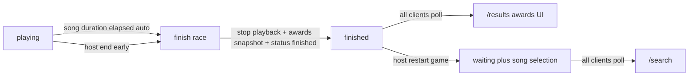

# End of Race Awards — Backend, Frontend, and Linear

## Locked decisions

- **UI source of truth:** [Figma node 2223:439](https://www.figma.com/design/xvOrhZZAqLqapwAtYD5GEq/kara-no-key?node-id=2223-439) — title “End of Race Awards”, three full ranked sections (Champions / Sharpshooters / Speed Demons), gold/silver/bronze stars for top 3, host “restart game” CTA
- **Scoring:** +1/correct char, **+50** phrase complete, **+20** first-to-finish; mistypes **0** (no penalty)
- **Speed Demon:** WPM via strategy formula; **per-player active typing time**; accuracy for tie-breakers
- **Song end → results (all players):** When the race ends — **automatically when song duration elapses**, or when the host ends early — lobby enters `finished`, **playback stops** (audio must not keep playing), and **every client** is routed to `/results` via lobby-state polling. No one stays on the game screen with music continuing.
- **Restart:** host-only → song selection (`waiting` + `song_selection_started`)
- **Linear:** update [NIM-46](https://linear.app/nimeshs-company/issue/NIM-46/be-finished-results-state-machine); add sibling FE/BE Feature tickets (4 total)

Future awards in [`plan/awards-strategy.md`](plan/awards-strategy.md) stay out of scope.

---

## Current gaps

- [`end-song`](supabase/functions/end-song/index.ts) wipes scores via `clearLobbyGameData` and jumps to `waiting` → FE `/search`
- `finished` enum exists but is unused ([NIM-46](https://linear.app/nimeshs-company/issue/NIM-46/be-finished-results-state-machine))
- Live scoring: [`PHRASE_BONUS_POINTS = 10`](supabase/functions/_shared/scoring/scoring.ts) (mirrored in [`src/lib/game/scoring.ts`](src/lib/game/scoring.ts)); no first-finish, no WPM/accuracy/typing_ms
- No `/results` route; [`lobbyRoute.ts`](src/lib/lobby/lobbyRoute.ts) has no `finished` mapping

---

## Target flow



**Finish race (shared path for auto and host end):**

1. Compute WPM/accuracy + awards rankings; persist snapshot
2. Set `status: "finished"`; clear/stop playback clocks (`playback_start_at` null, elapsed fixed, etc.) so clients treat the race as over
3. Do **not** wipe scores yet (needed for results)
4. All players’ clients see `finished` on next poll → navigate to `/results` and **tear down / pause YouTube playback** so audio cannot continue

---

## Backend

### 1. Scoring rules + race metrics

**Constants** (server + client mirrors + tests):

- `PHRASE_BONUS_POINTS`: 10 → **50**
- New `FIRST_FINISH_BONUS_POINTS = 20`
- Mistypes stay unscored (no change)

**First-to-finish:** On phrase finalize with full match, claim first completion for `(lobby_id, youtube_video_id, phrase_index)` (unique row or lobby-scoped map). Winner gets +20 once; later finishers get phrase bonus only.

**Player aggregates** (new columns on `players`, zeroed on reset):

| Column | Purpose |
|--------|---------|
| `correct_chars` | Sum of newly scored char indices |
| `attempted_chars` | Positions examined for match (correct + incorrect) — accuracy = correct/attempted |
| `typing_ms` | Accumulated active typing time from client deltas |

**Active typing time (FE → BE):** Client measures active typing windows (input/keydown with short idle timeout). Each [`submit-phrase-progress`](supabase/functions/submit-phrase-progress/index.ts) request includes `typing_ms_delta`; server clamps/adds to `typing_ms`.

**At race end (before wipe):**

```text
wpm = (correct_chars / 5) / max(typing_ms / 60000, epsilon)
accuracy = correct_chars / max(attempted_chars, 1)
```

Store computed `wpm` / `accuracy` on players (or compute in awards helper from aggregates). Tie-breakers per [`plan/awards-strategy.md`](plan/awards-strategy.md).

### 2. Finished state, awards payload, auto-end, host restart (NIM-46)

**Required: auto-finish when the song ends** (primary path), not optional.

- Server must detect race complete when playback elapsed ≥ song duration (derive duration from song metadata already stored, or lyrics last phrase `end_ms`).
- Detection paths (pick one concrete approach in implementation; both are acceptable if idempotent):
  - **Preferred:** `get-lobby-state` (or a shared helper) promotes `playing` → `finished` when elapsed ≥ duration (idempotent finish), so any client poll can trigger the transition once; **or**
  - Host/client watches elapsed locally and calls a finish endpoint when duration hits — server still authoritatively validates and finishes once.
- Host **end song early** uses the same finish helper as auto-end.

**Finish helper (shared by auto-end + host end):**

1. Idempotent: if already `finished`, return current awards snapshot
2. Do **not** wipe scores/progress
3. Compute WPM/accuracy + awards rankings; persist snapshot (JSON on lobby or equivalent)
4. Set `status: "finished"`; **clear playback so the song is over** (`playback_start_at` null, pause clocks, no further scoring)
5. Keep enough song context for analytics if needed

**Award rankings (Figma lists):**

| Section | Sort key | Display value (“Score” column) |
|---------|----------|--------------------------------|
| Champions | `score` desc + tie-breaks | points |
| Sharpshooters | `phrases_completed` desc + accuracy, avg phrase time | phrase count |
| Speed Demons | `wpm` desc + accuracy, phrases | WPM (rounded for display) |

**`get-lobby-state`:** When `finished`, return players + three ranked lists (player_id, display_name, metric, rank) so FE does not re-rank. While `playing`, may run the elapsed-vs-duration check and finish before responding.

**New host-only `restart-game`:** `clearLobbyGameData` → `status: waiting`, `song_selection_started: true`, clear selection/playback — same destination as today’s post-end search state.

---

## Frontend

### 3. Awards screen (Figma)

- New route `/results` + `ResultsFlow` / `AwardsScreen`
- Reuse existing [`Navbar`](src/components/Navbar/Navbar.tsx); add host-only **restart game** primary button (Figma); keep ellipsis/leave
- Reusable `AwardSection`: title, subtitle, Players/Score headers (teal), rows with gold/silver/bronze star assets for ranks 1–3, muted rows below
- Plain CSS + design tokens (no Tailwind); export star icons from Figma assets into `/public`
- Gradient blob atmosphere consistent with other pages

### 4. Flow wiring

- [`getRouteForLobbyStatus`](src/lib/lobby/lobbyRoute.ts): `finished` → `/results`
- [`GameFlow`](src/components/GameFlow/GameFlow.tsx) / playback sync: when lobby becomes `finished` **or** local elapsed reaches song duration, leave game UI for `/results`
- **Stop audio on finish:** destroy/pause YouTube player and stop sync loops so the track cannot keep playing on any client after transition
- Polling: **all players** follow `finished` → `/results` automatically (not host-only); after restart → `/search`
- Host may still end early via existing end control; same finish path
- Non-hosts: no restart CTA (or disabled); wait for host
- Client: typing-time accumulator + `typing_ms_delta` on score submits; sync `PHRASE_BONUS` / first-finish display if any local optimistic UI exists

---

## Linear issues to create/update (after plan approval)

Team **Nimesh's Company**, project **kar-no-key**, status **Todo**, labels **Frontend**/**Backend** + **Feature**, body template Summary / Scope / Acceptance / Notes.

| # | Action | Title |
|---|--------|--------|
| 1 | **Update** NIM-46 | `[BE] Finished / results state machine` — expand ACs: **auto-finish when song duration elapses**; host early-end uses same path; stop playback clocks; `finished` without wiping; awards snapshot; all clients see finished via `get-lobby-state`; host `restart-game` → song selection + wipe |
| 2 | **Create** | `[BE] Awards scoring rules and race metrics` — +50 phrase, +20 first-finish, correct/attempted chars, typing_ms accumulation, WPM/accuracy at finish, tests |
| 3 | **Create** | `[FE] End of Race Awards screen` — `/results` UI matching Figma (three sections, stars, navbar restart slot) |
| 4 | **Create** | `[FE] Results routing and host restart flow` — lobbyRoute; all players auto-nav to `/results` on `finished`; **stop YouTube on finish**; host restart; typing_ms_delta; poll redirects |

**Final ticket set (4 Feature issues):**

1. Update **NIM-46** — auto-end + finished + awards payload + restart
2. **[BE] Awards scoring rules and race metrics** (includes first-finish)
3. **[FE] End of Race Awards screen**
4. **[FE] Results routing and host restart flow** (all players → results; stop playback)

Relate 2–4 to NIM-46 via `relatedTo`. Link Figma + `plan/awards-strategy.md` in Notes.

---

## Implementation order (when coding later)

1. BE scoring + metrics + first-finish  
2. BE finished / awards / restart (NIM-46)  
3. FE awards UI  
4. FE routing + typing delta + restart CTA  

No app code in the Linear-only execution step — create/update issues only when you approve this plan.