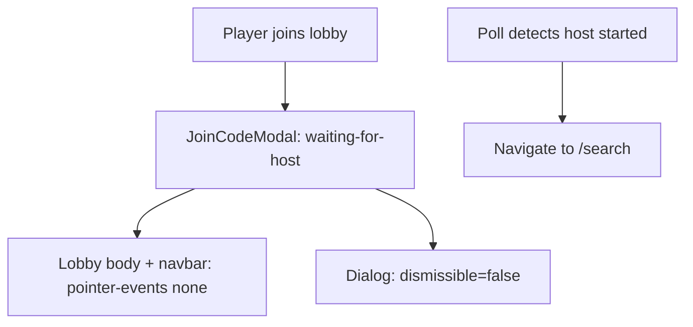

# Block player clicks during lobby waiting

## Problem

When a player joins a lobby and enters the **Patience :)** waiting state, they can still:

- Dismiss the join modal via overlay click, X button, or Escape ([`Dialog.tsx`](src/components/Dialog/Dialog.tsx))
- After dismiss, click **my fren gave me a code**, navbar dropdowns, **Leave Game**, etc. on [`LobbyScreen`](src/components/LobbyScreen/LobbyScreen.tsx)
- On page refresh as a non-host, land on the lobby with no modal open and full interactivity ([`LandingFlow.tsx`](src/components/LandingFlow/LandingFlow.tsx) resets `joinModalPhase` to `"enter-code"`)

Background clicks are partially blocked today via `.lobby-screen--modal-open { pointer-events: none }`, but only while the modal stays open.

## Approach

Reuse the existing modal + `pointer-events: none` pattern. Extend it so the waiting state cannot be escaped and non-host lobby sessions always re-enter that blocked state.



## Changes

### 1. Add `dismissible` prop to Dialog

**File:** [`src/components/Dialog/Dialog.tsx`](src/components/Dialog/Dialog.tsx)

Add optional `dismissible?: boolean` (default `true`). When `false`:

- Do not attach `onClick` to the overlay (render as non-interactive `div` instead of button)
- Hide the header close (X) button
- Skip Escape key handler in `useEffect`

This keeps the change reusable without affecting other dialogs (e.g. [`FeedbackDialog`](src/components/FeedbackDialog/FeedbackDialog.tsx)).

### 2. Make waiting modal non-dismissible

**File:** [`src/components/JoinCodeModal/JoinCodeModal.tsx`](src/components/JoinCodeModal/JoinCodeModal.tsx)

Pass `dismissible={!isBusy}` to `Dialog`, where `isBusy` is already `phase === "joining" || phase === "waiting-for-host"`.

Also add a guard in [`LobbyScreen.tsx`](src/components/LobbyScreen/LobbyScreen.tsx) `handleCloseModal` so parent state cannot reset the phase during busy states (defense in depth):

```ts
function handleCloseModal() {
  if (joinModalPhase === "joining" || joinModalPhase === "waiting-for-host") {
    return;
  }
  // existing logic...
}
```

### 3. Block lobby interactions for all non-host players

**File:** [`src/components/LobbyScreen/LobbyScreen.tsx`](src/components/LobbyScreen/LobbyScreen.tsx)

Non-host players on the lobby are always waiting for the host to start. Apply the existing click-block class whenever the player is not the host:

```ts
const isPlayerWaiting = !isHost;
const shouldBlockLobby =
  isModalOpen || isPlayerWaiting;

// className: lobby-screen--modal-open when shouldBlockLobby
```

This uses the existing CSS in [`LobbyScreen.css`](src/components/LobbyScreen/LobbyScreen.css):

```102:105:src/components/LobbyScreen/LobbyScreen.css
.lobby-screen--modal-open .lobby-screen__body,
.lobby-screen--modal-open .navbar {
  pointer-events: none;
}
```

The fixed-position `Dialog` remains interactive because it is a sibling of the blocked elements, not a descendant.

### 4. Restore waiting modal on session reload for non-hosts

**File:** [`src/components/LandingFlow/LandingFlow.tsx`](src/components/LandingFlow/LandingFlow.tsx)

In the session-restore `useEffect`, after loading a non-host session:

```ts
if (!session.isHost) {
  setJoinModalPhase("waiting-for-host");
}
```

This ensures refreshed players see the **Patience :)** modal again instead of a clickable lobby with no waiting message.

## Files touched

| File | Change |
|------|--------|
| [`src/components/Dialog/Dialog.tsx`](src/components/Dialog/Dialog.tsx) | Add `dismissible` prop |
| [`src/components/JoinCodeModal/JoinCodeModal.tsx`](src/components/JoinCodeModal/JoinCodeModal.tsx) | Pass `dismissible={!isBusy}` |
| [`src/components/LobbyScreen/LobbyScreen.tsx`](src/components/LobbyScreen/LobbyScreen.tsx) | Guard close handler; block lobby when `!isHost` |
| [`src/components/LandingFlow/LandingFlow.tsx`](src/components/LandingFlow/LandingFlow.tsx) | Restore `waiting-for-host` phase for non-host sessions |

No CSS changes required — existing `.lobby-screen--modal-open` rules cover the new blocking case.

## Test plan

1. **Player joins via modal** — enter code, submit → **Patience :)** modal appears; overlay/X/Escape do nothing; lobby buttons and navbar are not clickable behind modal.
2. **Host starts** — host clicks **let's gooo** → player auto-navigates to `/search` (existing polling behavior unchanged).
3. **Page refresh as non-host** — reload while waiting → **Patience :)** modal reopens automatically; still no dismiss or background clicks.
4. **Host unaffected** — host can still click **let's gooo**, open join modal, and use navbar normally.
5. **Joining phase** — during `wait...` spinner, modal is also non-dismissible.
