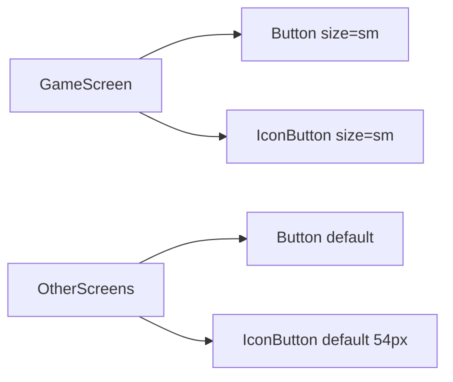

# Scalable 48px host control sizing

## Recommendation

Add an opt-in **`size` prop** on both [`Button`](src/components/Button/Button.tsx) and [`IconButton`](src/components/IconButton/IconButton.tsx):

- `size="default"` (implicit) — current look everywhere (navbar more, lobby CTAs, etc.)
- `size="sm"` — **48px** control height (IconButton also 48px width)

Game screen host controls pass `size="sm"`. Global defaults stay untouched.

This scales better than one-off GameScreen CSS overrides: the next compact control reuses the same API, and sizing lives in the design-system components instead of scattered consumer hacks.



## Implementation

### 1. Shared size token

In [`src/styles/tokens/typography.css`](src/styles/tokens/typography.css) or a spacing tokens file if one exists (otherwise typography/sizing tokens), add:

```css
--control-size-sm: 48px;
```

(If there is no spacing token file yet, put it next to other size tokens in `tokens/typography.css`, or add `tokens/spacing.css` only if the project already splits that way — prefer extending the existing size token file.)

### 2. Button — opt-in compact height

[`Button.tsx`](src/components/Button/Button.tsx): add `size?: "default" | "sm"`; append `button--sm` when `size === "sm"`.

[`Button.css`](src/components/Button/Button.css):

```css
.button--sm {
  box-sizing: border-box;
  height: var(--control-size-sm);
  padding-block: 0; /* keep horizontal padding; vertical centered via flex */
}
```

Default `.button` rules unchanged — only consumers that pass `size="sm"` get 48px height.

### 3. IconButton — opt-in 48×48

[`IconButton.tsx`](src/components/IconButton/IconButton.tsx): same `size?: "default" | "sm"`; append `icon-button--sm`.

[`IconButton.css`](src/components/IconButton/IconButton.css):

```css
.icon-button--sm {
  box-sizing: border-box;
  width: var(--control-size-sm);
  height: var(--control-size-sm);
}
```

Default stays **54×54** for navbar / elsewhere.

### 4. Wire GameScreen only

In [`GameScreen.tsx`](src/components/GameScreen/GameScreen.tsx), on the pause/play `IconButton` and the end-song `Button`:

```tsx
size="sm"
```

Keep existing `className="game-screen__end-song-button"` for layout (`flex-shrink` / mobile `flex: 1`) — do **not** put height there.

No changes to [`GameScreen.css`](src/components/GameScreen/GameScreen.css) for height (layout-only classes remain).

## Out of scope

- Changing default Button padding or IconButton 54px size globally
- Renaming/removing `game-screen__end-song-button` layout helpers
- Adding more sizes beyond `sm` until needed

## Why not the alternatives

- **GameScreen-only CSS**: works for this one screen, but duplicates 48px whenever another compact control appears and fights component padding from outside.
- **Semantic utility class only**: reusable, but less discoverable than a typed prop and easier to apply inconsistently (miss IconButton vs Button).

## Verification

- Navbar more icon still 54px; lobby/landing buttons unchanged height
- Game screen: pause/play is 48×48; end song is 48px tall; colors/variants unchanged
- Disabled/hover states still work on both controls
