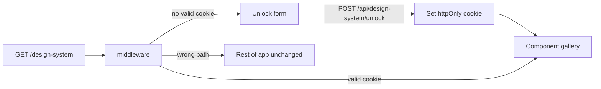

# Password-gated `/design-system` gallery

## Approach

Add an in-app design system route at `/design-system` that catalogs real UI components from this repo. Protect it with a **server-only password** (`DESIGN_SYSTEM_PASSWORD`), verified via middleware + an httpOnly cookie. **No Storybook.** No long-lived private branch — develop on a short feature branch, merge to `main`, deploy with the env var set on Vercel.

Local edit loop (unchanged): change component CSS/TSX → `npm run dev` → open `http://localhost:3000/design-system` (password from `.env.local`).

## Access control

1. **Env**
   - Add `DESIGN_SYSTEM_PASSWORD` to [`.env.local.example`](.env.local.example) (server-only, never `NEXT_PUBLIC_`).
   - You set the real value in `.env.local` and Vercel Production/Preview env.

2. **Unlock API** — `src/app/api/design-system/unlock/route.ts`
   - `POST` with password body.
   - Compare to `process.env.DESIGN_SYSTEM_PASSWORD` with a timing-safe compare.
   - On success: set httpOnly, `Secure` (prod), `SameSite=Lax`, `Path=/design-system` cookie (e.g. `design_system_access`), value = HMAC or signed token derived from the password + a server secret (or a simple constant signature using the password itself via Web Crypto / Node crypto). Prefer a short-lived or long-lived signed cookie so the raw password is never stored client-side.
   - On failure: `401`.
   - If env unset: treat as locked (`503` or always fail) so a misconfigured deploy does not open the gallery.

3. **Middleware** — [`src/middleware.ts`](src/middleware.ts) (new)
   - Matcher: `/design-system` and `/design-system/:path*` only (do **not** gate the unlock API, or gate it separately — unlock must remain reachable).
   - Allow: requests with a valid signed cookie.
   - Allow: the unlock UI shell (the page itself can render the form when unauthorized — see below).
   - Practical pattern: middleware only validates cookie for the gallery; the page is a Server Component that checks the cookie and either renders the unlock form or the gallery. Alternatively middleware rewrites unauthorized users to an unlock view. **Chosen pattern:** page-level server check + cookie set by unlock API; middleware returns **404** for unauthorized requests to nested design-system assets if any, and for direct gallery if we split routes:
     - `/design-system` — always reachable; server component reads cookie → unlock form **or** gallery (no information leak beyond “something exists at this path”).
     - Optional: return generic 404 when `DESIGN_SYSTEM_PASSWORD` is unset in production so the route disappears on misconfig.

4. **Stealth / SEO**
   - `robots: { index: false, follow: false }` in page metadata.
   - Do not link to `/design-system` from Navbar or public UI.

## Gallery UI

New files:

- [`src/app/design-system/page.tsx`](src/app/design-system/page.tsx) — server entry; cookie gate → unlock or gallery.
- [`src/app/design-system/DesignSystemGallery.tsx`](src/app/design-system/DesignSystemGallery.tsx) — client sections for interactive demos (dialog open, dropdown, inputs).
- [`src/app/design-system/DesignSystemUnlock.tsx`](src/app/design-system/DesignSystemUnlock.tsx) — password form using existing [`InputField`](src/components/InputField/InputField.tsx) + [`Button`](src/components/Button/Button.tsx).
- [`src/app/design-system/design-system.css`](src/app/design-system/design-system.css) — layout for sections/swatches only (plain CSS, semantic classes, tokens from existing [`src/styles/`](src/styles/)).

**Sections to include (v1):**

| Section | Content |
|---------|---------|
| Tokens | Color swatches from semantic/token CSS variables; type scale samples (`text-body`, `text-button-label`, etc.) |
| Button | primary / secondary / disabled / as link |
| IconButton | primary / secondary / disabled (use an existing public icon) |
| InputField | default / error / disabled / center align |
| Dropdown | closed + open demo |
| Dialog | trigger to open with title/body/footer |
| SongCard | selected / unselected mock data |
| AnimatedEllipsis | loading sample |
| Navbar | static demo with mock props if feasible without full lobby session; otherwise skip and document as flow-bound |
| PhraseTypingArea | static phrase demo if props allow without game state |

**Out of scope for v1:** full `LandingFlow` / `GameFlow` / `SearchFlow` screens, Storybook, Amplitude events on this page, git branch strategy beyond normal feature → `main`.

## Deploy / ops

1. Feature branch → implement → merge to `main`.
2. Set `DESIGN_SYSTEM_PASSWORD` in Vercel (Production + Preview).
3. Visit `https://<prod>/design-system`, enter password, browse.
4. For tweaks: edit locally, verify on localhost, then ship as usual.

## Security notes (explicit)

- Cookie must be httpOnly; password never in client bundle.
- Timing-safe password compare.
- This is shared-secret access (anyone with the password can enter) — appropriate for a solo catalog; not per-user identity.
- No `NEXT_PUBLIC_` exposure of the secret.
