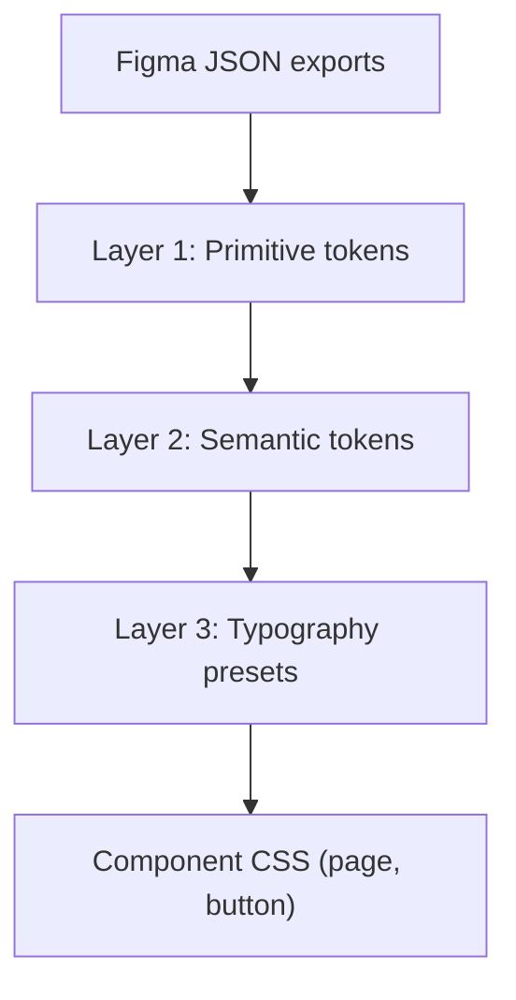

# Design System from Figma Token Exports

## Context

The [`variable-exports/`](variable-exports/) folder contains two Figma token files:

| File | Contents |
|------|----------|
| [`Mode 1.tokens.json`](variable-exports/Mode%201.tokens.json) | Typography primitives: Family, Size, Weight, Line Height |
| [`Mode 1.tokens 2.json`](variable-exports/Mode%201.tokens%202.json) | Color primitives: Solid (Black/White), Neutral (300/400/700) |

Figma node `1:8` defines three text styles and layout values. Current [`globals.css`](src/app/globals.css) uses ad-hoc variables that partially match but have drifted from the design.

**SVG exclusion:** [`TypewriterIllustration.tsx`](src/components/TypewriterIllustration/TypewriterIllustration.tsx) and its animation logic stay untouched. Only layout sizing on `.typewriter-image` (max-width, etc.) remains.

## Gaps Between Current Code and Figma

| Element | Current | Target (tokens + Figma) |
|---------|---------|-------------------------|
| Tagline color | `#bababa` | `--neutral-400` (`#A3A3A3`) |
| Title ↔ tagline gap | `20px` | `12px` (`--size-12`) |
| Title line-height | unset | `40px` (`--line-32`) |
| Tagline line-height | unset | `26px` (`--line-18`) |
| Button font | `18px` / weight 600 | `16px` / weight 500 (`--size-16`, `--weight-medium`) |
| Button line-height | unset | `24px` (`--line-16`) |
| Button padding | `16px` | `16px` (`--size-16`) — already correct |

## Architecture: Three-Layer Token System



### Layer 1 — Primitive tokens (direct JSON translation)

Create [`src/styles/tokens/colors.css`](src/styles/tokens/colors.css):

```css
:root {
  /* Solid */
  --solid-black: #000000;
  --solid-white: #ffffff;
  /* Neutral */
  --neutral-300: #d4d4d4;
  --neutral-400: #a3a3a3;
  --neutral-700: #404040;
}
```

Create [`src/styles/tokens/typography.css`](src/styles/tokens/typography.css):

```css
:root {
  --family-primary: var(--font-geist-sans);
  --family-mono: var(--font-geist-mono);

  --size-12: 12px;
  --size-16: 16px;
  --size-18: 18px;
  --size-20: 20px;
  --size-24: 24px;
  --size-32: 32px;

  --weight-regular: 400;
  --weight-medium: 500;
  --weight-semibold: 600;
  --weight-bold: 700;

  --line-12: 16px;
  --line-16: 24px;
  --line-18: 26px;
  --line-20: 28px;
  --line-24: 32px;
  --line-32: 40px;
}
```

Font families reference the Next.js font variables already wired in [`layout.tsx`](src/app/layout.tsx) (`--font-geist-sans`, `--font-geist-mono`), keeping font loading centralized.

Create [`src/styles/tokens/spacing.css`](src/styles/tokens/spacing.css) — layout spacing derived from the Size scale (not exported separately, but composable from primitives):

```css
:root {
  --spacing-text: var(--size-12);           /* title ↔ tagline: 12px */
  --spacing-content: calc(var(--size-20) * 2); /* illustration ↔ text: 40px */
  --spacing-section: calc(var(--size-20) * 3); /* text block ↔ button: 60px */
}
```

### Layer 2 — Semantic tokens (purpose-based aliases)

Create [`src/styles/semantic/colors.css`](src/styles/semantic/colors.css):

```css
:root {
  --color-background: var(--solid-white);
  --color-foreground: var(--solid-black);
  --color-text-primary: var(--solid-black);
  --color-text-muted: var(--neutral-400);
  --color-button-background: var(--solid-black);
  --color-button-foreground: var(--solid-white);
}
```

This layer is where future themes (e.g. dark mode) would swap values without touching components.

### Layer 3 — Typography presets (Figma text styles)

Create [`src/styles/semantic/typography.css`](src/styles/semantic/typography.css) mapping the three Figma text styles:

| Figma style | Preset class | Token mapping |
|-------------|-------------|---------------|
| Heading 1 | `.text-heading-1` | mono / semibold / size-32 / line-32 |
| Body | `.text-body` | mono / medium / size-18 / line-18 |
| Button Label | `.text-button-label` | mono / medium / size-16 / line-16 |

### Barrel import

Create [`src/styles/index.css`](src/styles/index.css) that `@import`s all token files in order (primitives → semantic).

## Apply Tokens to the Landing Page

### Update [`globals.css`](src/app/globals.css)

- Add `@import "../styles/index.css";` at the top
- Remove the hardcoded ad-hoc variables (`--color-background`, `--gap-small`, `--font-size-body`, etc.)
- Keep only the CSS reset and base `body` styles referencing semantic tokens (`--color-background`, `--color-foreground`)

### Update [`page.css`](src/app/page.css)

Replace all primitive references with semantic tokens and spacing tokens:

- `.landing-page` gap → `var(--spacing-section)`, padding → `var(--size-20)`
- `.typewriter-container` gap → `var(--spacing-content)`
- `.text-container` gap → `var(--spacing-text)`
- `.landing-title` → use `.text-heading-1` preset values via token vars (or apply class in markup)
- `.landing-tagline` → `color: var(--color-text-muted)` + body preset
- `.get-started-button` → `background: var(--color-button-background)`, `color: var(--color-button-foreground)`, `padding: var(--size-16)`, button label preset

Layout dimensions from Figma stay as-is: `max-width: 580px` column, `292px` text block, `552px` illustration max-width.

### Update [`page.tsx`](src/app/page.tsx) (minimal markup)

Add typography preset classes to non-SVG elements:

```tsx
<h1 className="landing-title text-heading-1">kar-no-key</h1>
<p className="landing-tagline text-body">race your frens, one lyric at a time :)</p>
<button className="get-started-button text-button-label">get started</button>
```

Component CSS files handle layout; preset classes handle typography — clean separation of concerns.

## File Structure After Changes

```
src/
  styles/
    tokens/
      colors.css
      typography.css
      spacing.css
    semantic/
      colors.css
      typography.css
    index.css
  app/
    globals.css        (reset + import tokens)
    page.css           (layout only, uses semantic tokens)
    page.tsx           (adds typography preset classes)
```

## What Stays Unchanged

- [`TypewriterIllustration/`](src/components/TypewriterIllustration/) — no CSS or SVG modifications
- [`layout.tsx`](src/app/layout.tsx) — font loading stays as-is
- Button hover/active interaction styles in `page.css` — preserved, just re-tokenized

## Verification

After implementation, visually compare against the Figma screenshot:
- White background, centered 580px column
- Title: black, 32px semibold mono, 40px line-height
- Tagline: `#A3A3A3`, 18px medium mono, 26px line-height, 12px below title
- Button: black bg, white 16px medium mono text, 16px padding, square corners
- 40px between illustration and text, 60px between text block and button
