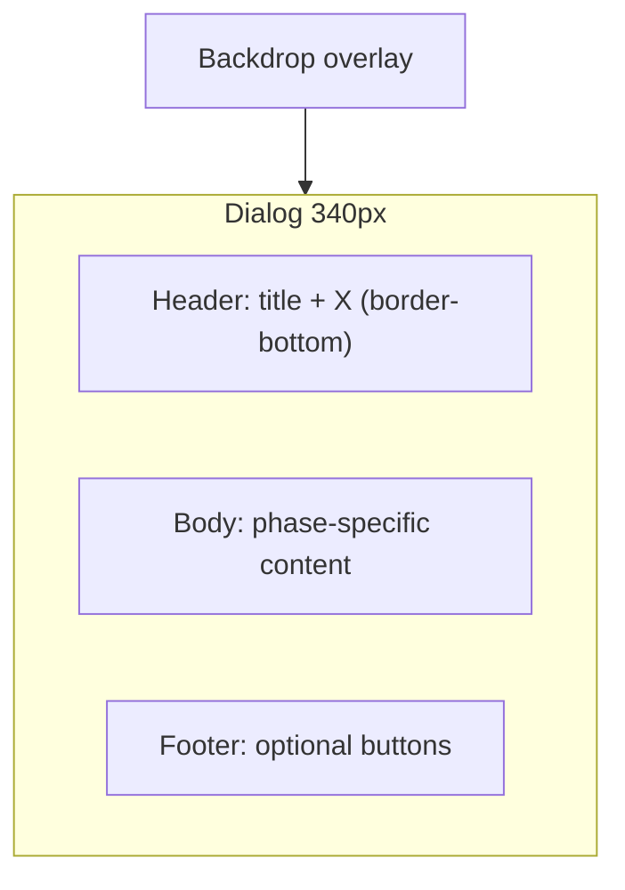

# Dialog Redesign (Figma 2116:3002)

## What changed in Figma vs current code

The modal is no longer a flat padded box with a screen-reader-only title. It is now a **structured dialog shell**:



| Area | Current [`JoinCodeModal`](src/components/JoinCodeModal/JoinCodeModal.tsx) | New Figma design |
|------|--------------------------------------------------------------------------|------------------|
| Title | Visually hidden (`sr-only`) | Visible in header bar, 18px medium |
| Close | Overlay + Escape only | **20×20 X icon** in header (all variants) |
| Panel | 340px, no border, uniform 20px padding | 340px, **1px `--neutral-100` border**, sectioned padding |
| Default placeholder | `enter the code` | `code` |
| Error copy | Split title + short body | Title **"Error"**; body **"unable to connect. please enter the correct code."** (18px regular) |
| Joining | `AnimatedEllipsis` "wait" | Title **"Hold on :)"**; static **"wait..."** (20px medium) |
| Waiting | Title "Waiting for host" | Title **"Patience :)"**; body 18px **regular** |
| Dismiss rules | Blocked during joining/waiting | **Allow dismiss in all states** (your choice) |

Reference screenshot from Figma (four variants left → right): Default, Error, Waiting, network delay.

---

## 1. New shared `Dialog` component

Create [`src/components/Dialog/Dialog.tsx`](src/components/Dialog/Dialog.tsx) + [`Dialog.css`](src/components/Dialog/Dialog.css).

**Responsibilities:**
- Fixed overlay (existing blur/dim from [`JoinCodeModal.css`](src/components/JoinCodeModal/JoinCodeModal.css))
- 340px white panel with `--neutral-100` border
- Header row: visible title (`text-body`) + close button
- Body slot (`children`) and optional footer slot
- A11y: `role="dialog"`, `aria-modal`, `aria-labelledby`, body scroll lock, Escape → `onClose`

**Props (initial):**
```ts
type DialogProps = {
  title: string;
  onClose: () => void;
  children: React.ReactNode;
  footer?: React.ReactNode;
  ariaBusy?: boolean;
  className?: string;
};
```

**Header close button:**
- Add [`public/icons/x.svg`](public/icons/x.svg) (20×20 lucide X from Figma export)
- Use a minimal modal-scoped close button (not full [`IconButton`](src/components/IconButton/IconButton.tsx) — that component is 24px icon + 16px padding, too large for the 20px header slot)
- CSS: 20×20 hit target, no background, pointer cursor

**Layout/CSS structure:**
```css
.dialog__panel { width: 340px; border: 1px solid var(--neutral-100); background: var(--solid-white); display: flex; flex-direction: column; gap: 20px; }
.dialog__header { display: flex; gap: 20px; align-items: center; padding: 20px; border-bottom: 1px solid var(--neutral-100); }
.dialog__title { flex: 1; margin: 0; /* text-body */ }
.dialog__body { padding: 0 20px; width: 100%; box-sizing: border-box; }
.dialog__footer { padding: 0 20px 20px; width: 100%; box-sizing: border-box; }
```

Move overlay + panel positioning from `JoinCodeModal.css` into `Dialog.css`.

---

## 2. Refactor `JoinCodeModal` onto `Dialog`

Update [`JoinCodeModal.tsx`](src/components/JoinCodeModal/JoinCodeModal.tsx):

**Title map (visible header):**
| Phase | Title |
|-------|-------|
| `enter-code` | Enter Code |
| `joining` | Hold on :) |
| `error` | Error |
| `waiting-for-host` | Patience :) |
| `own-code` | Cannot join own lobby |

**Phase bodies:**

- **enter-code** — `InputField` placeholder `"code"`; footer: Cancel (secondary) + let's gooo (primary, disabled until valid). Keep existing disabled-primary override (`--neutral-400` + 40% white text) scoped to modal.
- **joining** — static `<p className="join-code-modal__status text-heading-3">wait...</p>`; **remove** `AnimatedEllipsis` import.
- **error** — body message (18px regular, centered): `unable to connect. please enter the correct code.`; footer: full-width Retry primary.
- **waiting-for-host** — two centered lines at 18px regular (existing copy).
- **own-code** — keep existing message + Cancel / let's go buttons in footer.

**Dismiss:** Remove `canDismiss` guards — always wire `Dialog` `onClose`, overlay click, Escape, and X to `onClose`.

Slim [`JoinCodeModal.css`](src/components/JoinCodeModal/JoinCodeModal.css) to phase-specific styles only (actions row, message typography, disabled submit override). Delete moved overlay/panel/title-hiding rules.

---

## 3. Typography additions

Figma uses **18px regular** for error/waiting body copy; existing [`.text-body`](src/styles/semantic/typography.css) is 18px **medium**.

Add to [`typography.css`](src/styles/semantic/typography.css):
```css
.text-body-regular {
  font-family: var(--family-mono);
  font-size: var(--size-18);
  font-weight: var(--weight-regular);
  line-height: var(--line-18);
}
```

For **"wait..."**, Figma specifies 20px **medium** (`--line-16`). Current `.text-heading-3` uses semibold — add a modal-scoped class or a small `.text-heading-3-medium` utility if we want parity without changing global heading-3 usage elsewhere.

---

## 4. Update dismiss logic in `LobbyScreen`

In [`LobbyScreen.tsx`](src/components/LobbyScreen/LobbyScreen.tsx), simplify `handleCloseModal`:

```ts
function handleCloseModal() {
  setIsJoinModalOpen(false);
  onJoinModalPhaseChange("enter-code");
}
```

Remove phase checks that blocked close during `joining` / `waiting-for-host`. `isModalOpen` logic stays the same (modal reopens if phase is still non-enter-code from in-flight join — edge case noted in test plan).

No changes expected in [`LandingFlow.tsx`](src/components/LandingFlow/LandingFlow.tsx) beyond any phase-reset side effects already handled by `onJoinModalPhaseChange("enter-code")`.

---

## 5. Files touched

| File | Action |
|------|--------|
| `src/components/Dialog/Dialog.tsx` | **Create** — reusable shell |
| `src/components/Dialog/Dialog.css` | **Create** — overlay, panel, header, body, footer |
| `public/icons/x.svg` | **Create** — close icon asset |
| `src/components/JoinCodeModal/JoinCodeModal.tsx` | **Refactor** — compose Dialog, update copy/states |
| `src/components/JoinCodeModal/JoinCodeModal.css` | **Update** — phase-specific styles only |
| `src/components/LobbyScreen/LobbyScreen.tsx` | **Update** — allow dismiss all phases |
| `src/styles/semantic/typography.css` | **Update** — add `.text-body-regular` |

---

## Test plan

1. **Default** — Open join modal; header shows "Enter Code" + X; placeholder is `code`; Cancel and X close; disabled let's gooo is gray until 6 chars.
2. **Error** — Bad code → "Error" header, full error copy (18px regular), Retry returns to Default with code preserved.
3. **Joining** — Submit valid code → "Hold on :)" header, static `wait...`; X closes modal.
4. **Waiting** — After join success → "Patience :)" header, two body lines; X closes modal.
5. **Own-code** — Host enters own code → new header chrome, existing copy/buttons work.
6. **A11y** — Dialog has correct `aria-labelledby`; Escape closes; body scroll locked while open.
7. **Edge** — Dismiss during in-flight join: modal closes and phase resets; if join completes afterward, roster polling should still reflect joined state (existing behavior).
