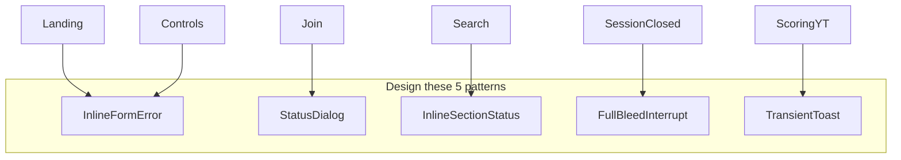

# Missing error & edge-case designs

## Current reality

Almost every failure is **raw API string → plain `
`** (or worse: silent / blank screen). The only designed exception patterns are:

- [JoinCodeModal](src/components/JoinCodeModal/JoinCodeModal.tsx) Dialog phases (joining / waiting / own-code / generic error)
- Search empty: `no songs found. try a different search.`
- SongCard lyrics badge (`lyrics available` / `no lyrics`)
- Non-host wait: `WAITING FOR THE HOST TO SELECT A SONG...`
- Countdown number + ready placeholders

Everything else needs a designed surface. Prefer **~5 reusable patterns** over one design per string.

---

## Pattern A — Inline form / control error

**Where today:** landing name/create ([LandingFlow.tsx](src/components/LandingFlow/LandingFlow.tsx) `landing-form__error`), lobby start (`lobby-screen__start-error`), game host controls (`game-screen__control-error`).

**Design need:** A small, intentional error treatment under the action (not just red mono text). Include icon/treatment, typography, and optional retry affordance.

| Case | Recommended messaging | Notes |
|------|----------------------|-------|
| Empty name | `please enter your name` | Keep playful lowercase voice |
| Create lobby fail (generic) | `couldn't create a lobby. try again.` | Hide raw server strings |
| Create lobby rate/network | `network hiccup. try again in a sec.` | |
| Start race fail | `couldn't start the race. try again.` | Under host CTA |
| Play / pause / end fail | `couldn't update playback. try again.` | Under host transport controls |
| Leave lobby fail (landing) | Move off the buried under-lobby placement → Pattern B or D | Today easy to miss |

---

## Pattern B — Status Dialog (extend JoinCodeModal)

**Where today:** Join only. One error phase with fixed copy that **discards** real API reasons:

> `unable to connect. please enter the correct code.`

**Design need:** Same Dialog shell, multiple content variants (title + body + 1–2 CTAs). Map server cases to distinct copy:

| Join / session case | Title | Body | CTA |
|---------------------|-------|------|-----|
| Invalid / unknown code | `hmm, no lobby` | `that code doesn't match any open lobby. double-check and try again.` | `retry` |
| Lobby full | `lobby's full` | `this race already has the max players. ask for a new lobby.` | `okay` |
| Lobby closed / in progress | `too late :(` | `this lobby isn't accepting players anymore.` | `okay` |
| Name taken | `name's taken` | `someone in that lobby already has your name. pick a different one.` | `retry` (back to landing or rename) |
| Already in a lobby | `you're already in a race` | `leave your current lobby before joining another.` | `got it` |
| Rate limited | `slow down` | `too many tries. wait a few seconds and retry.` | `okay` |
| Network / unknown | `couldn't connect` | `something went wrong joining. try again.` | `retry` |
| Own code (exists) | keep current | keep current | keep current |

Also design **leave-failure** and **create-failure** dialogs if inline feels too weak for blocking actions.

---

## Pattern C — Inline section status (search / results / waiting)

**Where today:** [SearchScreen.tsx](src/components/SearchScreen/SearchScreen.tsx) — errors and empty states share muted `search-screen__message` (errors don't read as errors).

**Design need:** One results-area status block with variants: loading, empty, error, waiting. Distinct visual weight for error vs empty vs wait.

| Case | Recommended messaging | CTA |
|------|----------------------|-----|
| Search loading | keep `searching…` (button) | — |
| Recs loading | keep `loading recommendations…` | — |
| No search results | keep `no songs found. try a different search.` | — |
| **Empty recommendations** (gap today) | `no picks yet. search for a song to race.` | focus search |
| Search / recs / load-more fail | `couldn't load songs. try again.` | `retry` |
| Rate limited search | `too many searches. wait a moment.` | — |
| Confirm / select fail (generic) | `couldn't lock in that song. try another.` | — |
| Lyrics unavailable | Prefer card badge + short confirm: `no lyrics for this one — pick another.` | — |
| Metadata / video unavailable | `that video couldn't load. pick another.` | — |
| Non-host waiting | refine existing wait (already designed) | — |
| Confirming song (soft lock, no copy today) | `locking in song…` overlay/busy on grid | — |

---

## Pattern D — Full-bleed interrupt (session / lobby death)

**Where today:** Missing. Session expiry, kicked, lobby closed surface as **Navbar dropdown red text** or **blank `return null`** on `/search` and `/game` ([SearchFlow.tsx](src/components/SearchFlow/SearchFlow.tsx) ~436, [GameFlow.tsx](src/components/GameFlow/GameFlow.tsx) ~379).

**Design need:** Full-screen (or large centered) interrupt with illustration/atmosphere consistent with brand, clear title, short body, single CTA → home.

| Case | Title | Body | CTA |
|------|-------|------|-----|
| Session expired / invalid | `session expired` | `your seat in this lobby timed out. start fresh from home.` | `back home` |
| Removed / not in lobby | `you're out` | `you're no longer in this lobby.` | `back home` |
| Lobby closed (host left / ended) | `lobby closed` | `this race wrapped up. create or join a new one.` | `back home` |
| Boot failure / game data not ready (stuck) | `couldn't load the race` | `something broke loading this lobby. try again from home.` | `back home` |
| Search/game bootstrap loading | `getting ready…` | optional short wait (replace blank screen) | — |

**Must clear local session** on these paths (implementation later; design should assume one CTA ends the stuck state).

---

## Pattern E — Transient toast / banner (non-blocking)

**Where today:** Silent or buried.

| Case | Recommended messaging | Why toast |
|------|----------------------|-----------|
| Phrase scoring / finalize fail | `score didn't save — keep typing` | Must not steal focus mid-race |
| Polling blip while roster exists | `reconnecting…` / dismiss on success | Today errors swallowed when roster exists |
| YouTube / audio error | `audio couldn't play. check the video or try another song.` | Host-critical; players still typing |
| Leave fail on search/game | `couldn't leave — try again` + retry | Or escalate to Pattern B |

---

## Edge cases that need design (not just “errors”)

| Edge | Current | Design as |
|------|---------|-----------|
| Empty lobby roster (0 players, no error) | Silent empty dropdown / scorecard | Empty: `waiting for frens…` |
| Phrase input locked (missed window) | Disabled, no copy | Subtle: `phrase locked` or next-phrase transition |
| Host transport disabled during countdown | Disabled buttons only | Optional helper under controls |
| Sticky poll error after recovery | Stale red text until success | Auto-clear + reconnecting state (Pattern E) |
| Leave blocked on API fail | User trapped | Force-leave path: `leave anyway` (Pattern B) |
| Lyrics empty mid-game | Falls through to placeholder | Pattern D or C: `lyrics missing for this song` |

---

## What already has acceptable design (do not redesign first)

- Join: joining / waiting-for-host / own-code Dialog phases
- Search: no-results copy
- SongCard lyrics badge (extend, don't replace)
- Non-host song-selection waiting section
- Countdown number + ready placeholders (`get ready…` / `click play…`)
- Design-system unlock errors (out of product scope)

---

## Suggested Figma deliverable order

1. **Pattern B Status Dialog variants** (join failures) — highest user confusion today  
2. **Pattern D Full-bleed interrupt** (session / lobby closed / boot) — replaces blank screens  
3. **Pattern C Section status** (search empty/error/busy) — unifies muted text mess  
4. **Pattern A Inline control error** (landing + host controls) — polish existing  
5. **Pattern E Toast** (scoring + audio + reconnect) — currently silent  

After designs exist, add each variant to [`/design-system`](src/app/design-system) so you can tweak in code against real CSS tokens.

## Out of scope for this design pass

- Rewriting edge-function error strings (map to friendly copy in the client)
- Amplitude events
- Storybook
- Implementing the patterns in product code (separate build after Figma sign-off)
