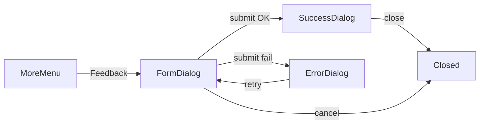

# Feedback dialog + backend

## Product rules (confirmed)

- Open from Navbar **Feedback** menu item ([`Navbar.tsx`](src/components/Navbar/Navbar.tsx)).
- Submit enabled only when **trimmed text is non-empty** and **rating is 1–5**.
- Stars: click sets 1…N; click same star again clears; **no hover preview**.
- Success → dialog phase **Received** ([Figma 2250:2606](https://www.figma.com/design/xvOrhZZAqLqapwAtYD5GEq/kara-no-key?node-id=2250-2606)): message + **close**.
- Error → dialog phase **Error** ([Figma 2250:2665](https://www.figma.com/design/xvOrhZZAqLqapwAtYD5GEq/kara-no-key?node-id=2250-2665)): message + **retry** (returns to form, **preserving** text + rating).

## Defaults (stated)

- **Append-only**: players may submit multiple feedback rows over time.
- Max message length **2000** chars (server-enforced).
- Auth: must have a valid lobby session (`requireLobbyPlayer`), same as other in-lobby APIs.
- `player_id` stored **without** FK to `players` (player rows are deleted on leave; feedback must persist). `lobby_id` optional FK with `on delete set null`.

## Backend

### Migration `supabase/migrations/010_player_feedback.sql`

```sql
create table player_feedback (
  id uuid primary key default gen_random_uuid(),
  player_id uuid not null,
  lobby_id uuid references lobbies(id) on delete set null,
  message text not null,
  rating int not null,
  created_at timestamptz not null default now(),
  constraint player_feedback_rating_range check (rating between 1 and 5),
  constraint player_feedback_message_len check (char_length(message) between 1 and 2000)
);

create index player_feedback_player_id_idx on player_feedback (player_id);
alter table player_feedback enable row level security;
```

### Edge function `supabase/functions/submit-feedback/index.ts`

Pattern-match [`submit-phrase-progress`](supabase/functions/submit-phrase-progress/index.ts):

1. CORS + POST only.
2. Validate `player_id`, `message` (string, trim, 1–2000), `rating` (int 1–5).
3. `requireLobbyPlayer(player_id, session_token)`.
4. Rate limit (e.g. 5 / 60s via existing [`checkRateLimit`](supabase/functions/_shared/rate-limit.ts)).
5. Insert `{ player_id, lobby_id: claims.lobbyId, message: trimmed, rating }`.
6. Return `{ ok: true }` or `{ error }` with appropriate status.

Register in [`scripts/deploy-hosted-supabase.sh`](scripts/deploy-hosted-supabase.sh).

### Client helper

In [`src/lib/supabase/functions.ts`](src/lib/supabase/functions.ts):

```ts
submitFeedback(playerId, message, rating)
```

Uses existing `invokeFunction` (auto-attaches `session_token`).

## Frontend

### Assets

Export Figma star SVGs (default + selected from node `2249:2409`) into:

- `public/icons/star-rating-default.svg`
- `public/icons/star-rating-selected.svg`

(Do not reuse award medal stars.)

### `FeedbackDialog` component

New [`src/components/FeedbackDialog/`](src/components/FeedbackDialog/) (`FeedbackDialog.tsx` + `.css`), built on existing [`Dialog`](src/components/Dialog/Dialog.tsx) + [`Button`](src/components/Button/Button.tsx), same phase pattern as [`JoinCodeModal`](src/components/JoinCodeModal/JoinCodeModal.tsx):

| Phase | Title | Body | Footer |
|-------|-------|------|--------|
| `form` | Feedback | Labeled textarea + star row | cancel / submit |
| `success` | Received | success copy | close |
| `error` | Error | error copy | retry |

Form details:

- Textarea: fixed height ~181px, vertical scroll when content overflows; placeholder `share your thoughts`; label `Your thoughts`.
- Star row: five 40px icon buttons, `gap: 4px`, label `Rate game`; `aria-label` / radiogroup semantics.
- Submit disabled unless `message.trim()` and `rating !== null`; disabled during in-flight request (`ariaBusy`).

### Wire into Navbar

In [`Navbar.tsx`](src/components/Navbar/Navbar.tsx):

- Feedback menu click → close menu, open `FeedbackDialog`.
- Dialog owns submit via `getPlayerId()` + `submitFeedback`.
- Close / cancel / success-close → unmount/reset dialog state.
- Retry → back to `form` with preserved fields.

No prop drilling through Lobby/Search/Game/Awards screens (Navbar is already shared).



## Out of scope

- Amplitude instrumentation (unless you ask later).
- Design-system gallery entry (can add if you want parity with other components).
- Unique-one-feedback-per-player constraint.