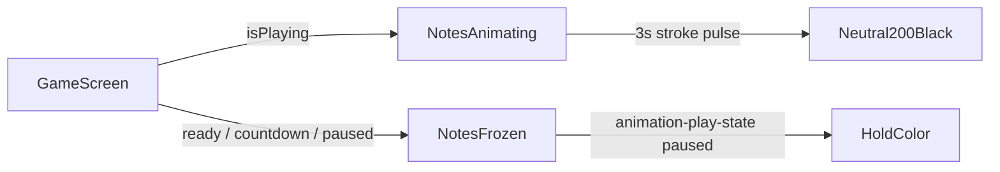

# Game screen musical note color pulse

## Behavior (confirmed)

- Notes spread across the game viewport (behind UI, non-interactive).
- Color pulse only — **no pendulum sway**.
- Pulse: stroke oscillates **neutral-200 ↔ black**, **3s full cycle**, ease-in-out, continuous while playing.
- Each note has a **staggered phase** so at rest/start they sit at different colors between **neutral-400 and black** (implemented via negative `animation-delay`).
- When song is **paused / ready / countdown / ended**: notes stay visible, **`animation-play-state: paused`** so they freeze on the current color.
- Honor `prefers-reduced-motion`: show notes at a static stroke (no pulse).

## Approach

Reuse orphaned [`MusicNoteDecorations`](src/components/MusicNoteDecorations/) (currently unused; this re-adopts it for game). Add a **`game`** variant + `isAnimating` prop; wire into [`GameScreen`](src/components/GameScreen/GameScreen.tsx).



## Implementation

### 1. Game decoration layout — [`decorations.ts`](src/components/MusicNoteDecorations/decorations.ts)

Add `GAME_PAGE_DECORATIONS` (~10–14 notes) using existing `MUSIC_NOTES` ids, positioned across the full viewport (corners, mid-sides, upper/lower thirds). Keep them out of the dense center typing panel enough that they read as atmosphere, not clutter. Varied rotations/widths like landing/search sets. No pendulum configs for game.

### 2. Component — [`MusicNoteDecorations.tsx`](src/components/MusicNoteDecorations/MusicNoteDecorations.tsx)

- Extend `variant` to `"landing" | "search" | "game"`.
- Add `isAnimating?: boolean` (default `false`).
- For `game`: render paths **without** `MotionG` / pendulum hooks.
- Apply per-note CSS vars for stagger, e.g. `--note-pulse-delay: -${phase}s` where phase is spread across `[0, 3)`.
- Class modifiers: `music-note-decorations--game`, path `music-note-decoration-path--pulse`, and `music-note-decorations--animating` when `isAnimating`.

### 3. Styles — [`MusicNoteDecorations.css`](src/components/MusicNoteDecorations/MusicNoteDecorations.css)

```css
@keyframes music-note-stroke-pulse {
  0%, 100% { stroke: var(--solid-black); }
  50% { stroke: var(--neutral-200); }
}

.music-note-decoration-path--pulse {
  animation: music-note-stroke-pulse 3s ease-in-out infinite;
  animation-delay: var(--note-pulse-delay, 0s);
  animation-play-state: paused;
}

.music-note-decorations--animating .music-note-decoration-path--pulse {
  animation-play-state: running;
}
```

Stagger delays chosen so the paused/initial frame of each note lands in the darker half of the cycle (reads as neutral-400 → black). Under `prefers-reduced-motion: reduce`, disable animation and use a fixed stroke (e.g. `var(--neutral-400)`).

### 4. Wire into GameScreen

In [`GameScreen.tsx`](src/components/GameScreen/GameScreen.tsx):

```tsx
<MusicNoteDecorations variant="game" isAnimating={isPlaying} />
```

Place early in `<main className="game-screen">` (fixed overlay, `z-index: 0`). Ensure `.game-screen__body` / navbar stack above via existing layout / `position: relative; z-index: 1` if needed so notes never cover controls or typing.

## Out of scope

- Pendulum / position motion
- Landing or search variants (unchanged; still available if reused later)
- Linear ticket updates for NIM-38 (orphaned-component cleanup) — this feature re-adopts the module instead of deleting it
