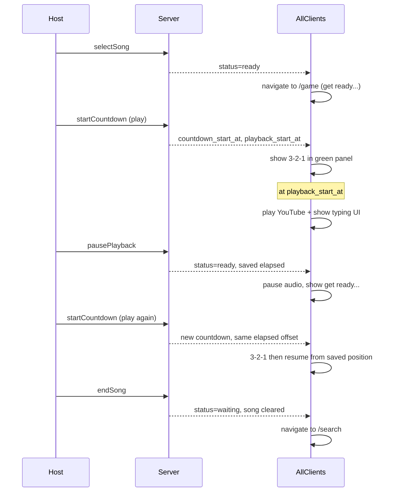

# Game Screen Play/Pause Flow

## Target UX (from Figma + your requirements)



After song selection, **everyone** lands on [`/game`](src/app/game/page.tsx) — no separate `/countdown` step, no confirm button, no “tap to enable audio” screens.

The game screen matches [Figma node 2102:2548](https://www.figma.com/design/xvOrhZZAqLqapwAtYD5GEq/kara-no-key?node-id=2102-2548):
- Song row: thumbnail + title + `elapsed / duration` timer
- Host controls: **play/pause icon button** (secondary) + **end song** (primary)
- Large green panel: `get ready...`, then **3-2-1 countdown**, then phrase typing
- Roster with **score** column (players already have `score` in API)

Icons: use existing [`public/icons/play_arrow.svg`](public/icons/play_arrow.svg) and [`public/icons/pause.svg`](public/icons/pause.svg) — no cancel/X icon on this screen.

---

## 1. Routing: song select → game

Update [`src/lib/lobby/lobbyRoute.ts`](src/lib/lobby/lobbyRoute.ts):

| Lobby status | Route |
|---|---|
| `waiting` + song_selection_started | `/search` |
| **`ready`** | **`/game`** (was `/countdown`) |
| `countdown` / `playing` | `/game` |

Changes:
- [`SearchFlow.tsx`](src/components/SearchFlow/SearchFlow.tsx): after `selectSong`, `router.replace("/game")`
- [`GameFlow.tsx`](src/components/GameFlow/GameFlow.tsx): allow mount when `status === "ready"` and song exists — **do not require** `playback_start_at`
- [`LandingFlow.tsx`](src/components/LandingFlow/LandingFlow.tsx), [`CountdownFlow.tsx`](src/components/CountdownFlow/CountdownFlow.tsx): remove `/countdown` redirects; redirect `ready`/`countdown`/`playing` → `/game`
- [`src/app/countdown/page.tsx`](src/app/countdown/page.tsx): redirect to `/game` (keep route as safety net, remove standalone flow)

---

## 2. Backend: playback state + host controls

### Migration `006_playback_elapsed.sql`

Add to `lobbies`:
```sql
playback_elapsed_ms bigint not null default 0
```

This stores how far into the song playback was when paused, so resume-after-countdown seeks to the correct position.

### Modify [`start-countdown`](supabase/functions/start-countdown/index.ts)

- Host-only; allowed when lobby has a selected song and status is `ready`, `countdown`, or `playing`
- **Always write fresh** `countdown_start_at = now` and `playback_start_at = now + 3s` (remove the early-return that reuses an in-progress countdown — each play press starts a new countdown)
- Set `status = countdown`
- Preserve existing `playback_elapsed_ms` (resume offset)
- Return `playback_elapsed_ms` + `server_now`

### New `pause-playback` edge function

- Host-only; allowed when status is `playing` (optionally also during `countdown` to cancel an in-flight countdown)
- Compute and persist:
  ```
  elapsed = playback_elapsed_ms + max(0, now - playback_start_at)
  ```
- Update lobby: `playback_elapsed_ms = elapsed`, `status = ready`, clear `countdown_start_at` and `playback_start_at`

### New `end-song` edge function

- Host-only
- Reset lobby to song-selection state:
  - `status = waiting`
  - `song_selection_started = true` (stay in search flow)
  - clear `selected_youtube_video_id`, countdown/playback timestamps, `playback_elapsed_ms`
- All clients poll → route back to `/search`

### Extend shared types

- [`supabase/functions/_shared/lobby-state.ts`](supabase/functions/_shared/lobby-state.ts): select + type `playback_elapsed_ms`
- [`get-lobby-state`](supabase/functions/get-lobby-state/index.ts): return `playback_elapsed_ms`
- [`src/lib/supabase/functions.ts`](src/lib/supabase/functions.ts): add `pausePlayback()` and `endSong()` clients; extend `GetLobbyStateResult`

---

## 3. Frontend sync logic

### Update [`usePlaybackSync`](src/lib/game/usePlaybackSync.ts)

Add `playbackElapsedMs` option. When playing:

```
elapsed = playbackElapsedMs + max(0, serverNow - playbackStartAt)
```

When paused/ready (no `playbackStartAt`): freeze display at `playbackElapsedMs`.

### Update [`GameFlow.tsx`](src/components/GameFlow/GameFlow.tsx)

- Track `countdownStartAt`, `playbackStartAt`, `playbackElapsedMs`, `lobbyStatus`, `isHost`
- Pass host action handlers: `onPlay`, `onPause`, `onEndSong`
- Poll-driven state drives all clients (host play/pause/end → server → all devices react)

### Playback behavior on all devices

When polled state transitions to `countdown` → show countdown overlay.

When `playback_start_at` is reached (`status` becomes `playing`):
- All clients call YouTube `seekTo(elapsedSec)` + `play()` automatically
- No per-player unlock button (per your direction: host controls everything)
- **Note:** some browsers may still block autoplay on non-host devices without prior page interaction. We will attempt programmatic play on countdown end; if blocked, log/handle gracefully (can add a minimal fallback prompt in a follow-up if needed during testing)

---

## 4. Redesign [`GameScreen`](src/components/GameScreen/GameScreen.tsx)

Replace current centered song-info + unlock UI with Figma layout.

### New sub-areas

**Song control bar** (top row):
- Compact song card: 56px thumbnail + title (`text-heading-3`)
- Timer: `formatTime(elapsed) / formatTime(duration)` in muted label style
- Host-only controls (gap 12px):
  - `IconButton` secondary — toggles play/pause icon
    - Show **play** when `ready` (paused/idle)
    - Show **pause** when `playing`
    - Disabled during countdown (host cannot interrupt mid-countdown unless we add cancel — defer unless needed)
  - `Button` primary — **end song**

**Main panel** (green `#59998c`, full width, flex-grow):
- `ready` → `get ready...` (light green muted text, `text-heading-2` style)
- `countdown` → large countdown number (reuse tick logic from [`CountdownScreen.tsx`](src/components/CountdownScreen/CountdownScreen.tsx))
- `playing` → [`PhraseTypingArea`](src/components/PhraseTypingArea/PhraseTypingArea.tsx)

**Remove entirely from game screen:**
- `audioUnlocked` state and “TAP TO ENABLE AUDIO” UI
- Separate countdown route dependency

### New [`IconButton`](src/components/IconButton/IconButton.tsx) component

Mirror existing [`Button`](src/components/Button/Button.tsx) variants (`primary` / `secondary`), 16px padding, 24px icon slot using `` / `pause.svg`.

### Layout CSS ([`GameScreen.css`](src/components/GameScreen/GameScreen.css))

Match Figma spacing: 120px gap between main + roster, 60px vertical padding, 20px gap between control bar and green panel, 40px panel padding. Use existing CSS variables where possible (`--color-accent-green`, semantic typography classes).

### Roster scores

Extend [`LobbyRoster`](src/components/LobbyRoster/LobbyRoster.tsx) with optional `variant="game"`:
- Header: `players` | `score` (green accent)
- Rows: name | score (instead of host/player role)

---

## 5. Cleanup

- Remove or gut [`CountdownScreen`](src/components/CountdownScreen/CountdownScreen.tsx) / [`CountdownFlow`](src/components/CountdownFlow/CountdownFlow.tsx) — extract countdown tick into a small hook (e.g. `useCountdownTick`) used by `GameScreen`
- Delete unused countdown CSS / audio-unlock styles
- Update any route references in polling flows

---

## Key files

| Area | Files |
|---|---|
| Routing | `lobbyRoute.ts`, `SearchFlow.tsx`, `GameFlow.tsx`, `LandingFlow.tsx` |
| Backend | `006_playback_elapsed.sql`, `start-countdown`, `pause-playback`, `end-song`, `get-lobby-state` |
| Game UI | `GameScreen.tsx/css`, new `IconButton.tsx/css`, `LobbyRoster.tsx/css` |
| Sync | `usePlaybackSync.ts`, `useLobbyStatePolling.ts`, `functions.ts` |

---

## Test plan

1. Host selects song → host + non-host players route to `/game`, green panel shows `get ready...`, timer at `0:00 / duration`
2. Host taps play → all devices show 3-2-1, then audio + typing starts in sync
3. Host taps pause → all devices pause, panel returns to `get ready...`, timer freezes at paused position
4. Host taps play again → new 3-2-1 on all devices, audio resumes from paused position
5. Host taps end song → all devices return to `/search`, song selection still active
6. Non-host cannot see/use play/pause/end controls
7. Verify play/pause icons render from `public/icons/` (not inline SVG or cancel icon)
