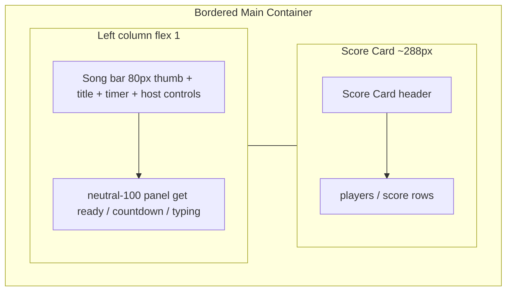

# Game screen UI revamp

## Design sources

| Frame | Node | What it shows |
|-------|------|----------------|
| Host game shell | [2258:3298](https://www.figma.com/design/xvOrhZZAqLqapwAtYD5GEq/kara-no-key?node-id=2258-3298) | Bordered main container: left column (song bar + gray panel) + right Score Card |
| Non-host | same shell | Identical layout; **no** play/pause / end song |

Figma’s X icon is ignored — keep existing **play/pause** `IconButton` + **end song** primary `Button`.

## Confirmed behavior

- Play / pause / end song / countdown / typing / scoring / YouTube sync unchanged.
- Non-host: same shell, host controls hidden (current behavior).
- Ready copy stays as today: host `click play to start the race`, non-host `get ready...`.
- Navbar / MusicNoteDecorations stay; out of scope for redesign.
- No Tailwind.

## Layout (mirror SearchScreen)

Match [`SearchScreen.css`](src/components/SearchScreen/SearchScreen.css) viewport pattern on [`GameScreen.css`](src/components/GameScreen/GameScreen.css):

- Root: `height: 100svh`, `overflow: hidden`, column flex
- Body: `flex: 1`, `min-height: 0`, `padding-top: var(--navbar-height)`, centered
- Main: `width: var(--layout-content-width)`, `padding: 40px 0`, fill remaining height
- Mobile (≤720px): `padding: 24px var(--size-20)`; stack score card under panel

## Visual structure (from Figma)

**Outer panel:** `1px --neutral-200` border, `flex: 1`, `overflow: hidden`, horizontal split (left flex, right fixed).

**Song bar** (inside left, bottom border):
- Padding `12px`; thumbnail `80×80`
- Title: Heading/H3 (`text-heading-3`); timer muted Button Label — keep marquee
- Host controls flush right: secondary play/pause + primary end song (no gap redesign beyond Figma flush pair)

**Typing / ready panel** (fills left below bar):
- `background: --neutral-100`, `padding: 40px`
- Existing states: ready textarea placeholder, countdown number, [`PhraseTypingArea`](src/components/PhraseTypingArea/PhraseTypingArea.tsx)

**Score Card** (right column, left border on shared container):
- Header row: `padding: 20px`, bottom border, title **Score Card** (H4 / 16 semibold)
- Body: `padding: 20px`, gap `12px`; green `players` / `score` headers; muted name + score rows (248px content width in Figma)
- Restyle [`LobbyRoster`](src/components/LobbyRoster/LobbyRoster.tsx) game variant to sit flush inside this column (title moves into bordered header chrome, or CSS wraps existing markup to match)

## Files to change

1. **[`GameScreen.tsx`](src/components/GameScreen/GameScreen.tsx)** — Restructure markup: one bordered shell → left (control bar + content panel) | right (roster). Drop the old `gap: 120px` side-by-side outside a shared border.
2. **[`GameScreen.css`](src/components/GameScreen/GameScreen.css)** — Viewport stretch like search; bordered split layout; 80px thumb; remove large outer gaps.
3. **[`LobbyRoster.css`](src/components/LobbyRoster/LobbyRoster.css)** (+ small TSX if needed) — Game variant: header/title padding and borders to match Score Card column; width fills parent (~288px) instead of floating 248px with 120px gap.

## Out of scope

- Navbar / Players dropdown
- Music note decorations behavior
- GameFlow APIs / scoring / playback sync
- PhraseTypingArea visual redesign beyond fitting the gray panel

## Implement order

1. GameScreen shell markup + Search-like viewport CSS
2. Song bar + panel metrics to Figma
3. LobbyRoster game Score Card chrome
4. Mobile stack pass + visual check vs Figma
