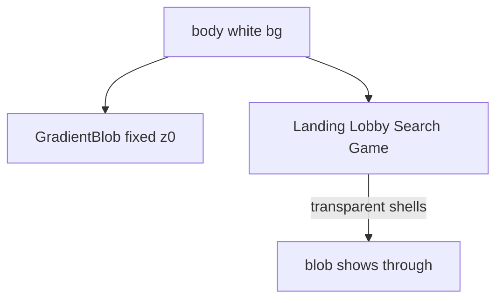

# Gradient blob + song text tweaks

## Design specs (from Figma)

**Gradient blob** ([Page: default `1:8`](https://www.figma.com/design/xvOrhZZAqLqapwAtYD5GEq/kara-no-key?node-id=1-8)):
- Soft radial ellipse SVG, 700×500, rotated **15°**
- Stops: `#AFE0D5` @ 25% opacity → `#BEE5DC` @ 12% → white @ 0%
- Sits behind content as ambient atmosphere (not a card / not inset media)

**Song panel text** ([Search title `2102:2552`](https://www.figma.com/design/xvOrhZZAqLqapwAtYD5GEq/kara-no-key?node-id=2102-2552)):
- **font-size:** `32px` (`Size/size-32`)
- **line-height:** `48px` (`Line Height/line-32`) — note: repo token `--line-32` is currently **40px** and must be corrected to **48px**
- Full style on ready copy: Geist Sans (`--family-primary`), weight 400, color `--neutral-400` / `--color-text-muted`

## 1. Shared gradient blob on all screens

- Download the Figma SVG asset and commit it as [`public/gradient-blob.svg`](public/gradient-blob.svg) (tiny radial ellipse; do not hand-author a different shape).
- Add [`src/components/GradientBlob/GradientBlob.tsx`](src/components/GradientBlob/GradientBlob.tsx) + [`GradientBlob.css`](src/components/GradientBlob/GradientBlob.css):
  - `position: fixed; inset: 0; pointer-events: none; z-index: 0; overflow: hidden`
  - Centered blob image (~700×500, `transform: rotate(15deg)`), `aria-hidden`
  - Scale down slightly on narrow viewports so it still reads as a soft wash
- Mount once in [`src/app/layout.tsx`](src/app/layout.tsx) so every route gets it.
- So the blob is visible, remove opaque full-page backgrounds from screen shells (they currently paint over anything behind them):
  - [`GameScreen.css`](src/components/GameScreen/GameScreen.css), [`LobbyScreen.css`](src/components/LobbyScreen/LobbyScreen.css), [`SearchScreen.css`](src/components/SearchScreen/SearchScreen.css): drop `background: var(--color-background)` on the root screen class
  - [`Navbar.css`](src/components/Navbar/Navbar.css): make navbar background transparent (keep border); content stays readable over the wash
- Keep interactive/content surfaces opaque (e.g. `.game-screen__panel`, song cards, dialogs). Body in [`globals.css`](src/app/globals.css) stays white.

## 2. Song screen text + token fix

- In [`src/styles/tokens/typography.css`](src/styles/tokens/typography.css): set `--line-32: 48px` to match Figma (also corrects `.text-heading-1` / landing title line-height).
- Update [`.game-screen__ready-message`](src/components/GameScreen/GameScreen.css) to the Search-title style:
  - `font-family: var(--family-primary)`
  - `font-size: var(--size-32)`
  - `font-weight: var(--weight-regular)`
  - `line-height: var(--line-32)` → 48px
  - keep muted color
- Update [`.phrase-typing-area__display`](src/components/PhraseTypingArea/PhraseTypingArea.css) **line-height only** to `var(--line-32)` (48px). Keep mono + semibold for character typing feedback; size is already 32px.

## Out of scope

- Reintroducing `MusicNoteDecorations`
- Redesigning landing typewriter / form layout beyond the shared blob
- Changing countdown numeral sizing (120px)