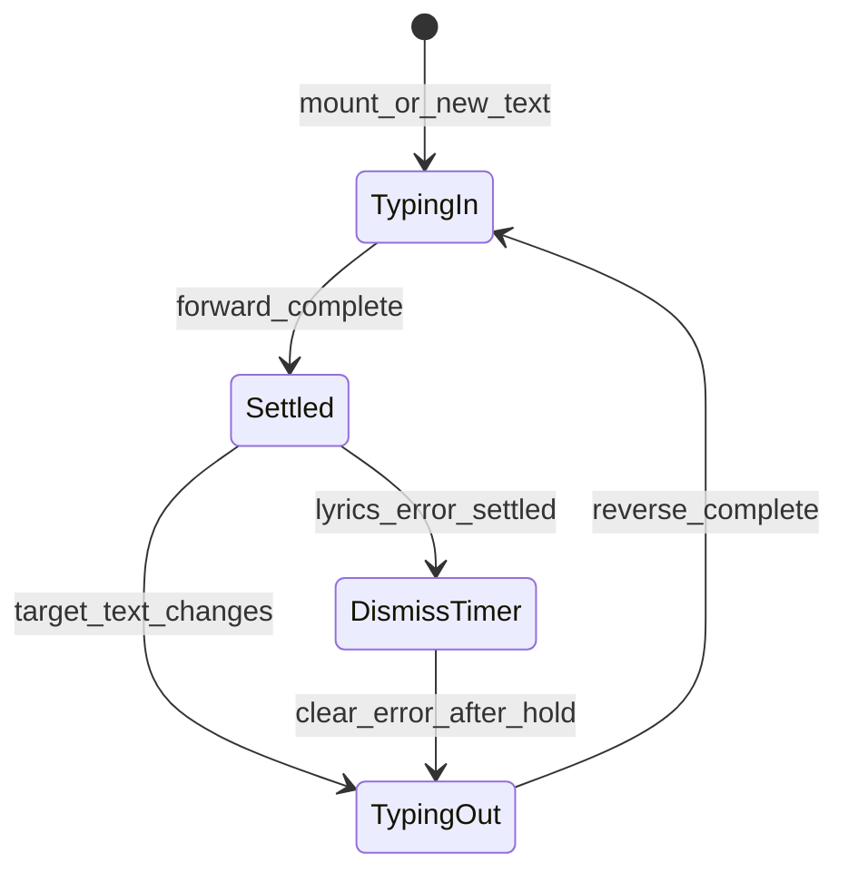

# Heading typewriter + lyrics error dismiss

## Problem

[`SearchFlow`](src/components/SearchFlow/SearchFlow.tsx) sets `lyricsTitleError` to `"No synced lyrics found for this song."` and [`SearchScreen`](src/components/SearchScreen/SearchScreen.tsx) shows it in [`Heading`](src/components/Heading/Heading.tsx) with `tone="error"`. That title stays until the next song confirm — no auto-dismiss, no text animation.

## Approach

Put typewriter behavior **inside `Heading`** so every screen that already uses it (`LandingFlow`, `LobbyScreen`, `SearchScreen`, `GameScreen`, `AwardsScreen`, design-system demos) gets the effect with no call-site animation logic.



### Intelligent animation rules

1. **Mount / first paint:** forward-type the label.
2. **Text change while settled (or mid-type):** reverse-type the *currently displayed* string (keep current tone), then switch to the new string + new tone, then forward-type.
3. **Speed:** slightly faster reverse than forward; longer strings type a bit faster so the error line does not drag (~28ms/char forward, ~16ms/char reverse, clamped).
4. **`prefers-reduced-motion`:** show full text immediately (no caret, no stagger) — match existing patterns in the repo.
5. **A11y:** keep the real accessible name as the full target string (`aria-label` on the heading); animated span is `aria-hidden`.
6. **Layout:** stack a hidden full-text sizer with the visible typed label (CSS grid same cell) so the boxed heading does not resize while characters appear — avoids jumping the song list.

### Lyrics error dismiss (2–3s)

In [`SearchFlow`](src/components/SearchFlow/SearchFlow.tsx) (or via a small callback from SearchScreen):

- When `lyricsTitleError` is set and Heading reports **forward type complete**, start a **2500ms** hold timer.
- On fire: `setLyricsTitleError(null)`.
- Heading sees `"Song?"` + default tone → reverse-types the error (still error tone) → forward-types `Song?` (default tone).
- Clear the timer if the user confirms another song (already clears error at confirm start) or if a new error replaces it.

SongCard `"no lyrics"` badges stay — only the title error is ephemeral.

## Implementation

### 1. `useTypewriterText` hook

New file: [`src/lib/ui/useTypewriterText.ts`](src/lib/ui/useTypewriterText.ts)

- Input: `target: string`, optional `enabled` (false under reduced motion).
- Output: `{ displayText, phase: "typing" | "deleting" | "settled", isAnimating }`.
- On `target` change: if `displayText` non-empty and differs, enter deleting → then typing; else typing.
- `onSettle?: () => void` when forward typing finishes and phase becomes `settled`.
- Use `window.setTimeout` / cleanup; respect reduced motion via `matchMedia("(prefers-reduced-motion: reduce)")` (same pattern as SearchScreen).

### 2. Upgrade `Heading`

[`Heading.tsx`](src/components/Heading/Heading.tsx) / [`Heading.css`](src/components/Heading/Heading.css):

- Narrow `children` to `string` (all current call sites already pass strings).
- Track **visual tone** separately: keep previous tone through reverse-out; apply incoming `tone` when forward-type of the new string starts.
- Render:
  - outer tag with `aria-label={children}`
  - `.heading__label` grid stack: sizer (`children`) + visible (`displayText`) + optional caret while `isAnimating`
- Soft blinking caret via CSS; disabled under reduced motion.
- Optional prop `onSettle?: () => void` forwarded from the hook (used only by Search for dismiss timing).

### 3. Wire ephemeral lyrics title in Search

[`SearchScreen.tsx`](src/components/SearchScreen/SearchScreen.tsx):

```tsx
<Heading
  ...
  tone={lyricsTitleError ? "error" : "default"}
  onSettle={() => {
    if (lyricsTitleError) onLyricsTitleErrorSettled?.();
  }}
>
  {lyricsTitleError ?? "Song?"}
</Heading>
```

[`SearchFlow.tsx`](src/components/SearchFlow/SearchFlow.tsx):

- Add `onLyricsTitleErrorSettled` handler that schedules `setLyricsTitleError(null)` after **2500ms**.
- Cancel that timeout on unmount, on next confirm (`setLyricsTitleError(null)` already runs), and if a new lyrics error is set.

### 4. Design-system smoke check

Existing error Heading demo in [`DesignSystemGallery.tsx`](src/app/design-system/DesignSystemGallery.tsx) will typewriter on load; no special dismiss needed there.

## Out of scope

- Changing SongCard `"no lyrics"` badges
- Typewriter for non-Heading copy (`PageLoader`, body alerts, `confirmError`)
- Typewriter click sounds
