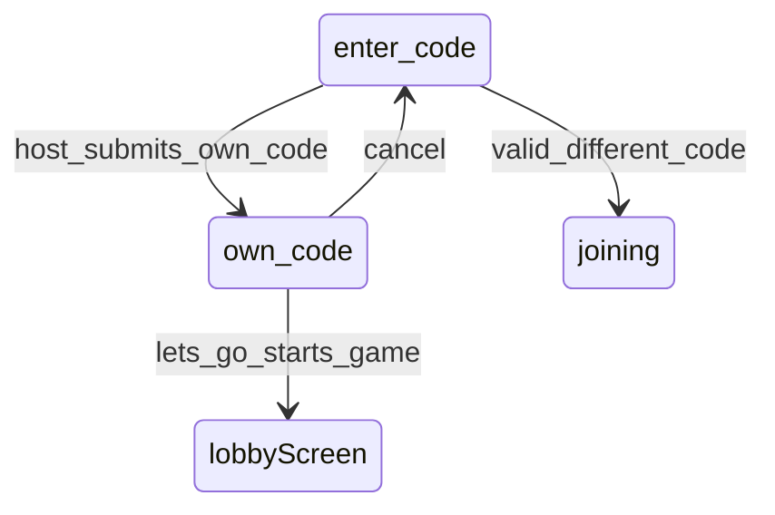

# Host Own-Code Join Error

## Problem

On the lobby screen, a **host** can click **"my fren gave me a code"** and enter their own displayed code. Today [`handleJoinLobby`](src/components/LandingFlow/LandingFlow.tsx) treats a matching code as a no-op success (skips `joinLobby`, fetches roster, closes modal) — no feedback that this is invalid.

```294:330:src/components/LandingFlow/LandingFlow.tsx
const normalizedJoinCode = normalizeLobbyCodeInput(joinCode);
const normalizedCurrentCode = normalizeLobbyCodeInput(lobbyCode);
// ...
if (!lobbyId || normalizedCurrentCode !== normalizedJoinCode) {
  // joinLobby API call
}
// matching code → silently succeeds
```

## Solution

Add a new join-modal phase and intercept on submit **before** calling `onJoinLobby`.



---

## 1. Extend modal phase type

In [`JoinCodeModal.tsx`](src/components/JoinCodeModal/JoinCodeModal.tsx):

```ts
export type JoinModalPhase =
  | "enter-code"
  | "joining"
  | "error"
  | "waiting-for-host"
  | "own-code";
```

Add a new render branch for `phase === "own-code"`:

- **Message:** `you cannot input your own code. wanna play the game yourself?`
- **Actions (50/50 row, same layout as enter-code):**
  - **cancel** (secondary) → `onClose`
  - **let's go** (primary) → new `onOwnCodeStartGame` callback

Reuse existing classes: `.join-code-modal__message` + `.join-code-modal__actions` + `.join-code-modal__action`.

Update dismiss rules:
- `canDismiss`: allow `"enter-code"`, `"error"`, and `"own-code"` (overlay click + Escape)
- `isBusy`: unchanged (`joining` | `waiting-for-host` only)

Add prop:

```ts
onOwnCodeStartGame: () => void;
```

---

## 2. Detect own code on submit in LobbyScreen

In [`LobbyScreen.tsx`](src/components/LobbyScreen/LobbyScreen.tsx), update `handleJoinSubmit`:

```ts
import { normalizeLobbyCodeInput } from "@/lib/lobby/lobbyCode";

async function handleJoinSubmit() {
  if (
    isHost &&
    normalizeLobbyCodeInput(joinCode) === normalizeLobbyCodeInput(lobbyCode)
  ) {
    onJoinModalPhaseChange("own-code");
    return;
  }

  onJoinModalPhaseChange("joining");
  // existing join flow...
}
```

Add handler for **let's go**:

```ts
function handleOwnCodeStartGame() {
  setIsJoinModalOpen(false);
  onJoinModalPhaseChange("enter-code");
  onStartGame();
}
```

Wire to modal:

```tsx
<JoinCodeModal
  ...
  onOwnCodeStartGame={handleOwnCodeStartGame}
/>
```

Update modal visibility to keep open during `own-code`:

```ts
const isModalOpen =
  isJoinModalOpen ||
  joinModalPhase === "joining" ||
  joinModalPhase === "error" ||
  joinModalPhase === "waiting-for-host" ||
  joinModalPhase === "own-code";
```

Update `handleCloseModal` to reset phase when closing from `own-code`.

---

## 3. No backend changes

This is a client-only guard. Host + matching normalized code is sufficient; no Edge Function changes needed.

---

## Files to change

| File | Change |
|------|--------|
| [`JoinCodeModal.tsx`](src/components/JoinCodeModal/JoinCodeModal.tsx) | Add `own-code` phase UI + `onOwnCodeStartGame` prop |
| [`LobbyScreen.tsx`](src/components/LobbyScreen/LobbyScreen.tsx) | Own-code detection, handlers, modal wiring |
| [`JoinCodeModal.css`](src/components/JoinCodeModal/JoinCodeModal.css) | Only if minor spacing tweaks needed (likely reuse existing) |

[`LandingFlow.tsx`](src/components/LandingFlow/LandingFlow.tsx) needs no changes — `lobbyCode`, `isHost`, and `onStartGame` are already passed to `LobbyScreen`.

---

## Test plan

1. Create lobby as host → land on lobby screen with code displayed
2. Click **my fren gave me a code** → enter your own code → **let's gooo**
3. Expect own-code message with **let's go** and **cancel** (no join API call)
4. **cancel** → modal closes, remain on lobby
5. Repeat → **let's go** → modal closes, navigates to `/search` (song selection)
6. Enter a *different* valid code → existing join flow unchanged
7. Non-host entering their current lobby code → existing behavior (not blocked)
