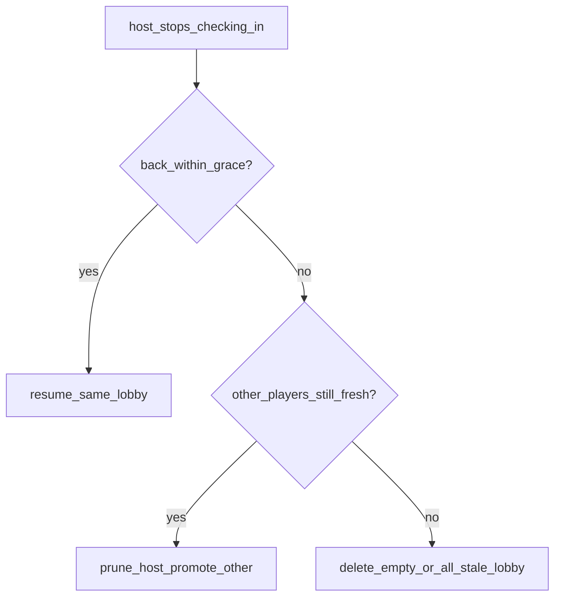

# Hybrid host tab-close (Option C)

Source of truth: [`plan/host-tab-close-edge-cases.md`](plan/host-tab-close-edge-cases.md).

**Locked product rules**

- Within grace: reconnect to the **same** lobby (stay host if still host).
- Friends still present after grace: **keep lobby**, promote earliest remaining player (already mostly true via prune).
- Lobby empty / everyone stale after grace: **delete lobby**.
- Old host returns after promote: may **join as a normal player** with the invite code (not auto-host).
- No browser close popup.

## Gap analysis (today vs wanted)

| Case | Today | Needed |
|---|---|---|
| Friends remain, host stale | Prune promotes | Keep (already works) |
| Host alone, closes tab | Lobby can linger forever | Scheduled cleanup deletes when all stale |
| Host back within 15s via get started | **409** if still fresh | **Resume** existing lobby |
| Refresh with session | Client restores lobby | Keep |
| Sleep / mid-race | 15s prune is harsh | Longer grace when lobby is in race states |
| Old invite after delete | Lobby not found | Clearer join error copy |
| Timing race | Prune uses current `last_seen_at` | Keep re-check-before-remove (already inherent) |

## Implementation

### 1. Grace helpers in [`player-leave.ts`](supabase/functions/_shared/player-leave.ts)

- Keep `PLAYER_STALE_MS = 15_000` for waiting / song selection.
- Add `PLAYER_STALE_IN_RACE_MS = 45_000` when lobby `status` is `countdown` | `playing` | `ready`.
- `staleMsForLobbyStatus(status)` helper.
- Update `pruneStalePlayers` to accept lobby status (or load it) and use the matching window.
- Only remove a player if they are **still** stale at remove time (re-read `last_seen_at` before `removePlayerFromLobby`) so a reconnect at the boundary wins.

### 2. Resume on create (within grace)

In [`create-lobby/index.ts`](supabase/functions/create-lobby/index.ts):

- If player has an **active** lobby membership and presence is **not** stale:
  - Touch presence, mint session token for **that** lobby.
  - Return success shaped like create today, plus `is_host` from the player row (do **not** create a new lobby, do **not** 409).
- If stale → keep existing reclaim then create-new path.

Client [`LandingFlow.tsx`](src/components/LandingFlow/LandingFlow.tsx) + [`CreateLobbyResult`](src/lib/supabase/functions.ts):

- Add optional `is_host` on create success; use `data.is_host ?? true` when saving session / `setIsHost`.

### 3. Empty / all-stale lobby cleanup (alone-host gap)

New Edge Function `cleanup-stale-lobbies`:

- Service-role only (verify JWT off or shared secret header — match other internal patterns if any; otherwise `verify_jwt: false` + require `Authorization: Bearer <service_role>` from cron).
- For each lobby that has players: run status-aware prune (same helper).
- Delete lobbies with **zero** players.
- This covers “everyone closed tabs” and “host alone abandoned.”

Schedule via Supabase Dashboard cron (every 1 minute) pointing at this function. Document the schedule step in the edge-cases doc or a short comment in the function README — no new product UI.

### 4. Join copy for dead lobbies

In [`join-lobby/index.ts`](supabase/functions/join-lobby/index.ts) (and validate if needed): when lobby missing/closed, return a clear message such as `"Lobby not found or has closed"`. Ensure landing join modal surfaces `error` from the API (already does via getErrorMessage).

### 5. Docs + Linear

- Update [`plan/host-tab-close-edge-cases.md`](plan/host-tab-close-edge-cases.md): mark Option C as **implemented behavior**, note 45s race grace, resume-on-create, cron cleanup.
- Update [NIM-42](https://linear.app/nimeshs-company/issue/NIM-42/be-lobby-expiration-and-cleanup) with this hybrid scope / AC.

### 6. Deploy

Deploy: `create-lobby`, `join-lobby`, `get-lobby-state`, `get-lobby-players`, `leave-lobby` (if shared helper changes), `cleanup-stale-lobbies`.

## Out of scope

- Custom `beforeunload` exit dialog
- Full `expires_at` TTL policy beyond all-stale/empty cleanup
- UI announcing “you are the new host” (nice-to-have later)

## Verify

- Alone host closes tab → within 15s get started → same lobby/code.
- Alone host closes tab → wait >15s (+ cron tick) → lobby gone; get started → new lobby; old code fails clearly.
- Host + friend; host closes → friend stays; after grace friend becomes host; race can continue.
- Host returns after promote → join with code as non-host.
- During playing, brief background &lt;45s does not immediately eject.
