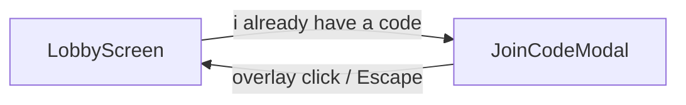

# Join Code Modal (Figma 2047:211)

## Goal

On the host code screen, **"i already have a code"** is an enabled secondary button (default variant). Clicking it opens the join-code modal from [Figma 2047:211](https://www.figma.com/design/xvOrhZZAqLqapwAtYD5GEq/kara-no-key?node-id=2047-211). **"let's gooo"** inside the modal remains a visual stub (no `joinLobby` call).



---

## Figma anatomy (2047:211)

| Layer | Spec |
|-------|------|
| Background | Existing lobby (code, copy, CTAs, navbar) visible but dimmed |
| Overlay | Full viewport, `rgba(0,0,0,0.6)`, `backdrop-filter: blur(4px)` |
| Modal panel | White, centered (`50% / 50%`), padding `20px`, inner gap `20px` |
| Input | Reuse [`InputField`](src/components/InputField/InputField.tsx), 248px wide, placeholder `enter your code`, centered text |
| CTA | Primary [`Button`](src/components/Button/Button.tsx), full width of panel (248px), label `let's gooo` — **no handler / disabled optional** |

Navbar, go-back, and feedback stay as-is behind the overlay (dimmed, non-interactive while modal is open).

---

## 1. New `JoinCodeModal` component

Create [`src/components/JoinCodeModal/JoinCodeModal.tsx`](src/components/JoinCodeModal/JoinCodeModal.tsx) + [`JoinCodeModal.css`](src/components/JoinCodeModal/JoinCodeModal.css).

**Props:**
- `joinCode: string`
- `onJoinCodeChange: (value: string) => void`
- `onClose: () => void`

**Structure:**
```tsx
<div className="join-code-modal">
  <button type="button" className="join-code-modal__overlay" onClick={onClose} aria-label="Close" />
  <div role="dialog" aria-modal="true" aria-labelledby="join-code-modal-title" className="join-code-modal__panel">
    <h2 id="join-code-modal-title" className="visually-hidden">Enter lobby code</h2>
    <InputField placeholder="enter your code" align="center" ... />
    <Button variant="primary" type="button">let&apos;s gooo</Button>
  </div>
</div>
```

**Behavior:**
- Overlay click → `onClose`
- `Escape` key → `onClose` (via `useEffect` listener while mounted)
- Autofocus input on open
- Body scroll lock optional (lightweight `overflow: hidden` on `document.body` while open)
- No submit handler on "let's gooo" (stub per your choice)

**CSS tokens:** use existing vars (`--solid-white`, `--color-background`, `--neutral-300` borders via InputField). Add overlay color as a CSS variable in the component file or reuse semantic tokens if preferred:

```css
.join-code-modal__overlay {
  background: rgba(0, 0, 0, 0.6);
  backdrop-filter: blur(4px);
}
```

Use fixed positioning + `inset: 0` + high z-index so modal sits above navbar and lobby content.

---

## 2. Update `LobbyScreen`

Modify [`src/components/LobbyScreen/LobbyScreen.tsx`](src/components/LobbyScreen/LobbyScreen.tsx) + [`LobbyScreen.css`](src/components/LobbyScreen/LobbyScreen.css).

**Changes:**
- Remove `disabled` from "i already have a code" — keep `variant="secondary"`
- Add local state: `isJoinModalOpen` (boolean)
- Secondary button `onClick` → `setIsJoinModalOpen(true)`
- When open, render `<JoinCodeModal />` as a sibling at end of `.lobby-screen` (positioned fixed, covers viewport)
- Pass `joinCode` / `onJoinCodeChange` from props (lifted to parent for future join wiring)
- Main lobby **"let's gooo"** stays `disabled` (unchanged)

Optional: add `.lobby-screen--modal-open` to prevent pointer events on background content (overlay already captures clicks).

---

## 3. Lift join-code state in `LandingFlow`

Update [`src/components/LandingFlow/LandingFlow.tsx`](src/components/LandingFlow/LandingFlow.tsx):

- Add `joinCode` state (string, default `""`)
- Pass to `LobbyScreen`: `joinCode`, `onJoinCodeChange={setJoinCode}`
- No new API calls this pass

Keeps join input value ready for a follow-up that wires `leaveLobby` + `joinLobby` on modal submit.

---

## Files touched

| Action | File |
|--------|------|
| Create | [`src/components/JoinCodeModal/JoinCodeModal.tsx`](src/components/JoinCodeModal/JoinCodeModal.tsx), [`JoinCodeModal.css`](src/components/JoinCodeModal/JoinCodeModal.css) |
| Modify | [`src/components/LobbyScreen/LobbyScreen.tsx`](src/components/LobbyScreen/LobbyScreen.tsx), [`LobbyScreen.css`](src/components/LobbyScreen/LobbyScreen.css) |
| Modify | [`src/components/LandingFlow/LandingFlow.tsx`](src/components/LandingFlow/LandingFlow.tsx) |

No backend changes.

---

## Test plan (manual)

- Create lobby → code screen shows enabled secondary **"i already have a code"** (gray default styling, hover works)
- Click it → dimmed overlay + centered white panel with input and **"let's gooo"**
- Type in input → value persists while modal is open
- Click overlay or press Escape → modal closes, lobby unchanged
- Go-back still works (modal should close first if open, or go-back closes modal — prefer closing modal on overlay only; go-back from navbar still calls leave flow)
- Main **"let's gooo"** below modal trigger remains disabled
- `prefers-reduced-motion`: no animation required (instant show/hide is fine)

---

## Out of scope (next pass)

- Wire modal **"let's gooo"** to `leaveLobby` + `joinLobby`
- Join error display inside modal
- Enter key submit
- Focus trap polish beyond autofocus + Escape
