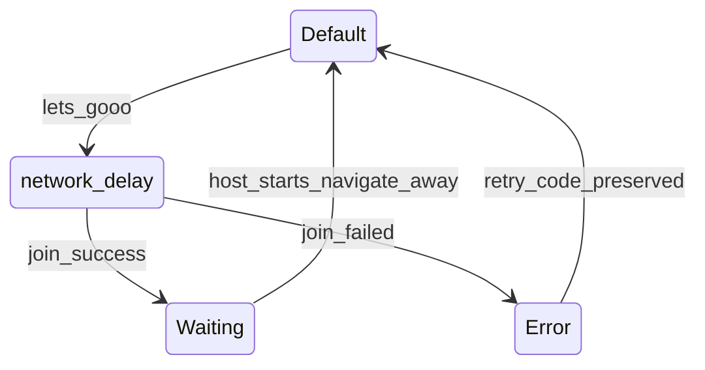

# Join Modal — Figma 2116:3002 Analysis & Plan

## What the design is

The Figma **Modal Container** ([2116:3002](https://www.figma.com/design/xvOrhZZAqLqapwAtYD5GEq/kara-no-key?node-id=2116-3002)) is a **340×172px white panel** (padding 20px, inner gap 20px). It does **not** include the backdrop — that stays as the existing overlay in [`JoinCodeModal.css`](src/components/JoinCodeModal/JoinCodeModal.css).

Four variant states in the component set:

| Figma variant | UI | Maps to code phase |
|---|---|---|
| **Default** | Full-width input (`enter the code`) + **Cancel** + **let's gooo** (disabled when empty) | `enter-code` |
| **Error** | Heading: `unable to connect. please enter the correct code.` + full-width **retry** | `error` (new) |
| **Waiting** | Two-line copy: `waiting for the host to start the race.` / `patience my humble fren.` | `waiting-for-host` |
| **network delay** | Centered `wait...` (20px heading style) | `joining` |



## How this compares to current code

[`JoinCodeModal.tsx`](src/components/JoinCodeModal/JoinCodeModal.tsx) already handles overlay, Escape, and phase wiring from [`LobbyScreen.tsx`](src/components/LobbyScreen/LobbyScreen.tsx). Gaps vs Figma:

1. **Layout** — Single 248px-wide primary button; Figma uses **full-width input** and a **50/50 button row** (Cancel secondary + let's gooo primary).
2. **Default copy** — Placeholder is `enter your code`; Figma says `enter the code`.
3. **Error UX** — Inline red error under input; Figma uses a **dedicated Error screen** with fixed copy and a **Retry** button (not reusing joinError text verbatim).
4. **Loading UX** — Button label becomes `joining...`; Figma swaps entire panel to **`wait...`** with no buttons.
5. **Waiting copy** — Single muted line; Figma uses **two lines** at 20px (`text-heading-3` style).
6. **Panel styling** — Uses `var(--color-background)` and no fixed width; Figma is **white**, **340px** wide.
7. **Disabled primary** — Current Button uses opacity; Figma uses **neutral-400 (#a3a3a3)** background with **40% white text** — may need a small CSS tweak on the modal's primary button when disabled.
8. **Dismiss rules** — Currently Escape works unless `isLoading`; you confirmed **block dismiss in both Waiting and network delay** (also overlay click).

## Proposed state model

Extend `JoinModalPhase` in [`JoinCodeModal.tsx`](src/components/JoinCodeModal/JoinCodeModal.tsx):

```ts
type JoinModalPhase = "enter-code" | "joining" | "error" | "waiting-for-host";
```

**LobbyScreen** ([`LobbyScreen.tsx`](src/components/LobbyScreen/LobbyScreen.tsx)) flow changes:

- `handleJoinSubmit`: `enter-code` → `joining` → on success `waiting-for-host`; on failure **`error`** (not back to `enter-code`).
- New `handleRetry`: `error` → `enter-code` (code preserved — your choice).
- `handleCloseModal`: only allowed when phase is `enter-code` or `error` (Retry path doesn't close; user can still Cancel from Default).
- `isModalOpen`: keep `isJoinModalOpen || joinModalPhase === "waiting-for-host"`; also stay open for `joining` and `error`.

**Error copy:** Use Figma's fixed string for the Error state UI. Server `joinError` can still be logged or used for aria-live, but the visible message matches design unless you want dynamic errors later.

## Component structure (per state)

Reuse existing [`InputField`](src/components/InputField/InputField.tsx) and [`Button`](src/components/Button/Button.tsx) — override width via modal CSS (`width: 100%` on input wrapper and button row).

```
join-code-modal__panel (340px, white, padding 20px, gap 20px)
├── [enter-code]
│   ├── InputField (full width, placeholder "enter the code", centered)
│   └── join-code-modal__actions (flex, gap 20px)
│       ├── Button secondary "cancel" → onClose
│       └── Button primary "let's gooo" → onSubmit (disabled until isLobbyCodeMinLength)
├── [joining]
│   └── p.text-heading-3 "wait..."
├── [error]
│   ├── p.text-heading-3 "unable to connect. please enter the correct code."
│   └── Button primary full-width "retry" → onRetry
└── [waiting-for-host]
    └── p.text-heading-3 (two lines with line break)
```

**Accessibility:** Keep `role="dialog"`, update visually hidden title per phase. During `joining` / `waiting-for-host`, set `aria-busy="true"` and disable overlay button.

## CSS changes ([`JoinCodeModal.css`](src/components/JoinCodeModal/JoinCodeModal.css))

- Panel: `width: 340px`, `background: var(--color-surface)` or `#fff` token if one exists, `gap: 20px`.
- Actions row: `display: flex; gap: 20px; width: 100%` with each button `flex: 1`.
- Waiting / loading / error message: `text-heading-3`, centered, full width.
- Optional: modal-scoped disabled primary override to match Figma gray (`--neutral-400`) instead of opacity-only — check [`src/styles/tokens/colors.css`](src/styles/tokens/colors.css) for existing tokens before adding new ones.

Remove obsolete `.join-code-modal__submit` fixed 248px width and inline error styles (Error state replaces them).

## Files to touch

| File | Change |
|---|---|
| [`JoinCodeModal.tsx`](src/components/JoinCodeModal/JoinCodeModal.tsx) | Four-state render tree, Cancel/Retry handlers, dismiss guards |
| [`JoinCodeModal.css`](src/components/JoinCodeModal/JoinCodeModal.css) | 340px panel, button row, message styles |
| [`LobbyScreen.tsx`](src/components/LobbyScreen/LobbyScreen.tsx) | Phase transitions (`error`, `onRetry`), stricter close rules |
| [`LandingFlow.tsx`](src/components/LandingFlow/LandingFlow.tsx) | Reset `joinModalPhase` on exit (already does); no logic change expected |

No new component file needed — this is a visual/UX refresh of the existing modal, not a generic `ModalContainer` abstraction (unless you want that later).

## Test plan

1. Open modal from **my fren gave me a code** → Default: empty input, disabled let's gooo, Cancel closes.
2. Type 6-char code → let's gooo enables (black primary).
3. Submit with bad code → **Error** screen; Retry returns to Default with code intact.
4. Submit with good code → **wait...** (no dismiss); then **Waiting** copy (no dismiss).
5. Host starts race → modal closes / navigates to `/search` (existing polling).
6. Escape / overlay during Default and Error → dismiss works; during joining/Waiting → blocked.
