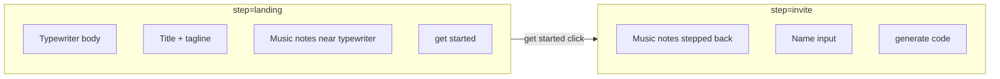

# Landing → Invite In-Page Transition

## Goal

Clicking **get started** on `/` triggers an animated state change (no route navigation):

1. **Music notes** — animate from tight positions around the typewriter to scattered viewport positions (Figma `2030:179` / nodes `2032:433+`)
2. **Typewriter + title + tagline** — fade out and move up
3. **Name input + generate code button** — fade in and move up from below

Uses existing `motion` package (`motion/react`) already in the project.



## Architecture

### Single-page orchestrator

Convert [`src/app/page.tsx`](src/app/page.tsx) to a thin server wrapper that renders a new client component:

- [`src/components/LandingFlow/LandingFlow.tsx`](src/components/LandingFlow/LandingFlow.tsx) — holds `step: 'landing' | 'invite'` state, wires animations
- [`src/components/LandingFlow/LandingFlow.css`](src/components/LandingFlow/LandingFlow.css) — layout + invite form styles (migrate from [`src/app/name/page.css`](src/app/name/page.css))

### Separate music notes from the SVG (without editing the 600k-line file)

Music notes are embedded inside [`TypewriterIllustration.tsx`](src/components/TypewriterIllustration/TypewriterIllustration.tsx). Rather than refactor that file, **hide the SVG's built-in note groups via CSS** and render an overlay layer from the start:

```css
/* page.css */
.typewriter-image--body-only #music,
.typewriter-image--body-only #music_2,
/* ...all 8 ids... */
.typewriter-image--body-only #music_6 {
  display: none;
}
```

The overlay [`AnimatedMusicNotes`](src/components/AnimatedMusicNotes/AnimatedMusicNotes.tsx) (refactored from [`MusicNoteDecorations`](src/components/MusicNoteDecorations/MusicNoteDecorations.tsx)) renders the same 8 note paths from [`musicNotes.ts`](src/components/MusicNoteDecorations/musicNotes.ts) and keeps pendulum step animation via `usePendulumRotations`.

### Dual position configs per note

Extend [`decorations.ts`](src/components/MusicNoteDecorations/decorations.ts) into a unified config with **landing** and **invite** positions per note (shared `noteId`):

| Note ID | Landing source | Invite source |
|---------|---------------|---------------|
| `music`, `music_2`, … `music_6` | SVG viewBox coords from [`pendulum.ts`](src/components/TypewriterIllustration/pendulum.ts) origins (~14/552, 60/414, etc.) | Updated Figma pixel positions on 1512×982 frame (`2032:433`–`2032:447`), converted to viewport `%` |

**Landing position math:** On mount/resize, read the typewriter illustration's `getBoundingClientRect()` and map each note's SVG coordinate to viewport `left`/`top` pixels:

```
viewportX = rect.left + (svgX / 552) * rect.width
viewportY = rect.top  + (svgY / 414) * rect.height
```

**Invite positions:** Use latest Figma coordinates (e.g. `music` at ~24% left / 21% top; `music_2` at ~64% / 11%; etc.) — update [`decorations.ts`](src/components/MusicNoteDecorations/decorations.ts) to match the current design, replacing the older percentage values.

Each note is a `motion.div` with `position: fixed`, animated between landing and invite `top`/`left`/`width`/`rotate` when `step` changes.

## Animation spec (Framer Motion)

All animations respect `useReducedMotion()` — if true, jump directly to invite layout with no motion.

| Element | Landing → Invite | Suggested transition |
|---------|-----------------|---------------------|
| Music notes | Tight → stepped-back viewport positions | `duration: 0.7`, `ease: [0.4, 0, 0.2, 1]`, slight `staggerChildren: 0.04` |
| Typewriter + title block | `opacity: 1, y: 0` → `opacity: 0, y: -48` | `duration: 0.5` |
| get started button | fade out with typewriter block | same as above |
| Name form (input + generate code) | `opacity: 0, y: 48` → `opacity: 1, y: 0` | `duration: 0.5`, `delay: 0.15` via `AnimatePresence` |

Use `AnimatePresence` for the invite form so it mounts only when `step === 'invite'`.

### LandingFlow structure

```tsx
<main className="landing-page">
  <AnimatedMusicNotes step={step} illustrationRef={illustrationRef} />

  <AnimatePresence mode="wait">
    {step === "landing" && (
      <motion.div key="landing" /* exit: fade up */>
        <div className="typewriter-container" ref={illustrationRef}>
          <TypewriterIllustration className="typewriter-image typewriter-image--body-only" />
          <div className="text-container">...</div>
        </div>
        <Button onClick={() => setStep("invite")}>get started</Button>
      </motion.div>
    )}
  </AnimatePresence>

  <AnimatePresence>
    {step === "invite" && (
      <motion.div key="invite" /* enter: from bottom */>
        <textarea placeholder="what name do you vibe with?" />
        <Button type="button">generate code</Button>
      </motion.div>
    )}
  </AnimatePresence>
</main>
```

Invite form reuses existing styles: 580px column, 292px input, placeholder/value colors, 2-row textarea.

## Cleanup

- **Remove** [`src/app/name/`](src/app/name/) route (page.tsx + page.css) — no longer needed
- **Rename/refactor** `MusicNoteDecorations` → `AnimatedMusicNotes` with `step` + `illustrationRef` props
- **Update** [`Button`](src/components/Button/Button.tsx): landing uses `onClick` instead of `href="/name"`
- Keep shared pieces: `Button`, `musicNotes.ts`, `usePendulumRotations`, design tokens

## Files

| Action | File |
|--------|------|
| Create | `src/components/LandingFlow/LandingFlow.tsx`, `LandingFlow.css` |
| Refactor | `MusicNoteDecorations` → `AnimatedMusicNotes` (component + CSS + `decorations.ts`) |
| Modify | `src/app/page.tsx`, `src/app/page.css` |
| Delete | `src/app/name/page.tsx`, `src/app/name/page.css` |

## Test plan

- Click **get started** — no URL change, no full page reload
- Music notes visibly step back from typewriter area to viewport edges
- Typewriter, title, tagline, and get started button fade up and disappear
- Input + generate code appear from below, matching Figma layout (580px column, 292px input)
- Placeholder wraps and typed text is black
- Pendulum step animation continues on notes throughout
- `prefers-reduced-motion` skips animation, shows invite state instantly
- Resize window before clicking — landing note positions still align with illustration

## Out of scope

- `generate code` button logic
- Persisting name / URL updates
- Refactoring inline SVG in `TypewriterIllustration.tsx`
