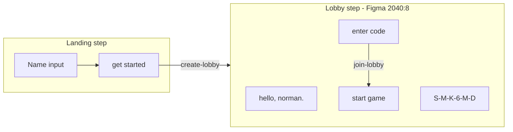

# Lobby Code Screen (Figma 2040:8)

## Goal

When a user enters their name on the landing page and clicks **get started**, the app creates a real lobby via the existing `create-lobby` Edge Function, then transitions (simple fade) to the code screen from [Figma node 2040:8](https://www.figma.com/design/xvOrhZZAqLqapwAtYD5GEq/kara-no-key?node-id=2040-8).



## Figma screen anatomy (node `2040:8`)

| Element | Figma content | Implementation |
|---------|---------------|----------------|
| Navbar | `hello, norman.` | `hello, {displayName}.` — muted body text, top of page |
| Hero code | `A-0-S-D-1` | Formatted lobby code with dashes: `SMK6MD` → `S-M-K-6-M-D` |
| Instructions | `share this code... (or) have code?` | Static copy, centered, muted |
| Join input | `enter code` placeholder, 248px | Reuse [`InputField`](src/components/InputField/InputField.tsx) |
| CTA | `start game` black button, full width of form column | Reuse [`Button`](src/components/Button/Button.tsx) |

Layout: 580px centered column, 60px gap between hero block and join form, 12px gap between input and button. Plain CSS only — no Tailwind.

---

## Backend: Module 6 — `join-lobby`

New Edge Function at [`supabase/functions/join-lobby/index.ts`](supabase/functions/join-lobby/index.ts).

**Request:** `{ player_id, display_name, code }`

**Validation (from [`plan/backend-overview.md`](plan/backend-overview.md)):**
1. Valid `player_id` (UUID) and `display_name` (reuse [`display-name.ts`](supabase/functions/_shared/display-name.ts))
2. Valid lobby code format (reuse [`lobby-code.ts`](supabase/functions/_shared/lobby-code.ts))
3. Lobby exists and `status === 'waiting'` (reject late joins)
4. Lobby not at capacity (`max_players = 10`)
5. Display name not taken in lobby (DB unique index from migration 002)
6. Player not already in an active lobby (same 409 logic as `create-lobby`)

**If player was host of a `waiting` lobby they're abandoning:** delete or close old lobby if they are the only player; otherwise reject with meaningful error (keep simple: return 409 if already in active lobby, require explicit leave later).

**Simpler MVP rule:** if `player_id` already in active lobby, return `409`. Host who wants to join another lobby must refresh / future `leave-lobby`.

**Response (200):**
```json
{ "code": "ABX92K", "lobby_id": "...", "player_id": "...", "display_name": "Alex", "is_host": false }
```

**Error responses:** 400 (validation), 404 (lobby not found), 409 (full / duplicate name / already in lobby), 403 (game already started).

**Client helper:** add `joinLobby(playerId, displayName, code)` to [`src/lib/supabase/functions.ts`](src/lib/supabase/functions.ts).

**Deploy:** add `join-lobby` to [`scripts/deploy-hosted-supabase.sh`](scripts/deploy-hosted-supabase.sh).

---

## Frontend architecture

### 1. `LandingFlow` orchestrator (new)

[`src/components/LandingFlow/LandingFlow.tsx`](src/components/LandingFlow/LandingFlow.tsx) + [`LandingFlow.css`](src/components/LandingFlow/LandingFlow.css)

- Client component with `step: 'landing' | 'lobby'`
- State: `displayName`, `lobbyCode`, `lobbyId`, `isHost`, `isLoading`, `error`
- On mount: read `getPlayerId()` from [`src/lib/player/identity.ts`](src/lib/player/identity.ts)
- Simple fade via `motion/react` `AnimatePresence` (respect `useReducedMotion`)
- Thin wrapper in [`src/app/page.tsx`](src/app/page.tsx)

### 2. Landing step (existing UI, wired up)

Keep current typewriter + title + tagline from [`page.tsx`](src/app/page.tsx). Wire:
- Controlled `InputField` for name
- **get started** → client-side name trim → call `createLobby(playerId, name)` → on success set lobby state → `step = 'lobby'`
- Loading: disable button, show subtle loading state
- Errors: inline message below form (validation errors from backend)

### 3. `LobbyScreen` component (new, matches Figma 2040:8)

[`src/components/LobbyScreen/LobbyScreen.tsx`](src/components/LobbyScreen/LobbyScreen.tsx) + [`LobbyScreen.css`](src/components/LobbyScreen/LobbyScreen.css)

```tsx
// Structure
<main className="lobby-screen">
  <header className="lobby-screen__greeting">hello, {name}.</header>
  <section className="lobby-screen__hero">
    <h1 className="lobby-screen__code text-heading-1">{formattedCode}</h1>
    <p className="lobby-screen__instructions text-body">...</p>
  </section>
  <form className="lobby-screen__join-form">
    <InputField placeholder="enter code" align="center" />
    <Button>start game</Button>
  </form>
</main>
```

**Code formatting utility:** [`src/lib/lobby/formatLobbyCode.ts`](src/lib/lobby/formatLobbyCode.ts)
```typescript
formatLobbyCode("SMK6MD") // → "S-M-K-6-M-D"
```

### 4. `start game` button behavior

Two paths on the lobby screen:

| Condition | Action |
|-----------|--------|
| Join input **empty** + user is **host** | Stub for Module 7 — button disabled with tooltip or no-op; host cannot "start game" until lifecycle is built |
| Join input **filled** | Call `joinLobby(playerId, displayName, code)` → on success update lobby state (switch to joined lobby view) |

This matches Figma layout while deferring full game-start lifecycle.

### 5. Session persistence (lightweight)

[`src/lib/player/session.ts`](src/lib/player/session.ts) — store `{ displayName, lobbyCode, lobbyId, isHost }` in `sessionStorage` on create/join success. On `LandingFlow` mount, restore to `lobby` step if session exists (handles refresh).

---

## Files to create / modify

| Action | File |
|--------|------|
| Create | `supabase/functions/join-lobby/index.ts` |
| Create | `src/components/LandingFlow/LandingFlow.tsx`, `LandingFlow.css` |
| Create | `src/components/LobbyScreen/LobbyScreen.tsx`, `LobbyScreen.css` |
| Create | `src/lib/lobby/formatLobbyCode.ts` |
| Create | `src/lib/player/session.ts` |
| Modify | `src/app/page.tsx` — render `LandingFlow` |
| Modify | `src/app/page.css` — move landing styles or import from LandingFlow |
| Modify | `src/lib/supabase/functions.ts` — add `joinLobby` |
| Modify | `scripts/deploy-hosted-supabase.sh` — deploy + verify `join-lobby` |
| Modify | `package.json` — optional `test:format-lobby-code` script |

---

## Styling notes (from Figma tokens)

Reuse existing semantic classes from [`src/styles/semantic/typography.css`](src/styles/semantic/typography.css):
- Code: `text-heading-1` (32px semibold mono)
- Instructions + greeting: `text-body` with `var(--color-text-muted)`
- Form column: 248px (matches existing `InputField` width)
- Button: full width of form column (add `.lobby-screen__join-form .primary-button { width: 100% }`)

Greeting is top-aligned (not vertically centered with hero) per Figma navbar at `top: 0`.

---

## Test plan

**Backend (curl after deploy):**
- Join existing lobby `SMK6MD` with new player → 200
- Join nonexistent code → 404
- Join with duplicate display name → 409
- Join full lobby (seed 10 players) → 409
- Join with invalid code format → 400

**Frontend (manual):**
- Enter name → get started → fade to code screen with dashed code
- Greeting shows `hello, {name}.`
- Refresh restores lobby screen from sessionStorage
- Enter friend's code + start game → joins lobby (updates code display)
- Empty join input + start game → no-op / disabled for host
- Invalid name on landing → inline error, no transition
- `prefers-reduced-motion` → instant step change

---

## Out of scope (this pass)

- Full music-notes / typewriter exit animation (user chose simple fade)
- `start game` host lifecycle (Module 7 — countdown, playing)
- Realtime lobby sync (Module 9)
- Dedicated join-only landing for friends who skip create
- `leave-lobby` Edge Function
