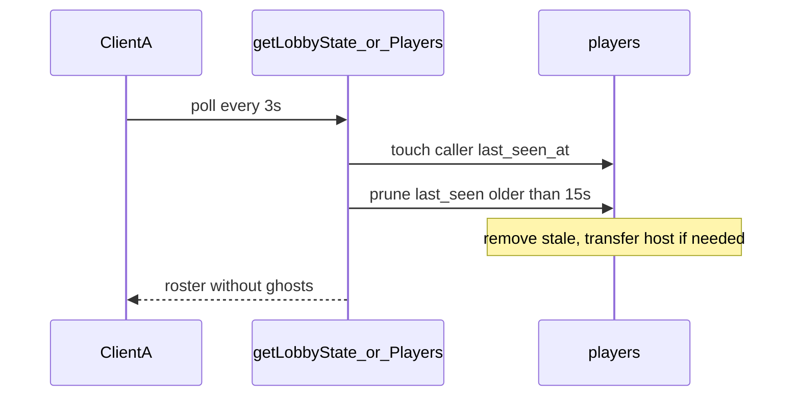

# Lobby tab-close disconnect

## Why not leave-on-unload

Immediate `pagehide` → `leaveLobby` would remove players on **refresh** too. [`plan/backend-overview.md`](plan/backend-overview.md) already requires a short reconnect window and refresh resume. Presence must be **server-owned** with TTL, not browser teardown.

## Root cause (today)

- Leave only runs from explicit UI exit ([`leaveLobby`](src/lib/supabase/functions.ts) in Landing/Search/Game/Results flows).
- `last_seen_at` / `is_connected` exist but are never updated after join and never used to prune.
- Roster APIs return every player row forever.

## Linear

**NIM-41** already exists: [Heartbeat / disconnect detection](https://linear.app/nimeshs-company/issue/NIM-41/be-heartbeat-disconnect-detection).

Do **not** create a duplicate. Update NIM-41 with:

- Tab-close repro (host + non-host)
- Chosen design (poll heartbeat + prune, 15s grace, no unload leave)
- Acceptance criteria matching the implementation below
- Priority **High**, status **In Progress** → **Done** after ship
- Relate to **NIM-42** (empty-lobby expiration) for the sole-host case where nobody remains to poll

## Taste learning

Add under **§2 Technical decisions** in [`plan/taste.md`](plan/taste.md), TASTE shape:

**Presence is server-owned (not tab teardown)**

- Tradeoff: unload `leaveLobby` vs heartbeat + grace prune
- Assessment: unload fires on refresh; sessionStorage clearing ≠ DB membership; columns already existed unused
- Stance: temporary disconnect must not eject; tab close must not ghost forever when others remain
- Tuning: stamp `last_seen_at` on lobby polls; prune after 15s; reuse leave/host-transfer path
- Effect: refresh reconnects; closed tabs drop out of the roster after the grace window

## Code changes

### 1. Shared leave / prune helpers

New [`supabase/functions/_shared/player-leave.ts`](supabase/functions/_shared/player-leave.ts):

- Extract remove + host-transfer + empty-lobby-delete logic from [`leave-lobby/index.ts`](supabase/functions/leave-lobby/index.ts) into something like `removePlayerFromLobby(supabase, playerId, lobbyId)`.
- New `pruneStalePlayers(supabase, lobbyId, now, staleMs = 15_000)`:
  - Select players in lobby with `last_seen_at < now - staleMs` (and not the caller if desired — usually fine to prune others only after touch)
  - For each stale player, call `removePlayerFromLobby` (order: non-hosts first, then host, so transfer is stable)
- New `touchPlayerPresence(supabase, playerId)` → `last_seen_at = now`, `is_connected = true`

Refactor [`leave-lobby/index.ts`](supabase/functions/leave-lobby/index.ts) to use `removePlayerFromLobby`.

### 2. Heartbeat + prune on poll paths

In [`get-lobby-state/index.ts`](supabase/functions/get-lobby-state/index.ts) and [`get-lobby-players/index.ts`](supabase/functions/get-lobby-players/index.ts), after auth:

1. `touchPlayerPresence` for the calling player
2. `pruneStalePlayers` for that lobby
3. Then fetch/return the player list as today

No new client APIs or unload handlers. Existing 3s polls in [`useLobbyStatePolling`](src/lib/lobby/useLobbyStatePolling.ts) / [`useLobbyRosterPolling`](src/lib/lobby/useLobbyRosterPolling.ts) become the heartbeat.

### 3. Grace window

**15 seconds** (~5 missed polls). Long enough for refresh/navigation; short enough that ghosts clear quickly when others remain.

### 4. Known residual (out of this PR’s hard guarantee)

If the **last remaining player** closes the tab, nobody polls to prune — lobby can linger until **NIM-42** expiration cleanup. Document that in NIM-41 / taste; do not add unload leave in this change.

## Verification

- Two browsers in one lobby: close one tab → within ~15s the other roster drops them; host close promotes the other player.
- Refresh while in lobby: player stays (reconnect within grace).
- Explicit Exit lobby: still immediate via `leave-lobby`.
- Deploy updated Edge Functions (`get-lobby-state`, `get-lobby-players`, `leave-lobby`) for Vercel/prod to pick up server behavior.
