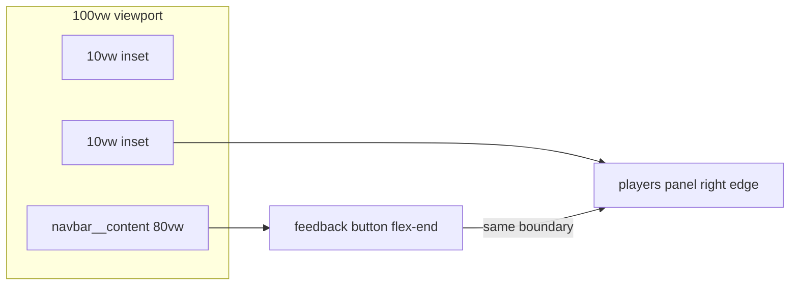

# Lobby Figma Parity (2040:8 / 2071:679)

## Key layout principle — 80vw is the authority

All horizontal alignment decisions derive from the **already-implemented** navbar content width (`80vw`), not from Figma's fixed `120px` padding on the 1512px artboard.



**Math (any viewport width):**

| Property | Value |
|----------|-------|
| Content width | `80vw` |
| Side inset | `calc((100vw - 80vw) / 2)` = **`10vw`** each side |
| Navbar content right edge | `10vw` from viewport right |
| Feedback button right edge | Same — sits at `flex-end` inside `navbar__content` |
| Players panel right edge | `right: 10vw` (via shared token) |
| Players panel left edge | `calc(100vw - 10vw - 248px)` — **not** Figma's `left: 1144px` |

**Important:** On a 1512px screen, Figma uses `120px` inset (~7.9%) while `80vw` gives `151px` inset (~10%). We intentionally follow **80vw**, not Figma pixel positions. The design intent we preserve is: *roster right edge = feedback button right edge = navbar content right edge*. Figma's `1144px` is only a snapshot of that relationship on a specific artboard — it is **not** a CSS target.

The players panel is **not** positioned relative to the 292px hero anchor (`left: calc(100% + 316px)`).

---

## Changes

### 1. Shared content width token (single source of truth for 80vw)

Add a CSS variable in [`src/styles/tokens/spacing.css`](src/styles/tokens/spacing.css):

```css
--layout-content-width: 80vw;
--layout-content-inset: calc((100vw - var(--layout-content-width)) / 2); /* 10vw */
```

Wire **both** consumers to this token:

- [`Navbar.css`](src/components/Navbar/Navbar.css) — replace hardcoded `80vw` on `.navbar__content` with `var(--layout-content-width)`
- [`LobbyScreen.css`](src/components/LobbyScreen/LobbyScreen.css) — roster uses `right: var(--layout-content-inset)`

No hardcoded `120px`, `1144px`, or `316px` offsets anywhere.

### 2. Players panel placement — [`LobbyScreen.css`](src/components/LobbyScreen/LobbyScreen.css)

Replace anchor-relative positioning:

```css
/* remove */
left: calc(100% + 316px);
top: 0;
```

With viewport-relative right alignment:

```css
.lobby-screen__body {
  position: relative; /* positioning context for roster */
}

.lobby-screen__roster {
  position: absolute;
  right: var(--layout-content-inset); /* aligns with feedback button */
  top: /* ~142px below navbar — align with lobby code block, not anchor top */;
  width: 248px;
}
```

`top` target: Figma places the panel at `234px` from viewport top (solo) / `247px` (multi) — roughly level with the lobby code, not flush with the anchor top. Tune to match visually (~`calc(92px + 60px body padding offset)` or anchor-relative `top` on the hero code element).

Mobile (≤720px): keep existing stack behavior (`position: static`, full width below main).

### 3. Main column structure — [`LobbyScreen.tsx`](src/components/LobbyScreen/LobbyScreen.tsx) + CSS

Match Figma's 580px outer column with 292px inner blocks:

- Wrap hero / divider / join in a `lobby-screen__content` (580px, viewport-centered)
- Keep hero and join blocks at 292px wide inside it
- Increase section gap from **60px → 120px**

The main column remains **viewport-centered** (not constrained to 80vw) — only the roster right edge shares the navbar content boundary.

### 4. "or" divider — [`LobbyScreen.tsx`](src/components/LobbyScreen/LobbyScreen.tsx) + CSS

Replace the solo-only `<hr>` with a permanent **line — or — line** divider (Figma nodes `2094:2395` / `2094:2416`):

- Always visible (solo **and** multi-player per 2071:679)
- Remove `isSolo` conditional around the divider
- Style: flex row, two `1px` rules flanking centered "or" label (16px, black)

### 5. Accent green styling

| Element | File | Change |
|---------|------|--------|
| Lobby code | `LobbyScreen.css` `.lobby-screen__code` | `color: #59998c` (or shared accent token) |
| Roster header | `LobbyRoster.css` `.lobby-roster__header` | Same accent green |

Search screen already uses `--search-accent: #59998c`; consider a shared `--color-accent-green` token.

### 6. Roster row spacing — [`LobbyRoster.css`](src/components/LobbyRoster/LobbyRoster.css)

- **20px** gap between rows when 1 player (Figma 2040:8)
- **12px** gap when 2+ players (Figma 2071:679)

Pass `playerCount` into spacing logic or use a modifier class from `LobbyScreen`.

---

## Out of scope

- Search / Game / Countdown screen layout changes (unless they also need roster right-edge alignment later)
- Navbar width change (80vw already implemented; this plan reuses it as the shared boundary)

---

## Verification

1. At any desktop width: **right edge of players panel** = **right edge of feedback button** = **right edge of `navbar__content`** (all at `10vw` inset)
2. Resize viewport: alignment holds because all three use the same `80vw` / `10vw` token — not fixed px
3. Solo (1 player): code is green, "or" divider visible, roster shows 1/8 + host row
4. Multi (3 players): "or" divider still visible, roster shows 3/8 + player list, instructions copy switches
5. Resize to ≤720px: roster stacks below main, no absolute positioning bleed
6. Visual check against [Figma 2040:8](https://www.figma.com/design/xvOrhZZAqLqapwAtYD5GEq/kara-no-key?node-id=2040-8) for typography, colors, and spacing — not for absolute px positions
