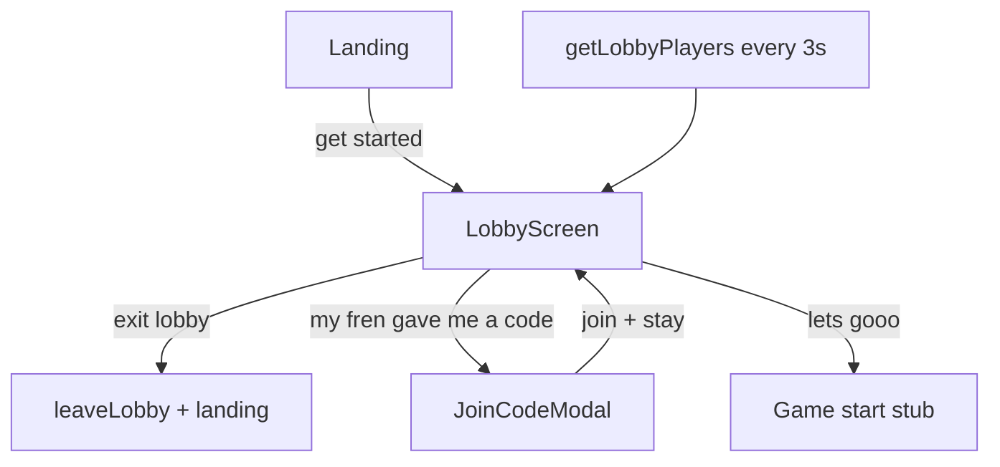

# Lobby Screen Redesign (Figma 2040:8 / 2071:679)

## Goal

The lobby becomes the **only waiting room**. Hosts can share their code, see friends join in real time, and tap **let's gooo** to start solo or with others (stubbed until Module 7). The separate Pool screen is removed from the flow.



---

## Design deltas (Figma vs current)

| Element | Current | New (Figma) |
|---------|---------|-------------|
| Navbar left | Arrow + "go back" text link | Secondary `Button`: **exit lobby** |
| Hero instructions (solo) | "share this code with your frens to begin the race." | "invite your friends by sharing this code, or start the race on your own." |
| Hero instructions (2+ players) | same | "share this code with your frens to begin the race." |
| Primary CTA placement | Below join section | **Inside hero block**, directly under instructions |
| Join section label | (none) | "did your fren give you a code?" |
| Join CTA | "i already have a code" | "my fren gave me a code" |
| Solo divider | none | Horizontal rule between hero and join section ([2040:8](https://www.figma.com/design/xvOrhZZAqLqapwAtYD5GEq/kara-no-key?node-id=2040-8)) |
| Player roster | Pool screen only | On lobby: **players joined X/Y** + name/role list when 2+ players ([2071:679](https://www.figma.com/design/xvOrhZZAqLqapwAtYD5GEq/kara-no-key?node-id=2071-679)) |

Layout: 580px centered main column (code + CTAs), roster panel beside/below per breakpoint. Plain CSS only — reuse existing tokens from [`src/styles/semantic/colors.css`](src/styles/semantic/colors.css) and typography classes.

---

## 1. Navbar — "exit lobby"

Update [`src/components/Navbar/Navbar.tsx`](src/components/Navbar/Navbar.tsx) + [`Navbar.css`](src/components/Navbar/Navbar.css):

- Replace the arrow + "go back" `<button>` with a secondary [`Button`](src/components/Button/Button.tsx) labeled **exit lobby**
- Rename prop `onGoBack` → `onExitLobby` (or keep callback name, change label only)
- Remove `.navbar__back-button` / `.navbar__back-icon` styles (arrow-left icon no longer used on this screen)

Behavior unchanged: calls existing `handleGoBack` in [`LandingFlow.tsx`](src/components/LandingFlow/LandingFlow.tsx) → `leaveLobby` → clear session → landing.

---

## 2. LobbyScreen UI restructure

Update [`src/components/LobbyScreen/LobbyScreen.tsx`](src/components/LobbyScreen/LobbyScreen.tsx) + [`LobbyScreen.css`](src/components/LobbyScreen/LobbyScreen.css):

**New props:**

```typescript
players: LobbyPlayer[];
maxPlayers: number;
rosterError: string | null;
isRosterLoading: boolean;  // true only on first fetch when players empty
onExitLobby: () => void;
onStartGame: () => void;   // stub
// keep: joinCode, onJoinCodeChange, onJoinLobby (renamed), isLoading, joinError
```

**Structure:**

```
main.lobby-screen
  Navbar(onExitLobby)
  div.lobby-screen__layout
    section.lobby-screen__main          // 292px content, 60px vertical gaps
      hero: code (uppercase) + contextual instructions + primary "let's gooo"
      [hr.lobby-screen__divider]        // only when players.length <= 1
      join block: "did your fren..." + secondary "my fren gave me a code"
    aside.lobby-screen__roster          // visible once roster data loaded
      header: "players joined" + "{count}/{maxPlayers}"
      ul player rows (name lowercase + host/player) — only when players.length > 1
  JoinCodeModal (unchanged behavior, updated copy if needed)
```

**Copy logic:**

- `players.length <= 1` → solo instructions + show divider
- `players.length > 1` → group instructions + hide divider + show player list

Reuse [`sortLobbyPlayers`](src/lib/lobby/sortLobbyPlayers.ts) for host-first ordering (same as old PoolScreen).

**Responsive layout:** mobile-first stack (main → roster below); at wider breakpoints use a two-column layout so roster sits to the right of the main column, matching Figma intent without absolute positioning.

---

## 3. Live roster on lobby (move polling from pool)

Update [`src/components/LandingFlow/LandingFlow.tsx`](src/components/LandingFlow/LandingFlow.tsx):

| Change | Detail |
|--------|--------|
| Remove `pool` step | `Step = "landing" \| "lobby"` only |
| Polling target | `useLobbyRosterPolling({ enabled: step === "lobby" })` |
| Rename error state | `poolError` → `lobbyRosterError` |
| Initial roster fetch | After `createLobby` success and on session restore to lobby, call `getLobbyPlayers` once (with loading spinner only when `players.length === 0`) |
| Remove handlers | `fetchAndShowPool`, `handleEnterPool`, `handleBackToLobby` |
| Rename handler | `handleJoinAndEnterPool` → `handleJoinLobby` — join via modal, close modal, **stay on lobby**, roster updates via poll/fetch |
| Add stub | `handleStartGame()` — no navigation; placeholder for Module 7 (button stays enabled) |
| Pass new props | `players`, `maxPlayers`, `rosterError`, `isRosterLoading`, `onStartGame`, `onExitLobby` to `LobbyScreen` |

Delete pool branch from `AnimatePresence` and remove `PoolScreen` import.

---

## 4. Backend — return `max_players` (small additive change)

Extend [`supabase/functions/get-lobby-players/index.ts`](supabase/functions/get-lobby-players/index.ts) to select `max_players` from `lobbies` and include it in the response.

Update types + client in [`src/lib/supabase/functions.ts`](src/lib/supabase/functions.ts):

```typescript
GetLobbyPlayersResult = { lobby_id, code, max_players, players }
```

Update `handleRosterUpdate` / polling `onUpdate` to also set `maxPlayers` state.

Note: Figma shows `/8`; DB default is `10` ([`001_initial_schema.sql`](supabase/migrations/001_initial_schema.sql)). Display `{count}/{max_players}` from API so the UI stays accurate. Changing the DB default to 8 is out of scope unless you want that alignment later.

---

## 5. Session persistence cleanup

Update [`src/lib/player/session.ts`](src/lib/player/session.ts):

- Remove `LobbyScreen = "code" \| "pool"` — lobby is the only in-lobby screen now
- Drop `screen` field (or keep only `"lobby"` / remove entirely)
- On restore: if session exists → `step = "lobby"` + fetch roster (migrate any stored `screen: "pool"` to lobby)

---

## 6. Remove Pool screen

Delete (no longer referenced):

- [`src/components/PoolScreen/PoolScreen.tsx`](src/components/PoolScreen/PoolScreen.tsx)
- [`src/components/PoolScreen/PoolScreen.css`](src/components/PoolScreen/PoolScreen.css)

[`useLobbyRosterPolling.ts`](src/lib/lobby/useLobbyRosterPolling.ts) stays — now serves the lobby step.

---

## Files touched

| Action | File |
|--------|------|
| Modify | [`src/components/Navbar/Navbar.tsx`](src/components/Navbar/Navbar.tsx), [`Navbar.css`](src/components/Navbar/Navbar.css) |
| Modify | [`src/components/LobbyScreen/LobbyScreen.tsx`](src/components/LobbyScreen/LobbyScreen.tsx), [`LobbyScreen.css`](src/components/LobbyScreen/LobbyScreen.css) |
| Modify | [`src/components/LandingFlow/LandingFlow.tsx`](src/components/LandingFlow/LandingFlow.tsx) |
| Modify | [`src/lib/supabase/functions.ts`](src/lib/supabase/functions.ts) |
| Modify | [`supabase/functions/get-lobby-players/index.ts`](supabase/functions/get-lobby-players/index.ts) |
| Modify | [`src/lib/player/session.ts`](src/lib/player/session.ts) |
| Modify | [`src/lib/lobby/useLobbyRosterPolling.ts`](src/lib/lobby/useLobbyRosterPolling.ts) — extend `LobbyRosterUpdate` with `max_players` |
| Delete | [`src/components/PoolScreen/`](src/components/PoolScreen/) |

No changes to `JoinCodeModal` structure beyond wiring; modal submit still calls join handler.

---

## Test plan (manual)

1. Create lobby → lobby shows solo copy, divider, **exit lobby**, **let's gooo**, join section; roster shows `1/{max}`
2. Second browser joins same code → host lobby updates within ~3s; copy switches to group version; player list appears; divider hides
3. **exit lobby** → `leaveLobby` fires, returns to landing
4. **my fren gave me a code** → modal opens; successful join stays on lobby with updated code/roster
5. **let's gooo** (solo or with players) → no navigation (stub); no errors
6. Refresh on lobby → restores lobby + roster
7. Tab away/back → immediate roster refetch

---

## Out of scope

- Game start lifecycle (Module 7 — countdown, playing)
- Changing `max_players` DB default from 10 to 8
- Supabase Realtime (still polling)
- Feedback button action
