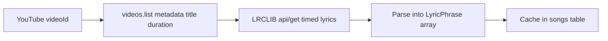
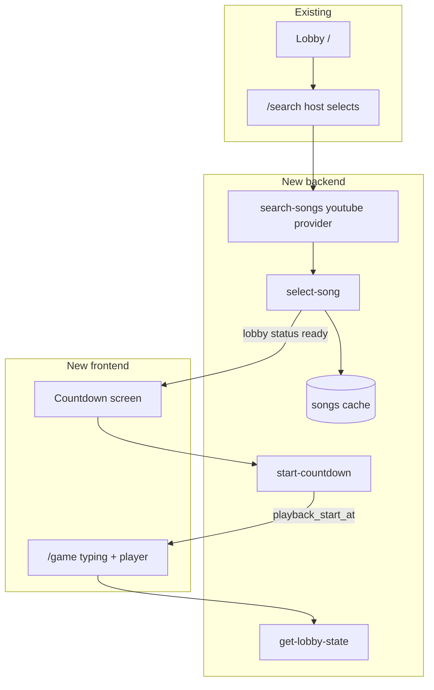

# Multiplayer Typeaoke Game Plan

## Goal

Deliver a **multiplayer [typeaoke](https://type.pauwee.com/)** experience:

1. **Synced music** — all clients play the same YouTube video aligned to a server timestamp
2. **Players hear audio** — YouTube IFrame Player with an explicit user gesture before play
3. **Phrase-by-phrase typing** — timed lyric lines shown as placeholders, typed in sync with playback

**Phase 1 song selection:** in-app **YouTube search only** (no paste-URL field).

---

## What you need to provide

### 1. YouTube Data API key (required before Phase 1)

| Step | Action |
|------|--------|
| 1 | Go to [Google Cloud Console](https://console.cloud.google.com/) → create or select a project |
| 2 | **APIs & Services → Library** → enable **YouTube Data API v3** |
| 3 | **APIs & Services → Credentials** → **Create credentials → API key** |
| 4 | Restrict the key: **API restrictions** → only YouTube Data API v3 |
| 5 | Copy the key — you will **not** put this in the Next.js client |

**Quota note:** Default is ~10,000 units/day. Each `search.list` costs ~100 units (~100 searches/day). We will debounce search and cache results in Postgres to stretch this. Request a [quota extension](https://developers.google.com/youtube/v3/guides/quota_and_compliance) before public launch.

**Playback does not use this key** — the browser loads YouTube’s IFrame Player API directly (no extra credential).

### 2. Supabase secrets (local + hosted)

Add to `.env.local` for local functions, and **Supabase Dashboard → Edge Functions → Secrets** for hosted:

```bash
SONG_SEARCH_PROVIDER=youtube
YOUTUBE_API_KEY=your_key_here
```

Existing vars still required: `NEXT_PUBLIC_SUPABASE_URL`, `NEXT_PUBLIC_SUPABASE_ANON_KEY`, and deploy credentials from [`.env.local.example`](.env.local.example).

After implementation: run `npm run supabase:deploy` (or `db push` + deploy functions) so hosted Supabase gets the migration and new edge functions.

### 3. No OAuth needed for MVP

- **Search + metadata:** API key in edge functions only
- **Lyrics:** LRCLIB public API (no key) — see lyrics strategy below
- **Playback:** client-side YouTube IFrame (no OAuth)

### 4. Product decisions (defaults unless you say otherwise)

| Decision | Default |
|----------|---------|
| Countdown length | 3 seconds |
| Phrase unit | One LRC/caption line |
| Typing match | Case-insensitive, ignore extra punctuation (configurable later) |
| Late join during game | Rejected (per [`plan/backend-overview.md`](plan/backend-overview.md)) |
| Audio unlock | Tap “ready” on countdown screen before play |

---

## Lyrics strategy (important)

Official [YouTube `captions.download`](https://developers.google.com/youtube/v3/docs/captions/download) requires OAuth and **only works for videos you own** — not suitable for arbitrary lyric videos.

**Recommended pipeline for MVP:**



- **YouTube:** search + playback + title/thumbnail/duration
- **LRCLIB:** synced lyrics (`plainLyrics` + `syncedLyrics` LRC format) matched by parsed title/artist + duration
- **If LRCLIB misses:** show “lyrics unavailable — pick another result” (no song select)
- **Future:** optional transcript fallback or curated catalog

This satisfies timed phrase placeholders without relying on restricted caption downloads.

---

## Architecture



**Sync model:** Server sets `playback_start_at` (UTC). Every client computes `elapsed = serverNow - playback_start_at`, seeks YouTube player to `elapsed`, and picks the active phrase from `lyrics_phrases[].start_ms`. Re-sync every ~5s to correct drift.

---

## Data model

New migration `005_songs_and_lobby_game.sql`:

### `songs` table (global cache by YouTube video)

```sql
songs (
  youtube_video_id  text primary key,
  title             text not null,
  channel           text,
  thumbnail_url     text,
  duration_sec      int not null,
  lyrics_phrases    jsonb not null,  -- LyricPhrase[]
  lyrics_source     text not null,   -- 'lrclib'
  created_at        timestamptz
)
```

### Extend `lobbies`

```sql
selected_youtube_video_id  text references songs(youtube_video_id),
playback_start_at          timestamptz,  -- set when countdown ends
countdown_start_at         timestamptz   -- optional: when 3-2-1 begins
```

### Extend `players` (Phase 2 scoring)

```sql
score           int default 0,
phrases_completed int default 0,
```

### `LyricPhrase` shape (shared TS type)

```ts
type LyricPhrase = {
  index: number;
  text: string;
  start_ms: number;
  end_ms: number;
};
```

Update [`get-lobby-players`](supabase/functions/get-lobby-players/index.ts) or add **`get-lobby-state`** to return: `status`, `song`, `playback_start_at`, `countdown_start_at`, roster.

---

## Backend (edge functions)

| Function | Who | Purpose |
|----------|-----|---------|
| `search-songs` | Host | YouTube `search.list` with `q="{query} lyrics"`, `type=video`; return results with `has_lyrics` hint after quick LRCLIB check or lazy check on select |
| `select-song` | Host | Resolve `videoId` → cache song + phrases → lobby `status = ready` |
| `start-countdown` | Host | `countdown_start_at = now()`, `playback_start_at = now() + 3s`, `status = countdown` → auto `playing` at T0 |
| `get-lobby-state` | All | Full lobby payload for route guards + game sync |
| `submit-phrase` | Player | Optional Phase 2: validate typed phrase, update score |

### New shared modules

- [`supabase/functions/_shared/song-providers/youtube.ts`](supabase/functions/_shared/song-providers/youtube.ts) — search + `videos.list`
- `supabase/functions/_shared/lyrics/lrclib.ts` — fetch + parse LRC into phrases
- `supabase/functions/_shared/lyrics/parseTitle.ts` — heuristic `Artist - Title` from YouTube title
- `supabase/functions/_shared/lyrics/types.ts` — `LyricPhrase`

Register new functions in [`scripts/deploy-hosted-supabase.sh`](scripts/deploy-hosted-supabase.sh).

---

## Frontend

### Phase 1 — Search completion ([`SearchScreen.tsx`](src/components/SearchScreen/SearchScreen.tsx))

Host-only changes on existing `/search`:

- Search calls real YouTube results (thumbnails, titles)
- Song card shows **lyrics available** / **unavailable** badge after selection attempt
- **Confirm selection** button (host only) → `select-song` → navigate all players to `/countdown` or `/game` when lobby becomes `ready`
- Extend polling in [`LandingFlow`](src/components/LandingFlow/LandingFlow.tsx) / [`SearchFlow`](src/components/SearchFlow/SearchFlow.tsx) to follow `status` transitions

Extend [`SongResult`](src/lib/supabase/functions.ts):

```ts
{ id: videoId, title, thumbnail_url, channel?, duration_sec?, has_lyrics? }
```

### Phase 2 — Countdown route `/countdown`

New [`src/app/countdown/page.tsx`](src/app/countdown/page.tsx) + `CountdownScreen`:

- Shows 3…2…1 synced to `countdown_start_at` / `playback_start_at` from server
- **“Tap to enable audio”** button (browser autoplay policy)
- Host-only **Start** triggers `start-countdown` (if not auto-started on song confirm)
- At `playback_start_at`, all clients navigate to `/game`

### Phase 3 — Game route `/game`

New [`src/app/game/page.tsx`](src/app/game/page.tsx) + components:

| Component | Role |
|-----------|------|
| `YouTubePlayer` | Loads IFrame API, seeks/plays synced to server time |
| `PhraseTypingArea` | Ghost placeholder for active phrase; typed chars overlay (Typeracer style) |
| `GameRoster` | Reuse [`LobbyRoster`](src/components/LobbyRoster/LobbyRoster.tsx) + live scores later |
| `usePlaybackSync` | Hook: server time offset, active phrase index, drift correction |
| `GameFlow` | Session guard, polling `get-lobby-state`, route orchestration |

**Phrase UI behavior:**

- Compute `activePhrase` from `elapsed_ms` and `lyrics_phrases`
- Render ghost text: `never gonna give you up`
- User types on top; correct chars normal color, wrong chars red
- On phrase `end_ms`, lock phrase and advance (time-driven)

**Audio:** YouTube player can be visually minimal (small or hidden iframe) — audio still plays.

### Phase 4 — Player follow routes

Extend polling so non-hosts auto-navigate:

| `lobby.status` | Route |
|----------------|-------|
| `waiting` + `song_selection_started` | `/search` |
| `ready` | `/countdown` (or brief ready screen) |
| `countdown` / `playing` | `/game` |
| `finished` | `/results` (future) |

---

## Key files to change

| Action | Path |
|--------|------|
| Add | `supabase/migrations/005_songs_and_lobby_game.sql` |
| Add | `supabase/functions/_shared/song-providers/youtube.ts` |
| Add | `supabase/functions/_shared/lyrics/*` |
| Add | `supabase/functions/select-song/index.ts` |
| Add | `supabase/functions/start-countdown/index.ts` |
| Add | `supabase/functions/get-lobby-state/index.ts` |
| Edit | `supabase/functions/search-songs/index.ts`, `song-providers/index.ts` |
| Edit | `src/lib/supabase/functions.ts` |
| Edit | `src/components/SearchScreen/*` |
| Add | `src/app/countdown/page.tsx`, `src/components/CountdownScreen/*` |
| Add | `src/app/game/page.tsx`, `src/components/GameScreen/*` |
| Add | `src/components/YouTubePlayer/*`, `src/components/PhraseTypingArea/*` |
| Add | `src/lib/game/usePlaybackSync.ts`, `src/lib/game/types.ts` |
| Edit | `.env.local.example` |

---

## Implementation phases

### Phase A — YouTube search + song cache (backend)
- Migration `005`
- YouTube provider + LRCLIB lyrics pipeline
- `select-song` edge function
- Update `search-songs` to use `youtube` provider

### Phase B — Search UI + lobby transition (frontend)
- Host search shows YouTube results
- Confirm selection → `select-song`
- Players follow to next screen when `status = ready`

### Phase C — Countdown + sync foundation
- `start-countdown` + `get-lobby-state`
- `/countdown` screen with audio unlock
- Server `playback_start_at` written and polled

### Phase D — Game screen
- `/game` with `YouTubePlayer` + `PhraseTypingArea`
- `usePlaybackSync` hook (phrase index from server time)
- Two-browser sync test (host + player)

### Phase E — Scoring + polish (follow-up)
- `submit-phrase` + live roster scores
- Drift correction tuning
- Search query caching table
- Error states (no lyrics, embed blocked, 429 quota)

---

## Test plan

1. Set `YOUTUBE_API_KEY` + `SONG_SEARCH_PROVIDER=youtube` → host searches “Laufey Promise lyrics” → results appear
2. Host selects a result with LRCLIB match → `select-song` succeeds → lobby `ready`
3. Player on `/search` auto-navigates when song selected
4. Countdown: both clients show 3…2…1 aligned to server time
5. Game: both hear audio; active phrase advances in sync within ~300ms
6. Typing: placeholder phrase visible; typed chars overlay correctly
7. Refresh mid-game: same player reconnects via `player_id` (existing spec)
8. Song without LRCLIB lyrics: selection rejected with clear error

---

## Risks and mitigations

| Risk | Mitigation |
|------|------------|
| YouTube search quota | Debounce, cache queries, request quota extension pre-launch |
| LRCLIB miss on popular videos | Title parsing heuristics; show clear “no lyrics” state |
| Browser autoplay block | Explicit tap on countdown screen |
| Client drift | Periodic seek correction vs server `playback_start_at` |
| Embed restrictions (some videos) | Filter search toward embeddable results; handle `onError` on player |

---

## Out of scope (this plan)

- Paste YouTube URL field (per your choice: search only)
- Realtime subscriptions (polling sufficient for MVP)
- Results/finished screen UI
- Spotify integration
- Paid lyrics licensing (Musixmatch/LyricFind)
