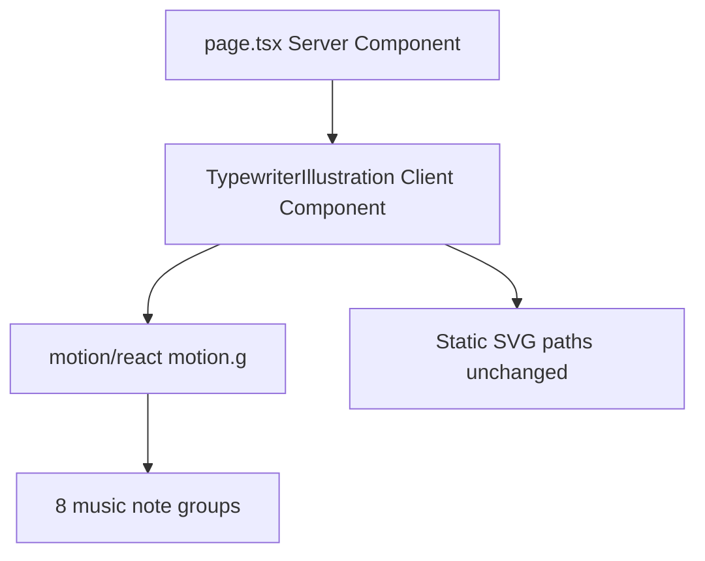

# Music Note Pendulum Animation with Motion

## Target elements

The typewriter SVG in `[src/components/TypewriterIllustration/TypewriterIllustration.tsx](src/components/TypewriterIllustration/TypewriterIllustration.tsx)` contains **8 music note groups** to animate:


| Group id    | Approx pivot (viewBox) | Base rotation from Figma clip |
| ----------- | ---------------------- | ----------------------------- |
| `music`     | `14px 60px`            | -8°                           |
| `music_2`   | `411px 34px`           | 12°                           |
| `music_3`   | `502px 99px`           | 6°                            |
| `music-2`   | `499px 322px`          | -10°                          |
| `music_4`   | `22px 355px`           | 15°                           |
| `music_5`   | `98px 44px`            | (no clip; stem top ~98, 35)   |
| `music-2_2` | `536px 201px`          | 8°                            |
| `music_6`   | `148px 399px`          | -12°                          |


Pendulum = gentle back-and-forth **rotate** around each note’s stem-top pivot, with slightly different duration/delay/amplitude per note so they don’t swing in sync.

## Architecture




- `[src/app/page.tsx](src/app/page.tsx)` stays a server component; it already imports `TypewriterIllustration`.
- `[TypewriterIllustration.tsx](src/components/TypewriterIllustration/TypewriterIllustration.tsx)` becomes a **client component** (`"use client"`) because Motion hooks run on the client.

## Implementation steps

### 1. Install Motion

```bash
npm install motion
```

Use `import { motion, useReducedMotion } from "motion/react"` (current Motion API).

### 2. Add a small pendulum helper

Create `[src/components/TypewriterIllustration/pendulum.ts](src/components/TypewriterIllustration/pendulum.ts)` with a typed config per note:

```ts
export type PendulumConfig = {
  id: string;
  origin: string;      // e.g. "14px 60px"
  amplitude?: number;  // degrees, default ~10–12
  duration?: number;   // seconds, default ~2.5–3.5
  delay?: number;
};
```

Export `MUSIC_NOTE_PENDULUMS: PendulumConfig[]` for all 8 groups.

In the component, map configs to Motion props:

- `animate={{ rotate: [base - amp, base + amp] }}` (or symmetric `[-amp, amp]` with origin handling the base tilt)
- `transition={{ duration, delay, repeat: Infinity, repeatType: "reverse", ease: "easeInOut" }}`
- `style={{ transformOrigin: origin, transformBox: "fill-box" }}`

Use `useReducedMotion()` — when true, skip animation (static `rotate: 0`).

### 3. Wrap music note groups with `motion.g`

In `[TypewriterIllustration.tsx](src/components/TypewriterIllustration/TypewriterIllustration.tsx)`, replace the 8 `<g id="music…">` wrappers with `<motion.g id="…" …>` + pendulum props. Inner `<path>` geometry stays untouched.

Because the file is currently a single minified line (~620KB), apply targeted replacements on the 8 group open tags only (no need to reformat the entire SVG).

### 4. Optional CSS companion

Add `[src/components/TypewriterIllustration/TypewriterIllustration.css](src/components/TypewriterIllustration/TypewriterIllustration.css)` only if needed for static sizing (`.typewriter-image` is already on the parent in `[page.css](src/app/page.css)`); likely no CSS changes required.

### 5. Verify

- Run dev server and confirm all 8 notes swing continuously at different phases
- Confirm `prefers-reduced-motion: reduce` disables animation
- Run `npm run build` to ensure the client boundary compiles cleanly

## Notes / constraints

- **No Tailwind** — animation lives entirely in Motion props, not utility classes.
- **Bundle impact**: `motion` adds a dependency; the SVG body size is unchanged.
- **Accessibility**: parent keeps `role="img"` + `aria-label`; decorative note motion is suppressed for reduced-motion users.


This should produce step animation.

