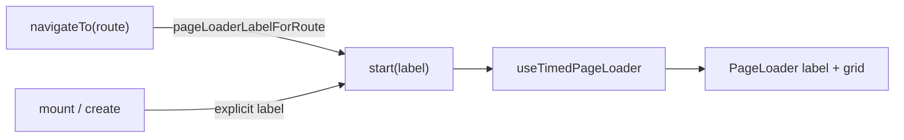

# Implement NIM-63: PageLoader Label Indicators

Issue: [NIM-63](https://linear.app/nimeshs-company/issue/NIM-63/fe-loading-screen-label-indicators) (description already written). Timing/cancel behavior from NIM-54 stays unchanged.

## Approach

1. **Visible label in PageLoader** — static lowercase text under the grid (grid already animates; avoid stacking AnimatedEllipsis).
2. **Label state in `useTimedPageLoader`** — `start(label)` stores the active label so outbound navigations can show the correct copy before the destination mounts.
3. **Shared label constants + route helper** — one source of truth matching the NIM-63 map.



## 1. Shared labels

Add [`src/lib/ui/pageLoaderLabels.ts`](src/lib/ui/pageLoaderLabels.ts):

```ts
export const PAGE_LOADER_LABELS = {
  creatingLobby: "creating lobby",
  loadingLobby: "loading lobby",
  loadingSearch: "loading search",
  loadingGame: "loading game",
  loadingResults: "loading results",
  leavingLobby: "leaving lobby",
} as const;

export function pageLoaderLabelForRoute(route: string): string {
  if (route === "/" || route.startsWith("/?")) return PAGE_LOADER_LABELS.leavingLobby;
  if (route.startsWith("/search")) return PAGE_LOADER_LABELS.loadingSearch;
  if (route.startsWith("/game")) return PAGE_LOADER_LABELS.loadingGame;
  if (route.startsWith("/results")) return PAGE_LOADER_LABELS.loadingResults;
  return PAGE_LOADER_LABELS.loadingLobby;
}
```

## 2. Hook: carry label

Update [`src/lib/ui/useTimedPageLoader.ts`](src/lib/ui/useTimedPageLoader.ts):

- Add `label` state (default `PAGE_LOADER_LABELS.loadingLobby`)
- Change `start` to `start(nextLabel?: string)` — when provided, set label before showing loader
- Return `{ isLoading, label, start, finish, cancel }`

## 3. PageLoader UI

Update [`src/components/PageLoader/PageLoader.tsx`](src/components/PageLoader/PageLoader.tsx) + [`PageLoader.css`](src/components/PageLoader/PageLoader.css):

- Column layout: grid, then `<p className="page-loader__label text-heading-3">`
- Keep passing `label` to `Loader` for `aria-label`; mark visible `<p>` as `aria-hidden="true"` to avoid double announcement
- Default prop: `loading` → prefer lowercase `"loading lobby"` or keep callers always passing (flows will pass hook `label`)
- Style: muted text (`--color-text-muted`), centered, small gap under the 120px grid (e.g. `--size-16` if present)

## 4. Wire flows

| Call site | Label |
|---|---|
| Landing create (`handleGetStarted`) | `creating lobby` |
| Landing session restore | `loading lobby` |
| Landing `navigateToSearch` / start game | `loading search` |
| Landing `navigateToLobbyRoute(route)` | `pageLoaderLabelForRoute(route)` |
| Search/Game/Results `navigateTo(route)` | `pageLoaderLabelForRoute(route)` |
| Search/Game/Results bootstrap `start()` | destination: `loading search` / `loading game` / `loading results` |
| Explicit exits to `/` | `leaving lobby` (via route helper) |
| Confirm song → `/game`, finish → `/results`, restart → `/search` | via `navigateTo` |

Concrete edits:

- [`LandingFlow.tsx`](src/components/LandingFlow/LandingFlow.tsx): destructure `label` from hook; pass to `<PageLoader label={label} />`; pass labels into every `startPageLoader(...)`.
- [`SearchFlow.tsx`](src/components/SearchFlow/SearchFlow.tsx), [`GameFlow.tsx`](src/components/GameFlow/GameFlow.tsx), [`ResultsFlow.tsx`](src/components/ResultsFlow/ResultsFlow.tsx): same — `navigateTo` calls `startPageLoader(pageLoaderLabelForRoute(route))`; bootstrap starts with destination label; replace hardcoded `"Loading search"` etc. with hook `label`.

For Search confirm / Game end that call `startPageLoader()` then `navigateTo(...)`: ensure the second `start` (inside `navigateTo`) sets the destination label (`loading game` / `loading results`). If an earlier `start` runs without a label during the API wait, pass the destination label on that first `start` as well so the wait copy is already correct.

## 5. Design system gallery

In [`DesignSystemGallery.tsx`](src/app/design-system/DesignSystemGallery.tsx), show a representative labeled loader (e.g. `label="loading search"`) so the visible caption is obvious in the framed demo.

## Out of scope

- `useTimedPageLoader` min duration / cancel semantics
- In-screen `AnimatedEllipsis`, skeletons, join-modal copy
- Landing same-page exit (no PageLoader today) — no new loader for that path

## Done when

NIM-63 acceptance criteria are met in the UI: visible transition labels on PageLoader for each mapped hop, lowercase tone, a11y name preserved, errors still cancel immediately.