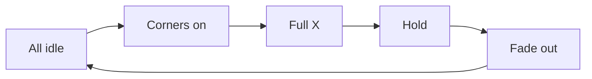

# Pixel grid Loader (Figma + muload-style motion)

## Design source

[Figma Loader `2246:2075`](https://www.figma.com/design/xvOrhZZAqLqapwAtYD5GEq/kara-no-key?node-id=2246-2075) — component set with two variants:

| Variant | Pattern |
|---------|---------|
| Frame 14 | All 16 cells idle (`--neutral-100`) |
| Frame 15 | X / corners lit (`--solid-black`): corners + inner diamond |

Geometry: **4×4**, cell **8px**, gap **2px**, total **38×38**, sharp squares (no radius).

## Behavior model (muload-inspired, original code)

Do **not** install `@muload/*` (paid registry). Match the **engineering feel** from [muload docs](https://muload.dev/docs):

- Small DOM grid, **opacity-only** CSS keyframes (GPU compositor)
- No canvas / no per-frame JS animation loop
- `role="status"` + `aria-label` (default `"Loading"`)
- `prefers-reduced-motion`: collapse to a soft whole-grid pulse
- Pause when offscreen via `IntersectionObserver` → `data-paused="true"` (animation-play-state)
- Tunable via CSS vars / props: cell size, gap, speed, active/idle colors

**Animation intent** (keyed to Figma’s two frames, expanded into a looping cycle like muload pulse loaders such as Sync / Cluster Sync):

1. Idle grid (Frame 14)
2. Outer corners fade in
3. Full X (Frame 15)
4. Hold briefly
5. Fade back through corners → idle
6. Loop (~1.2–1.6s at `speed={1}`)

Each cell gets a staggered delay from its role in the X (corners vs inner cross) so motion reads as a crystalline pulse, not a hard binary flip.



## Component API

New: [`src/components/Loader/Loader.tsx`](src/components/Loader/Loader.tsx) + [`Loader.css`](src/components/Loader/Loader.css)

```tsx
type LoaderProps = {
  className?: string;
  size?: number;       // cell px; default 8
  gap?: number;        // default 2
  speed?: number;      // default 1 (scales animation-duration)
  label?: string;      // aria-label; default "Loading"
  paused?: boolean;    // force pause (tests / parent control)
};
```

Implementation sketch:

- Render 16 `<span class="loader__cell">` in CSS grid `repeat(4, size)` / `gap`
- Idle fill: `var(--neutral-100)`; active via opacity of a black layer on an idle underlayer
- CSS custom properties: `--loader-cell`, `--loader-gap`, `--loader-duration`, `--loader-active`, `--loader-idle`
- Client component only for the IntersectionObserver pause helper; animation itself stays CSS

## Scope (this pass)

**In scope**

1. Build `Loader` + CSS
2. Demo in [`DesignSystemGallery.tsx`](src/app/design-system/DesignSystemGallery.tsx) — default, slower, larger — so you can inspect at `/design-system`
3. Linear issue `[FE] Pixel grid Loader` under project `kar-no-key` (Done after ship)

**Out of scope**

- Wiring into Search / Game / Results / Awards or any other product surface
- Replacing `AnimatedEllipsis`
- Buying / wiring muload registry
- Stateful AI lifecycle wrapper (`idle|thinking|streaming|…`)

## Styling rules

- Plain CSS file co-located with component (no Tailwind)
- Tokens only: `--neutral-100`, `--solid-black` / `--color-text-primary`
- Match existing component folder pattern (`Button/`, `AnimatedEllipsis/`)

## Verify

- Visual match to Figma idle + X peak frames
- Loop feels continuous at default speed; `speed={0.5}` / `{2}` scale duration
- Reduced motion: gentle pulse, no multi-phase stagger
- Offscreen: animation paused when scrolled out of gallery view
- Gallery section shows labeled variants for inspection
