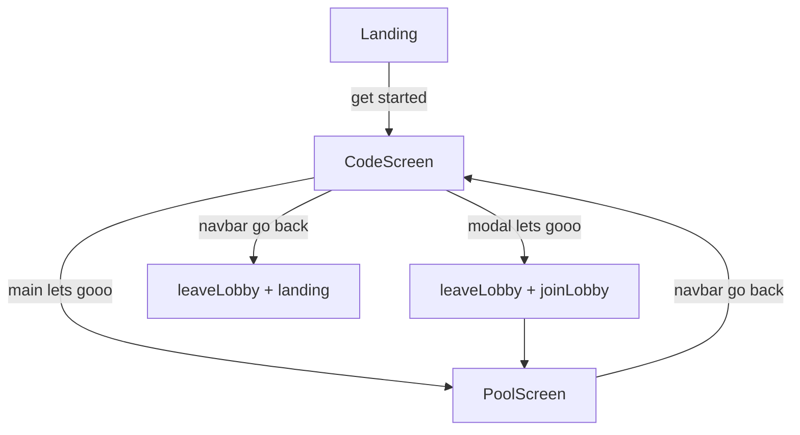

# Player Pool / Roster Screen

## Goal

After a user enters a lobby, both **let's gooo** buttons navigate to a new screen listing everyone in that lobby with **host** or **player** role. Host is whoever owns the lobby (`is_host: true` in DB); joiners are players.



**Design:** No Figma — match existing lobby/navbar patterns ([`LobbyScreen`](src/components/LobbyScreen/LobbyScreen.tsx), [`Navbar`](src/components/Navbar/Navbar.tsx), semantic typography/colors).

---

## 1. Backend — `get-lobby-players`

New Edge Function at [`supabase/functions/get-lobby-players/index.ts`](supabase/functions/get-lobby-players/index.ts).

**Request:** `{ player_id: string }`

**Logic:**
1. Validate `player_id` (reuse [`player-id.ts`](supabase/functions/_shared/player-id.ts))
2. Load player row → `lobby_id`; 404 if not in a lobby
3. Load lobby `code`, `status`; reject if `closed`
4. Query `players` for that `lobby_id`, ordered `joined_at ASC`
5. Return:

```json
{
  "lobby_id": "...",
  "code": "ABX92K",
  "players": [
    { "player_id": "...", "display_name": "norman", "is_host": true, "is_connected": true }
  ]
}
```

**Security:** Only return players if requester is a member of that lobby (via their `player_id` row).

**Deploy:** add to [`scripts/deploy-hosted-supabase.sh`](scripts/deploy-hosted-supabase.sh).

**Client helper:** `getLobbyPlayers(playerId)` in [`src/lib/supabase/functions.ts`](src/lib/supabase/functions.ts).

---

## 2. Frontend flow — extend `LandingFlow`

Update [`src/components/LandingFlow/LandingFlow.tsx`](src/components/LandingFlow/LandingFlow.tsx):

**Step enum:** `'landing' | 'lobby' | 'pool'`

**New state:**
- `players: LobbyPlayer[]` — roster from API
- `poolError: string | null` — errors on pool fetch/join

**Handler A — main code-screen "let's gooo":**
```typescript
handleEnterPool()
  → getLobbyPlayers(playerId)
  → set players, setStep('pool')
```

**Handler B — modal "let's gooo":**
```typescript
handleJoinAndEnterPool()
  → if already in lobby with different code: leaveLobby(playerId) first
  → joinLobby(playerId, displayName, normalizedJoinCode)
  → update lobbyCode, lobbyId, isHost from response
  → saveLobbySession(...)
  → getLobbyPlayers(playerId)
  → close modal, setStep('pool')
```

Use [`normalizeLobbyCodeInput`](src/lib/lobby/lobbyCode.ts) before `joinLobby`. Handle join errors inline in modal (pass `joinError` prop).

**Handler C — pool navbar go back:**
- `setStep('lobby')` only — **do not** call `leaveLobby` (user returns to code screen still in lobby)

**Handler D — code-screen navbar go back:** unchanged (`leaveLobby` → landing)

**Session persistence** — extend [`src/lib/player/session.ts`](src/lib/player/session.ts):

```typescript
type LobbySession = {
  displayName, lobbyCode, lobbyId, isHost,
  screen?: 'code' | 'pool'  // default 'code'
}
```

On mount: if `screen === 'pool'`, restore step to `pool` and refetch players via `getLobbyPlayers`.

---

## 3. New `PoolScreen` component

Create [`src/components/PoolScreen/PoolScreen.tsx`](src/components/PoolScreen/PoolScreen.tsx) + [`PoolScreen.css`](src/components/PoolScreen/PoolScreen.css).

**Layout (match lobby patterns):**
- Reuse [`Navbar`](src/components/Navbar/Navbar.tsx) with `onGoBack` → back to code screen
- Centered column (580px max), vertical center
- Heading: lobby code (`text-heading-1`) — same as code screen
- Subcopy: `text-body` muted — e.g. `the pool is forming...` or player count
- Player list: each row shows `display_name` (lowercase) + role label

**Role labels:**
| `is_host` | Label |
|-----------|-------|
| `true` | `host` |
| `false` | `player` |

Sort for display: host first, then `joined_at` order from API.

**List item styling:** flex row, name left (black `text-body`), role right (muted `text-body`). No new components required — semantic classes only.

**Loading:** brief loading state while fetching players on enter.

**Empty/error:** show muted message if fetch fails; retry not required for MVP.

---

## 4. Wire lobby + modal CTAs

### [`LobbyScreen`](src/components/LobbyScreen/LobbyScreen.tsx)
- Add props: `onEnterPool`, `onJoinAndEnterPool`, `isLoading`, `joinError`
- Main **let's gooo** → `onClick={onEnterPool}`, `disabled={isLoading}`
- Pass handlers into [`JoinCodeModal`](src/components/JoinCodeModal/JoinCodeModal.tsx)

### [`JoinCodeModal`](src/components/JoinCodeModal/JoinCodeModal.tsx)
- Add props: `onSubmit`, `isLoading`, `error`
- **let's gooo** → `onSubmit` when `canSubmit`, show loading label `joining...`
- Display `error` below input (reuse `text-body` error color pattern from landing form)

---

## 5. Host vs player correctness

| Path | Expected `is_host` |
|------|-------------------|
| Create lobby → main let's gooo | `true` (only player, shown as host) |
| Join via modal (different code) | `false` for joiner; roster shows code owner as host |
| Join same code idempotently | preserves existing role from DB |

Roster always reflects DB truth from `get-lobby-players`, not client assumptions.

---

## Files touched

| Action | File |
|--------|------|
| Create | `supabase/functions/get-lobby-players/index.ts` |
| Create | `src/components/PoolScreen/PoolScreen.tsx`, `PoolScreen.css` |
| Modify | `src/lib/supabase/functions.ts` |
| Modify | `src/lib/player/session.ts` |
| Modify | `src/components/LandingFlow/LandingFlow.tsx` |
| Modify | `src/components/LobbyScreen/LobbyScreen.tsx` |
| Modify | `src/components/JoinCodeModal/JoinCodeModal.tsx`, `JoinCodeModal.css` |
| Modify | `scripts/deploy-hosted-supabase.sh` |

---

## Test plan

**Backend (curl):**
- Host creates lobby → `get-lobby-players` returns 1 player with `is_host: true`
- Joiner joins → host fetch returns 2 players, exactly one host
- Non-member `player_id` → 404

**Frontend (manual):**
- Create lobby → main **let's gooo** → pool shows self as **host**
- Open modal, enter friend's code → **let's gooo** → pool shows friend as **host**, self as **player**
- Pool go back → code screen (still in lobby, no 409 on re-enter pool)
- Code screen go back → landing + `leaveLobby` (unchanged)
- Refresh on pool screen → restores pool view with refetched roster

---

## Out of scope (next pass)

- Realtime roster updates when others join/leave
- Main pool screen CTA to start game (Module 7)
- Polling/refresh button on pool screen
