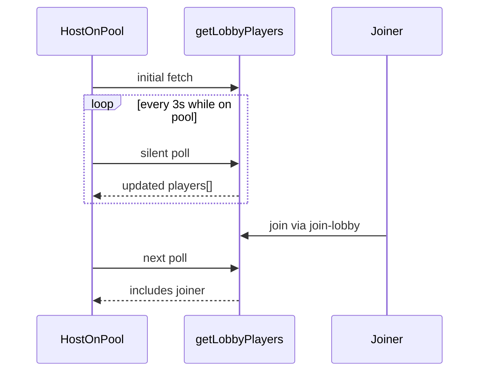

# Live Pool Roster via Polling

## Problem

[`PoolScreen`](src/components/PoolScreen/PoolScreen.tsx) only loads players once — on enter or page refresh via [`getLobbyPlayers`](src/lib/supabase/functions.ts). When another user joins via `join-lobby`, existing pool viewers see a stale list until they manually refresh.

**Why not Supabase Realtime `postgres_changes`?** [`players`](supabase/migrations/001_initial_schema.sql) has deny-all RLS for anon clients. Direct table subscriptions would not deliver events without a new auth/RLS model (deferred Module 9). Polling reuses the authoritative Edge Function and needs no backend changes.



---

## 1. Extract roster refresh logic

Refactor [`LandingFlow.tsx`](src/components/LandingFlow/LandingFlow.tsx) to split **initial load** (shows spinner) from **background refresh** (no spinner).

Add a shared helper inside `LandingFlow` or a small hook [`src/lib/lobby/useLobbyRosterPolling.ts`](src/lib/lobby/useLobbyRosterPolling.ts):

```typescript
// useLobbyRosterPolling({ playerId, enabled, onUpdate, onError })
```

**`enabled`:** `step === "pool" && playerId != null`

**On each poll (every 3 seconds):**
- Call `getLobbyPlayers(playerId)`
- On success: `onUpdate({ players, code, lobby_id })` — update `players`, `lobbyCode`, `lobbyId` state
- On failure: set `poolError` only if no players loaded yet; otherwise keep last good roster (avoid flicker)

**Also refetch when:**
- `document.visibilitychange` → visible (user returns to tab)
- Immediately on mount when entering pool (in addition to interval)

**Cleanup:** clear interval + remove visibility listener on unmount or when `enabled` becomes false.

**Constants:** `POLL_INTERVAL_MS = 3000` in the hook file.

---

## 2. LandingFlow integration

Update [`LandingFlow.tsx`](src/components/LandingFlow/LandingFlow.tsx):

| Concern | Change |
|---------|--------|
| Initial enter pool | Keep `fetchAndShowPool` with `isLoading = true` (spinner) |
| Background poll | Hook updates `players` without toggling `isLoading` |
| `isLoading` on pool | Only true during first fetch / session restore — not during polls |
| Pool player count | Updates automatically as `players` state changes |

Remove duplicate fetch logic from the session-restore `useEffect` where possible — initial fetch on pool restore stays; polling hook handles subsequent updates.

---

## 3. PoolScreen UX (minor)

[`PoolScreen.tsx`](src/components/PoolScreen/PoolScreen.tsx) — no structural changes required. Player count and list already derive from `players` prop.

Optional polish (small): only show `"loading the pool..."` on **initial** load (`isLoading && players.length === 0`), so background polls don't blank the list.

---

## 4. Edge cases

| Case | Behavior |
|------|----------|
| Joiner appears | Next poll adds row with `player` role |
| Player leaves | Next poll removes them |
| Host transfer after leave | `is_host` flags update on refetch |
| Poll fails mid-session | Keep last roster; optional silent retry next interval |
| User leaves pool (go back to code) | `enabled: false` — polling stops |
| User leaves lobby entirely | Polling stops when step !== pool |

---

## Files touched

| Action | File |
|--------|------|
| Create | [`src/lib/lobby/useLobbyRosterPolling.ts`](src/lib/lobby/useLobbyRosterPolling.ts) |
| Modify | [`src/components/LandingFlow/LandingFlow.tsx`](src/components/LandingFlow/LandingFlow.tsx) |
| Modify | [`src/components/PoolScreen/PoolScreen.tsx`](src/components/PoolScreen/PoolScreen.tsx) (loading copy guard only) |

No backend, migration, or deploy changes.

---

## Test plan (manual)

1. User A: create lobby → enter pool (solo host)
2. User B (incognito): join A's code via modal → enter pool
3. User A's pool screen should show B within ~3s without refresh
4. User B leaves (code screen go back) → A's list removes B on next poll
5. Switch tabs away and back → immediate refetch on focus
6. Pool go back → polling stops (no network spam on code screen)

---

## Out of scope (future Module 9)

- Supabase Realtime `postgres_changes` or Broadcast channels
- Roster sync on code screen (lobby step)
- Manual refresh button
