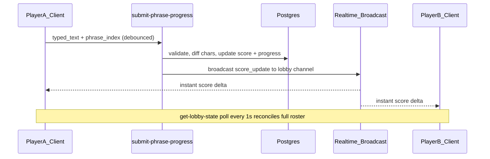

# Realtime Points Scoring with Supabase

## Context

[points-strategy.md](plan/points-strategy.md) defines four scoring rules plus a hard constraint: **every player must see other players' scores update in real time**.

Today:
- `players.score` and `players.phrases_completed` exist ([005 migration](supabase/migrations/005_songs_and_lobby_game.sql)) but are **never written**
- Typing is **client-local only** in [GameScreen.tsx](src/components/GameScreen/GameScreen.tsx)
- Multiplayer sync uses **Edge Function polling** (1s on game screen via [useLobbyStatePolling.ts](src/lib/lobby/useLobbyStatePolling.ts)) — not Supabase Realtime
- Anon clients have **deny-all RLS** on `players`; direct `postgres_changes` subscriptions won't work without a new auth model (explicitly deferred in [pool_roster_polling plan](.cursor/plans/pool_roster_polling_2c61f657.plan.md))

## Recommended Supabase approach: Broadcast + polling (hybrid)



**Why this over alternatives:**

| Approach | Verdict |
|----------|---------|
| Polling only (1s) | Too slow for "real-time" constraint |
| `postgres_changes` on `players` | Blocked by deny-all RLS; requires Module 9 auth work |
| **Realtime Broadcast from Edge Function** | **Best fit** — no RLS changes, sub-second updates, matches server-authoritative model |
| Polling + Broadcast hybrid | **Recommended** — instant UI + authoritative reconciliation |

After each score write, the Edge Function publishes to channel `lobby:{lobby_id}`:

```ts
{ event: "score_update", payload: { player_id, score, phrases_completed, delta } }
```

All clients on `/game` subscribe on mount and merge updates into local `players` state. Existing 1s `get-lobby-state` polling remains the source of truth for full roster reconciliation.

---

## Scoring rules (server-enforced)

Mirror client matching logic already in [PhraseTypingArea.tsx](src/components/PhraseTypingArea/PhraseTypingArea.tsx) and [usePlaybackSync.ts](src/lib/game/usePlaybackSync.ts):

- **Per character:** case-insensitive, punctuation ignored (`normalizeChar`)
- **Rule 1 — chars once:** track scored indices per `(player, song, phrase_index)` in DB
- **Rule 2 — phrase bonus:** award only if `phrasesMatch(typed, expected)` at finalize time
- **Rule 3 — phrase lock:** server computes `activePhraseIndex` from `playback_start_at + playback_elapsed_ms + server_now`; reject new char points for `phrase_index < activePhraseIndex`
- **Rule 4 — leaderboard after phrase:** on finalize, broadcast updated scores; sort roster by score desc

### Default point values (assumed — adjust if needed)

| Award | Points |
|-------|--------|
| Correct character (first time only) | 1 |
| Full phrase bonus (before lyric advances) | 10 |

Scores **accumulate across songs** in a lobby session (no reset in `end-song` today). Add reset-on-new-song later if desired.

---

## Database: new progress tracking table

**Migration `008_player_phrase_progress.sql`:**

```sql
create table player_phrase_progress (
  id                  uuid primary key default gen_random_uuid(),
  player_id           uuid not null references players(id) on delete cascade,
  lobby_id            uuid not null references lobbies(id) on delete cascade,
  youtube_video_id    text not null,
  phrase_index        int not null,
  scored_char_indices int[] not null default '{}',
  phrase_bonus_awarded boolean not null default false,
  finalized           boolean not null default false,
  updated_at          timestamptz not null default now(),
  unique (player_id, lobby_id, youtube_video_id, phrase_index)
);

alter table player_phrase_progress enable row level security;
-- deny-all RLS (same pattern as other tables; Edge Functions use service role)
```

This table is the anti-cheat ledger: the server never trusts client-reported totals, only diffs against `scored_char_indices`.

---

## Backend: new Edge Function `submit-phrase-progress`

**File:** `supabase/functions/submit-phrase-progress/index.ts`

**Request:**

```ts
{
  player_id: string;
  phrase_index: number;
  typed_text: string;
  finalize?: boolean;  // true when client locks phrase (lyric advanced)
}
```

**Server steps:**

1. `requireLobbyPlayer(player_id)` — reuse [lobby-state.ts](supabase/functions/_shared/lobby-state.ts)
2. Assert lobby `status === "playing"` and song is selected
3. Load `lyrics_phrases[phrase_index]` from cached song
4. Compute `activePhraseIndex` from playback timestamps (same algorithm as [getActivePhraseIndex](src/lib/game/usePlaybackSync.ts))
5. Reject if `phrase_index > activePhraseIndex` (future phrase)
6. Load or create `player_phrase_progress` row for this phrase
7. If phrase is locked (`phrase_index < activePhraseIndex` or `finalized === true`): skip char scoring; only process `finalize` if not yet finalized
8. Walk `typed_text` vs expected phrase text; for each newly correct index not in `scored_char_indices`, append index and add 1 point
9. If `finalize === true`:
   - Set `finalized = true`
   - If `phrasesMatch(typed_text, expected)` and not yet awarded: add phrase bonus (+10), increment `players.phrases_completed`
10. Update `players.score` atomically
11. **Broadcast** score update via Supabase Realtime (service role client in Edge Function)
12. Return `{ score, phrases_completed, points_awarded, phrase_bonus_awarded }`

**Shared module:** extract `normalizeChar`, `phrasesMatch`, `getActivePhraseIndex`, `scorePhraseProgress` into `supabase/functions/_shared/scoring/` so client and server stay aligned.

**Rate limit:** ~20 req/10s per player via existing [rate-limit.ts](supabase/functions/_shared/rate-limit.ts) (keystroke debounce on client keeps this comfortable).

Register in [scripts/deploy-hosted-supabase.sh](scripts/deploy-hosted-supabase.sh).

---

## Frontend changes

### 1. Scoring hook — `src/lib/game/usePhraseScoring.ts`

- Track `lastSubmittedText` and `pendingPhraseIndex`
- On `typedText` change (debounced ~250ms): call `submitPhraseProgress({ phrase_index, typed_text })`
- On `lockedPhraseIndex` transition (existing effect in GameScreen): call with `finalize: true` for the locked phrase
- Optimistically update **local player's** score from response; other players update via Realtime

### 2. Realtime subscription — `src/lib/lobby/useLobbyScoreBroadcast.ts`

- Subscribe to `supabase.channel('lobby:' + lobbyId)` with `.on('broadcast', { event: 'score_update' }, handler)`
- Merge `{ player_id, score, phrases_completed }` into `players` state in [GameFlow.tsx](src/components/GameFlow/GameFlow.tsx)
- Unsubscribe on unmount / lobby exit
- Polling from `useLobbyStatePolling` (1s) overwrites any drift

### 3. Wire into GameScreen / GameFlow

- Pass `playerId`, `lobbyId`, scoring callbacks into [GameScreen.tsx](src/components/GameScreen/GameScreen.tsx)
- Reuse existing `lockedPhraseIndex` effect as the finalize trigger
- Reset local scoring state when `activePhraseIndex` changes (already resets `typedText`)

### 4. Leaderboard display

- Update [sortLobbyPlayers.ts](src/lib/lobby/sortLobbyPlayers.ts): in game context, sort by `score` desc (host-first tiebreaker or score-only — recommend **score desc, then join order**)
- [LobbyRoster.tsx](src/components/LobbyRoster/LobbyRoster.tsx) already renders `player.score`; no structural change needed
- Optional: brief CSS transition on score cell when value changes

### 5. Client API wrapper

Add to [functions.ts](src/lib/supabase/functions.ts):

```ts
submitPhraseProgress(playerId, { phrase_index, typed_text, finalize? })
```

---

## Realtime Broadcast implementation detail

In the Edge Function, after DB update:

```ts
const channel = supabase.channel(`lobby:${lobby.id}`);
await channel.send({
  type: "broadcast",
  event: "score_update",
  payload: { player_id, score, phrases_completed, delta },
});
```

On the client ([client.ts](src/lib/supabase/client.ts)):

```ts
supabase.channel(`lobby:${lobbyId}`)
  .on("broadcast", { event: "score_update" }, ({ payload }) => { ... })
  .subscribe();
```

No RLS policy changes required. Channel name uses `lobby_id` (UUID) — only players who joined have it.

---

## Edge cases

| Case | Handling |
|------|----------|
| Host pauses (`status → ready`) | Reject char scoring; allow finalize for in-progress phrase |
| Player reconnects mid-phrase | Progress is server-side; client re-syncs score via poll + resubmits current typed text |
| Duplicate finalize calls | Idempotent: `finalized` flag prevents double bonus |
| Tab backgrounded | `visibilitychange` refetch in polling hook already exists; Realtime stays connected |
| Two players type same phrase | Independent progress rows per player |
| Rate limit hit | Client silently retries on next debounce; local typing UX unaffected |

---

## Testing plan

1. Two browser sessions in same lobby; host starts song
2. Player A types correct chars → Player B sees score tick up within ~300ms (Broadcast)
3. Phrase advances → finalize fires → phrase bonus applied only if full match
4. Locked phrase → further typing/submits earn zero additional points
5. Poll reconciliation: disable Broadcast temporarily, confirm 1s polling still updates scores
6. Pause mid-phrase → no new char points until resume

---

## Assumptions (confirm or override before implementation)

- **1 pt/char, 10 pt phrase bonus** — not specified in strategy doc
- **Scores persist across songs** in the same lobby
- **Hybrid Broadcast + polling** satisfies the real-time constraint without opening RLS

If you want different point values or score reset per song, say so before we implement.
