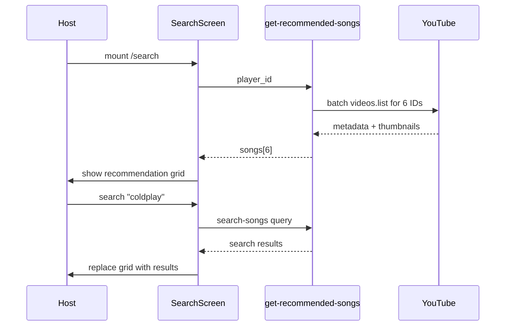

# Recommended Music on Search Screen

## Goal

When the host lands on `/search`, show a **2×3 song grid** (like [Figma 2094:2239](https://www.figma.com/design/xvOrhZZAqLqapwAtYD5GEq/kara-no-key?node-id=2094-2239)) **before** they search. Songs are **curated YouTube video IDs** resolved via the API. When the host searches, recommendations are **replaced** by search results.



---

## 1. Curated video ID config

Add [`supabase/functions/_shared/recommended-songs.ts`](supabase/functions/_shared/recommended-songs.ts):

```typescript
export const RECOMMENDED_VIDEO_IDS = [
  "...", // 6 stable YouTube IDs matching Figma titles
] as const;
```

Seed with IDs for the Figma/mock titles (Honne, Coldplay Fix You, Frank Sinatra My Way, etc.). Document in a short comment that IDs must be embeddable (`videoEmbeddable`). Team can swap IDs without touching UI code.

Extend [`mock.ts`](supabase/functions/_shared/song-providers/mock.ts) to **6 entries** (currently 3) so mock mode matches the grid without YouTube quota.

---

## 2. Batch YouTube metadata helper

Add `fetchYouTubeVideosMetadata(videoIds: string[])` to [`youtube.ts`](supabase/functions/_shared/song-providers/youtube.ts):

- Reuse existing `videos.list` + `parseIso8601Duration` logic
- Single API call for all 6 IDs (1 quota unit vs 6 searches)
- Refactor `fetchYouTubeVideoMetadata` to delegate to the batch helper

Add `getRecommendedSongs()` to [`song-providers/index.ts`](supabase/functions/_shared/song-providers/index.ts):

- **mock provider**: return extended `MOCK_SONGS` (6 items)
- **youtube provider**: batch-fetch metadata for `RECOMMENDED_VIDEO_IDS`; skip nulls; preserve config order

---

## 3. New edge function: `get-recommended-songs`

Create [`supabase/functions/get-recommended-songs/index.ts`](supabase/functions/get-recommended-songs/index.ts):

- **Auth**: same gates as `search-songs` — host only, `song_selection_started`, lobby `waiting`
- **Input**: `{ player_id }` only (no query)
- **Output**: `{ songs: SongResult[] }`
- **Rate limit**: separate bucket, e.g. `10 req / 60s per player` (one fetch per page load; cheap vs search)
- **No lyrics pre-check** on load (lyrics still validated on `select-song` confirm, same as today)

Register in [`scripts/deploy-hosted-supabase.sh`](scripts/deploy-hosted-supabase.sh).

---

## 4. Client wrappers

| File | Change |
|------|--------|
| [`src/lib/supabase/functions.ts`](src/lib/supabase/functions.ts) | `getRecommendedSongs(playerId)` invoke |
| [`src/lib/songs/getRecommendedSongs.ts`](src/lib/songs/getRecommendedSongs.ts) | Thin wrapper (mirror `searchSongs.ts` error handling) |

---

## 5. SearchScreen / SearchFlow UI

**State** in [`SearchScreen.tsx`](src/components/SearchScreen/SearchScreen.tsx):

```typescript
recommendedSongs: SongResult[]
isLoadingRecommendations: boolean
recommendationsError: string | null
// existing: songs, hasSearched, isSearching, ...
```

**Fetch** on mount (host only) via `useEffect` in `SearchScreen` or `SearchFlow` (prefer `SearchFlow` to keep screen presentational — pass props down).

**Display logic**:

```typescript
const displaySongs = hasSearched ? songs : recommendedSongs;
const isGridLoading = hasSearched ? isSearching : isLoadingRecommendations;
```

- Show grid when `displaySongs.length > 0`
- Show loading message in grid area while `isGridLoading`
- Show `recommendationsError` only when `!hasSearched`
- Keep existing `searchError` / `no songs found` for post-search empty state
- **Song selection + confirm** works identically for recommended and searched songs

No new CSS required — reuse existing `.search-screen__results` 2-column grid.

---

## 6. Out of scope

- Lyrics badge pre-fetch for recommendations (still lazy on confirm)
- Player waiting view changes (non-host does not see recommendations)
- Caching recommendations across sessions / CDN
- Admin UI to edit the curated list (config file only for now)

---

## Verification

1. Host opens `/search` (mock provider): 6 song cards appear in 2×3 grid without searching
2. Host opens `/search` (youtube provider): 6 cards with real thumbnails/titles from curated IDs
3. Host searches → grid replaces with search results; recommendations hidden
4. Host search returns 0 results → "no songs found" (not recommendations)
5. Host can select + confirm a recommended song → `select-song` flow unchanged
6. Rate limit: repeated page refreshes respect `get-recommended-songs` limit without blocking `search-songs`
