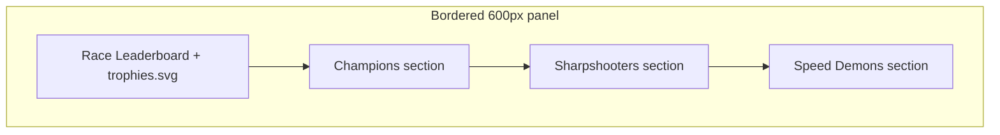

# Results screen UI revamp

## Design source

[Figma Main Container 2265:3038](https://www.figma.com/design/xvOrhZZAqLqapwAtYD5GEq/kara-no-key?node-id=2265-3038) — bordered **Race Leaderboard** panel (Champions / Sharpshooters / Speed Demons).

Assets already in repo:
- Trophy: [`public/icons/trophies.svg`](public/icons/trophies.svg)
- Stars: [`star-gold.svg`](public/icons/star-gold.svg) / [`star-silver.svg`](public/icons/star-silver.svg) / [`star-bronze.svg`](public/icons/star-bronze.svg)

## Confirmed behavior (unchanged)

- [`ResultsFlow`](src/components/ResultsFlow/ResultsFlow.tsx) + awards API / rankings / host **restart game** in Navbar stay as-is
- Section titles + descriptions stay exact Figma copy (already in [`AwardsScreen.tsx`](src/components/AwardsScreen/AwardsScreen.tsx))
- Top-3 stars by `entry.rank`; muted rows for rank > 3
- No Tailwind

## Visual target

**Page chrome** (mirror Search/Game viewport feel):
- Root: column flex; body `padding-top: var(--navbar-height)`
- Center content; vertical padding `40px` (mobile `24px` + horizontal `--size-20`)
- Panel: `max-width: 600px` (Figma width), `width: 100%`, `1px --neutral-200` border, fills available height with `overflow-y: auto` so long lists scroll inside the box

**Panel header** (bottom border, `padding: 20px`):
- Title **Race Leaderboard** — 20px semibold mono (H3), black
- Right: 24×24 ``

**Each award section** (bottom border, `padding: 20px 0`, gap `20px`):
- Title 16px semibold; description Body/Medium muted
- Table header: green **Players** | **Score** — 16px semibold
- Rows `gap: 12px`; horizontal padding `20px` on header + rows

**Row layout (key change vs today):**
- Current: `[star gutter | name | score]` with empty gutters on titles
- Figma: `[name (flex) | star (top 3 only) | score]` — no left gutter
- Top 3: name + score **black**; others: both **muted** (fix current CSS that always mutes `.award-section__metric`)

## Files

1. **[`AwardsScreen.tsx`](src/components/AwardsScreen/AwardsScreen.tsx)** / **[`AwardsScreen.css`](src/components/AwardsScreen/AwardsScreen.css)**
   - Rename title to Race Leaderboard; add trophy in heading
   - Wrap heading + sections in bordered panel; drop outer gutters / large 60px gaps / standalone `
` (section borders replace dividers)
   - Viewport padding + internal panel scroll as above

2. **[`AwardSection.tsx`](src/components/AwardSection/AwardSection.tsx)** / **[`AwardSection.css`](src/components/AwardSection/AwardSection.css)**
   - Remove rank-slot gutters from title/description/table header
   - Move star after name; inherit row color for metric
   - Tighten spacing/typography to Figma (section padding, 16px green headers)

## Out of scope

- Awards computation / `AwardsSnapshot` shape
- Navbar restart CTA copy/placement
- New icons (use existing files)

## Implement order

1. AwardsScreen bordered panel + Race Leaderboard header + trophy
2. AwardSection row/star/color restyle
3. Mobile padding pass
