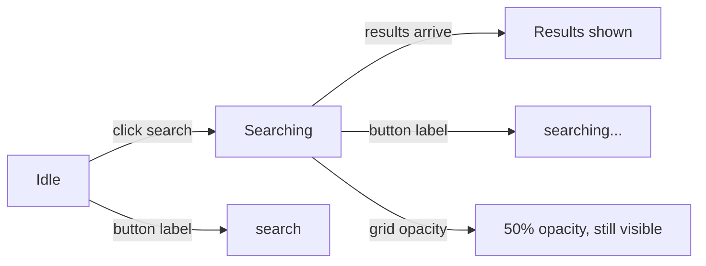

# Search Button Loading State

## Current behavior

In [`SearchScreen.tsx`](src/components/SearchScreen/SearchScreen.tsx):

- Clicking **search** disables the input/button and renders a page-level `<AnimatedEllipsis label="searching" />` below the search bar (lines 150–157).
- The song grid is hidden while `isSearching` via `showSongGrid = !showSearchLoading && ...`.

## Target behavior



- **Button**: show animated loading copy while searching, static label otherwise — same pattern as [`LandingFlow.tsx`](src/components/LandingFlow/LandingFlow.tsx) (`creating...` / `get started`).
- **Page**: remove the standalone searching status line.
- **Grid**: remain visible during search at ~50% opacity (per your preference); hide only for initial recommendations loading.

## Changes

### 1. [`SearchScreen.tsx`](src/components/SearchScreen/SearchScreen.tsx)

**Button label** — replace static `"search"` with conditional content:

```tsx
{isSearching ? <AnimatedEllipsis label="searching" /> : "search"}
```

Keep `disabled={isSearching}` on both input and button.

**Remove page-level search loading** — delete the `showSearchLoading` block (lines 150–157) and the `showSearchLoading` variable if no longer referenced.

**Grid visibility logic** — simplify gating so search no longer hides the grid:

```tsx
// Before
const showSearchLoading = isSearching;
const showSongGrid =
  !showSearchLoading && !showRecommendationsLoading && displaySongs.length > 0;

// After
const showSongGrid =
  !showRecommendationsLoading && displaySongs.length > 0;
```

**Dim grid during search** — add a modifier class on the results container:

```tsx
<div
  className={[
    "search-screen__results",
    isSearching ? "search-screen__results--searching" : "",
  ].filter(Boolean).join(" ")}
>
```

**Empty state** — keep gated so it does not flash during search:

```tsx
{!searchError && hasSearched && !isSearching && songs.length === 0 ? ( ... ) : null}
```

**Out of scope (unchanged):** the page-level `loading recommendations...` message for initial load stays as-is.

### 2. [`SearchScreen.css`](src/components/SearchScreen/SearchScreen.css)

- Add dimmed state for the results grid:

```css
.search-screen__results--searching {
  opacity: 0.5;
  pointer-events: none;
}
```

`pointer-events: none` prevents accidental song selection while a search is in flight (selection is already cleared at search start, but this avoids clicks on dimmed cards).

- Remove unused `.search-screen__loading-status` rules (lines 81–88) since the searching indicator moves into the button.

No changes needed to [`Button.tsx`](src/components/Button/Button.tsx) or [`AnimatedEllipsis`](src/components/AnimatedEllipsis/AnimatedEllipsis.tsx) — existing components already support this pattern.

## Test plan

1. Host opens `/search` → recommendations load with existing page-level `loading recommendations...` (unchanged).
2. Click **search** (first time) → button shows animated `searching...`, input disabled, no page-level searching line, grid dims to 50% if visible.
3. Search completes → button returns to `search`, grid returns to full opacity with new results (or empty-state message if none).
4. Search again with existing results → previous results stay visible (dimmed) until new results replace them.
5. Verify reduced-motion: ellipsis dots remain static per existing `AnimatedEllipsis` CSS.
