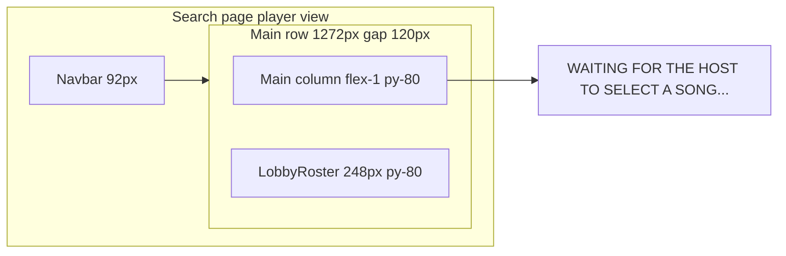

# Search Screen — Player Waiting (Figma 2094:2307)

## Scope (confirmed)

- **Screen:** [`/search`](src/app/search/page.tsx) player view only (`!isHost` branch in [`SearchScreen.tsx`](src/components/SearchScreen/SearchScreen.tsx))
- **Not in scope:** JoinCodeModal waiting, GameScreen, music notes (explicitly hidden in 2094:2307)
- **Reuse as-is:** [`Navbar`](src/components/Navbar/Navbar.tsx), [`LobbyRoster`](src/components/LobbyRoster/LobbyRoster.tsx)

## What Figma 2094:2307 specifies



| Element | Figma spec |
|---|---|
| Page shell | Navbar + content row starting directly below navbar (no extra top gap) |
| Row | `1272px` total: flex main (`904px` flex-1) + `120px` gap + `248px` roster |
| Main column | `flex: 1`, `flex-direction: column`, `padding: 80px 0`, **no vertical centering** |
| Waiting copy | `text-body` (18px mono medium), `--neutral-400`, **top of column**, left-aligned |
| Copy text | `WAITING FOR THE HOST TO SELECT A SONG...` (with ellipsis) |
| Decorations | Music-note group is **hidden** — do not render |

## Gap vs current code

Current player branch in [`SearchScreen.tsx`](src/components/SearchScreen/SearchScreen.tsx):

```194:201:src/components/SearchScreen/SearchScreen.tsx
<section className="search-screen__main">
  <div className="search-screen__waiting">
    <MusicNoteDecorations variant="search" />
    <p className="search-screen__waiting-message text-body">
      WAITING FOR THE HOST TO SELECT A SONG
    </p>
  </div>
</section>
```

Issues:
1. Renders `MusicNoteDecorations` — Figma hides these
2. Message is vertically centered in a `min-height: 400px` flex box — Figma is **top-aligned**
3. Message is `text-align: center` — Figma is **left-aligned**
4. Missing trailing `...` on copy
5. Vertical spacing: body `padding: 60px 0` + main `padding: 60px 0` stacks to ~120px before content; Figma uses **80px** column padding only

The shared row layout (`search-screen__container` flex + 120px gap + 248px roster) already matches Figma structurally.

## Implementation

### 1. Simplify player JSX — [`SearchScreen.tsx`](src/components/SearchScreen/SearchScreen.tsx)

- Remove `MusicNoteDecorations` import and usage from the `!isHost` branch
- Replace waiting block with a single message:

```tsx
<section className="search-screen__main search-screen__main--player-waiting">
  <p className="search-screen__waiting-message text-body">
    WAITING FOR THE HOST TO SELECT A SONG...
  </p>
</section>
```

No wrapper div needed unless useful for future states.

### 2. Layout CSS — [`SearchScreen.css`](src/components/SearchScreen/SearchScreen.css)

**Vertical spacing (align with Figma py-80):**
- Change `.search-screen__body` padding from `60px 0` → `0` (content starts below navbar)
- Change `.search-screen__main` and `.search-screen__roster` padding from `60px 0` → `80px 0`

This also improves host-view top spacing consistency with Figma host search frames.

**Player waiting styles — replace centered block:**

Remove `.search-screen__waiting` (centered min-height container) and restyle message:

```css
.search-screen__main--player-waiting {
  justify-content: flex-start;
}

.search-screen__waiting-message {
  color: var(--color-text-muted);
  margin: 0;
  width: 100%;
}
```

Delete `text-align: center`, `position: relative`, `z-index`, and `min-height: 400px` rules from the old waiting block.

**Mobile (`720px`):** keep existing column stack; player message stays top-aligned in main column (no centering override).

### 3. No other file changes

- [`SearchFlow.tsx`](src/components/SearchFlow/SearchFlow.tsx) — routing/polling unchanged
- [`LobbyRoster`](src/components/LobbyRoster/LobbyRoster.tsx) — already matches Figma roster (header + rows)
- Do **not** edit the plan file

## Test plan

1. Join lobby as **player**; host navigates to `/search`
2. Player sees: navbar, top-left waiting copy with `...`, roster on right — **no music notes**
3. Copy is left-aligned at top of main column, not vertically centered
4. Host view on `/search` still renders search UI correctly with updated 80px column padding
5. At `720px` width: column stacks; waiting message remains readable at top of main section
