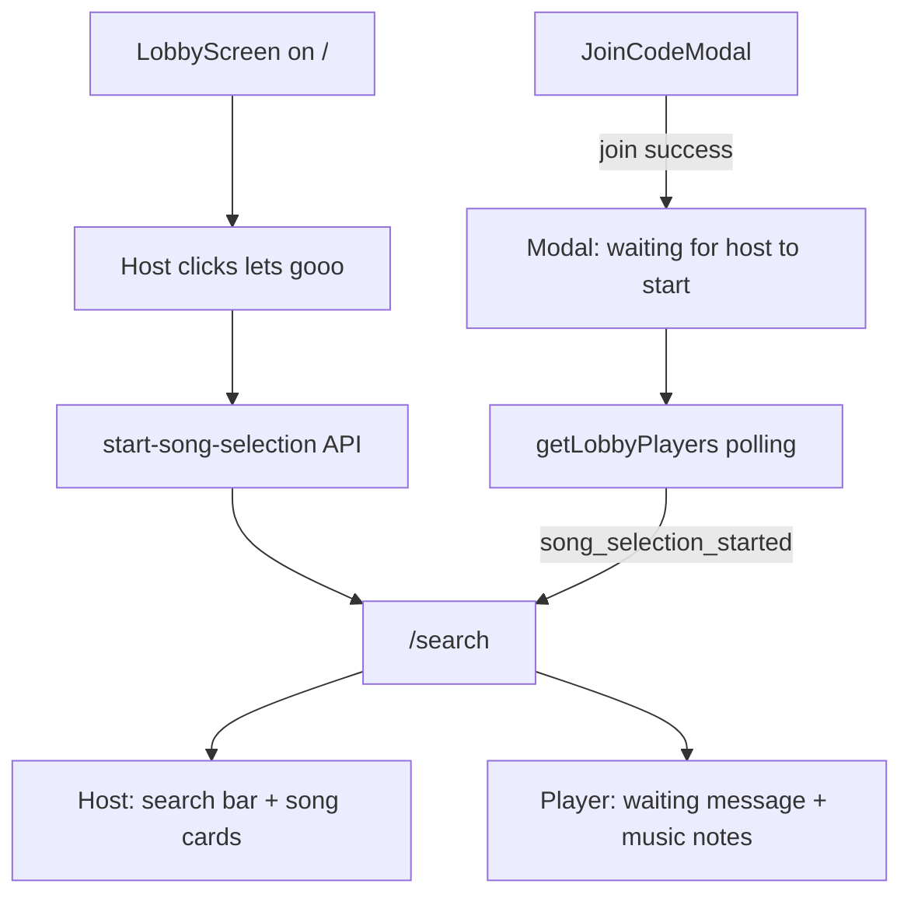

# Search Screen Game Flow

## Goal

When the **host** taps **let's gooo** on the lobby, they navigate to `/search` and get the full song-search UI ([Figma 2082:1635](https://www.figma.com/design/xvOrhZZAqLqapwAtYD5GEq/kara-no-key?node-id=2082-1635)). All **players** follow automatically to `/search` and see the waiting state ([Figma 2083:1750](https://www.figma.com/design/xvOrhZZAqLqapwAtYD5GEq/kara-no-key?node-id=2083-1750)). When a player joins via the join-code modal, the modal stays open and shows **"waiting for the host to start"** until the host starts.



---

## Current state (gaps)

| Area | Today | Needed |
|------|-------|--------|
| Navigation | Single-page `LandingFlow` at `/` only | Add [`src/app/search/page.tsx`](src/app/search/page.tsx) |
| `handleStartGame` | No-op stub in [`LandingFlow.tsx`](src/components/LandingFlow/LandingFlow.tsx) | Host-only API call + `router.push('/search')` |
| Lobby status sync | `get-lobby-players` reads `status` but **does not return it** | Return `status` + new `song_selection_started` flag |
| Join modal | Closes on success → stays on lobby | New **waiting** view after join |
| Song search | None | Pluggable edge function; provider TBD |
| Host gating | All users see enabled **let's gooo** | Host-only on lobby |

---

## 1. Backend — song selection phase sync

Add a lightweight signal so clients know when to leave the lobby. Keep `lobby_status` at `waiting` during song selection (per spec: `ready` = song actually selected).

**Migration** — new file `supabase/migrations/002_song_selection_started.sql`:

```sql
alter table lobbies
  add column song_selection_started boolean not null default false;
```

**New edge function** — `supabase/functions/start-song-selection/index.ts`:

- Input: `{ player_id }`
- Validate caller is host of an active `waiting` lobby
- Set `song_selection_started = true`, `updated_at = now()`
- Return `{ lobby_id, code, song_selection_started: true }`
- Errors: 403 (not host / wrong state), 404 (no lobby)

**Extend** [`get-lobby-players`](supabase/functions/get-lobby-players/index.ts) response:

```ts
{ lobby_id, code, status, max_players, song_selection_started, players }
```

**Client types** — update [`src/lib/supabase/functions.ts`](src/lib/supabase/functions.ts) with `startSongSelection()` + extended `GetLobbyPlayersResult`.

Register the new function in [`supabase/config.toml`](supabase/config.toml) and deploy script if one exists.

---

## 2. Pluggable song search API (provider TBD)

Build the real network shape now; swap the provider later via env.

**Edge function** — `supabase/functions/search-songs/index.ts`:

- Input: `{ query: string, limit?: number }`
- Output: `{ songs: SongResult[] }` where `SongResult = { id, title, artist?, thumbnail_url? }`
- Provider adapter in `supabase/functions/_shared/song-providers/`:
  - `types.ts` — shared interface `searchSongs(query, limit): Promise<SongResult[]>`
  - `mock.ts` — initial adapter (3 Figma-like results) so UI is testable before a real provider is chosen
  - `index.ts` — reads `SONG_SEARCH_PROVIDER` env (`mock` default); future: `spotify`, `youtube`, etc.

**Client** — `src/lib/songs/searchSongs.ts` invokes `search-songs`; host UI calls this on **search** button click / Enter key.

Document new env vars in [`.env.local.example`](.env.local.example) (e.g. `SONG_SEARCH_PROVIDER=mock`, plus placeholders for future API keys).

Song card click (host only): select/highlight a card and store selection in local state. Persisting selection to DB (`select-song` + `waiting → ready`) is **out of scope** for this pass unless you want it included — the countdown/game screens come next.

---

## 3. Routing — `/search` page

Add [`src/app/search/page.tsx`](src/app/search/page.tsx) rendering a new `SearchFlow` client component (mirrors the `LandingFlow` pattern on `/`).

**Session guard** on mount:

1. Load `player_id` + `sessionStorage` lobby session ([`session.ts`](src/lib/player/session.ts))
2. If missing → redirect to `/`
3. Call `getLobbyPlayers` — if `song_selection_started` is false and user is not mid-host-start → redirect to `/`
4. Render `SearchScreen` with `isHost`, roster, and session data

**Host navigation** from lobby:

```ts
// LandingFlow.handleStartGame
await startSongSelection(playerId);
router.push('/search');
```

**Player auto-navigation** — poll `getLobbyPlayers` while on lobby or in join-modal waiting state; when `song_selection_started === true` → `router.push('/search')`.

Extend [`useLobbyRosterPolling`](src/lib/lobby/useLobbyRosterPolling.ts) (or rename to `useLobbyPolling`) to:

- Run when `step === 'lobby'` OR join modal is in `waiting` state
- Invoke `onStatusChange` callback with full lobby payload including `status` + `song_selection_started`
- Keep existing 3s interval

---

## 4. UI — `SearchScreen` (host + player)

New files:

- [`src/components/SearchScreen/SearchScreen.tsx`](src/components/SearchScreen/SearchScreen.tsx)
- [`src/components/SearchScreen/SearchScreen.css`](src/components/SearchScreen/SearchScreen.css)
- [`src/components/SongCard/SongCard.tsx`](src/components/SongCard/SongCard.tsx) + `.css`
- [`src/components/LobbyRoster/LobbyRoster.tsx`](src/components/LobbyRoster/LobbyRoster.tsx) + `.css` — extract roster from [`LobbyScreen`](src/components/LobbyScreen/LobbyScreen.tsx) for reuse

**Shared layout** (match Figma + existing lobby patterns):

- Reuse [`Navbar`](src/components/Navbar/Navbar.tsx) (`exit lobby` → `leaveLobby` + redirect `/`)
- 580px centered main column, 248px roster panel positioned like [`LobbyScreen.css`](src/components/LobbyScreen/LobbyScreen.css) (`.lobby-screen__roster` positioning)
- Plain CSS + existing typography tokens (`text-heading-1`, `text-body`, `text-button-label`) and [`colors.css`](src/styles/semantic/colors.css)

**Host view** ([2082:1635](https://www.figma.com/design/xvOrhZZAqLqapwAtYD5GEq/kara-no-key?node-id=2082-1635)):

- Green heading: **SEARCH A SONG**
- Row: [`InputField`](src/components/InputField/InputField.tsx) (`search for artists or songs`) + primary [`Button`](src/components/Button/Button.tsx) (`search`)
- Vertical list of `SongCard` results (160px thumbnail + title)
- Loading / empty / error states for search

**Player view** ([2083:1750](https://www.figma.com/design/xvOrhZZAqLqapwAtYD5GEq/kara-no-key?node-id=2083-1750)):

- Centered muted text: **WAITING FOR THE HOST TO SELECT A SONG**
- Scatter music-note decorations around the message — add a new decoration preset in [`MusicNoteDecorations`](src/components/MusicNoteDecorations/MusicNoteDecorations.tsx) (new `SEARCH_PAGE_DECORATIONS` config; static positions from Figma, no pendulum needed)

---

## 5. Lobby changes — host gating + start wiring

Update [`LobbyScreen.tsx`](src/components/LobbyScreen/LobbyScreen.tsx):

- New prop: `isHost: boolean`
- Show **let's gooo** only when `isHost === true` (non-hosts see lobby code + join CTA + roster only)
- Pass `isHost` from [`LandingFlow`](src/components/LandingFlow/LandingFlow.tsx) (already in state)

Update `handleStartGame` in `LandingFlow`:

- Guard: host only, not loading
- Call `startSongSelection`, then `router.push('/search')`
- On error: surface message in lobby hero area

---

## 6. Join modal — waiting state

Update [`JoinCodeModal.tsx`](src/components/JoinCodeModal/JoinCodeModal.tsx) + `.css`:

Add a `phase` prop: `'enter-code' | 'waiting-for-host' | 'joining'`

| Phase | UI |
|-------|-----|
| `enter-code` | Current: input + **let's gooo** |
| `joining` | Input disabled + **joining...** button |
| `waiting-for-host` | Hide input; show centered **waiting for the host to start**; hide submit button; keep overlay (dismissible via Escape/overlay unless loading) |

**LobbyScreen** tracks `joinModalPhase` locally:

- On successful `onJoinLobby()` → set phase to `waiting-for-host` (do **not** close modal)
- While phase is `waiting-for-host`, parent polling watches `song_selection_started` → close modal + navigate to `/search`
- On modal close → reset phase to `enter-code`

---

## 7. Polling on `/search`

Reuse the polling hook on the search page to keep the roster live (`players joined X/Y`). Host search interactions stay local; no extra sync needed until song selection is persisted.

---

## File change summary

| Action | Path |
|--------|------|
| Add | `supabase/migrations/002_song_selection_started.sql` |
| Add | `supabase/functions/start-song-selection/index.ts` |
| Add | `supabase/functions/search-songs/index.ts` |
| Add | `supabase/functions/_shared/song-providers/{types,mock,index}.ts` |
| Edit | `supabase/functions/get-lobby-players/index.ts` |
| Edit | `src/lib/supabase/functions.ts` |
| Add | `src/lib/songs/searchSongs.ts` |
| Add | `src/app/search/page.tsx` |
| Add | `src/components/SearchFlow/SearchFlow.tsx` |
| Add | `src/components/SearchScreen/*` |
| Add | `src/components/SongCard/*` |
| Add | `src/components/LobbyRoster/*` |
| Edit | `src/components/LobbyScreen/*` (extract roster, host gating) |
| Edit | `src/components/JoinCodeModal/*` (waiting phase) |
| Edit | `src/components/LandingFlow/LandingFlow.tsx` (start game, polling, navigation) |
| Edit | `src/lib/lobby/useLobbyRosterPolling.ts` |
| Edit | `src/components/MusicNoteDecorations/*` (search preset) |
| Edit | `.env.local.example` |

---

## Test plan

1. **Host solo** — create lobby → **let's gooo** → lands on `/search` with search UI; roster shows self as host
2. **Player via modal** — host creates lobby → player opens modal, enters code, **let's gooo** → modal shows **waiting for the host to start** (no navigation yet)
3. **Host starts** — host taps **let's gooo** → player modal closes (or transitions) and player lands on `/search` with waiting message + music notes
4. **Player already on lobby** — second player joins and stays on lobby → when host starts, auto-navigates to `/search` waiting view
5. **Host search** — type query → **search** → results render as song cards from edge function
6. **Non-host lobby** — joined player on `/` does not see host **let's gooo** button
7. **Refresh on `/search`** — session restores and screen reappears if `song_selection_started` is true
8. **Exit lobby** from `/search` → `leaveLobby`, clear session, redirect `/`

---

## Out of scope (next module)

- Persisting selected song (`select-song` edge function, `waiting → ready` transition)
- Countdown / playing screens
- Realtime subscriptions (polling is sufficient for this pass)
- Wiring a specific Spotify/YouTube provider (interface ready; `mock` adapter ships first)
