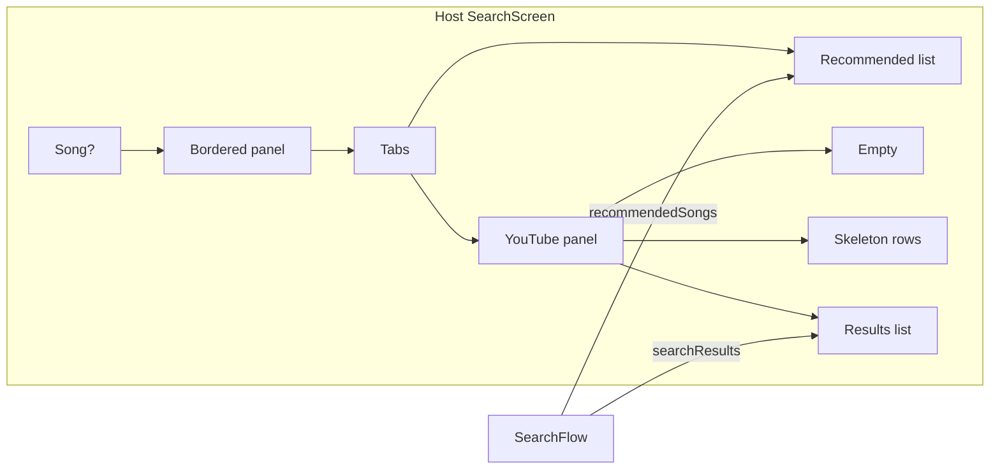

# Search screen UI revamp

## Design sources (read via MCP as `nimeshm.work@gmail.com`)

| Frame | Node | What it shows |
|-------|------|----------------|
| Recommended | [2256:2905](https://www.figma.com/design/xvOrhZZAqLqapwAtYD5GEq/kara-no-key?node-id=2256-2905) | `Song?` + tabs + list (no search bar) |
| Tab | [2260:3414](https://www.figma.com/design/xvOrhZZAqLqapwAtYD5GEq/kara-no-key?node-id=2260-3414) | Selected / Unselected / Hover |
| List item | [2260:3387](https://www.figma.com/design/xvOrhZZAqLqapwAtYD5GEq/kara-no-key?node-id=2260-3387) | Default / Hover / Loading skeleton |
| YouTube empty | [2261:2615](https://www.figma.com/design/xvOrhZZAqLqapwAtYD5GEq/kara-no-key?node-id=2261-2615) | Tabs + search bar, empty body |
| YouTube loading | [2263:2725](https://www.figma.com/design/xvOrhZZAqLqapwAtYD5GEq/kara-no-key?node-id=2263-2725) | Search bar + 4 skeleton rows |
| YouTube results | [2263:2829](https://www.figma.com/design/xvOrhZZAqLqapwAtYD5GEq/kara-no-key?node-id=2263-2829) | Search bar + result rows |
| Non-host waiting | [2261:580](https://www.figma.com/design/xvOrhZZAqLqapwAtYD5GEq/kara-no-key?node-id=2261-580) | Bordered box + centered waiting copy |

## Visual spec (from Figma)

**Page**
- Title: **`Song?`** — Heading/H1 (`--size-32`, semibold mono, black)
- Content padding: `40px` vertical on recommended frame / `20px` on YouTube frames; horizontal `120px` (map to existing layout tokens / content width)
- Main interactive area: full-width **bordered panel** (`1px --neutral-200`), `overflow: clip`, flex column

**Tabs** ([2260:3414](https://www.figma.com/design/xvOrhZZAqLqapwAtYD5GEq/kara-no-key?node-id=2260-3414))
- Labels exact: **`Recommended Songs`** | **`Search Youtube`**
- Equal flex children, `padding: 16px`, centered Button Label (14 medium mono)
- Selected: `--solid-black` bg, white text
- Unselected: white bg, black text
- Hover (unselected): `--neutral-100` bg
- Tab row has bottom border `--neutral-200`

**List item** ([2260:3387](https://www.figma.com/design/xvOrhZZAqLqapwAtYD5GEq/kara-no-key?node-id=2260-3387))
- Height `88px`, `padding: 12px`, bottom border `--neutral-200`
- Thumbnail `64×64`
- Info row: `padding: 20px`, `gap: 20px` — title flexes left (black); artist + duration right (`--neutral-400`)
- Hover: `--neutral-100` background
- **Loading:** gray blocks — 64×64 thumb, 300×24 title, two 42×24 meta bars
- Drop green title and “select song” hover chrome; whole row remains clickable
- **Lyrics badge stays on the row** (available / unavailable) — place in the meta group with artist + duration (not in Figma frames, but required)

**YouTube search bar** (only when Search Youtube tab active)
- Row under tabs: `pl: 12px`, bottom border; placeholder “Search for artists or songs” (`--neutral-200`)
- Secondary **search** button, fixed ~`90px` wide, flush right (disabled until query)
- Empty state: search row only, empty panel body
- Loading: keep search row + skeleton list items (not pixel `Loader` / not ellipsis)

**Non-host waiting** ([2261:580](https://www.figma.com/design/xvOrhZZAqLqapwAtYD5GEq/kara-no-key?node-id=2261-580))
- Large bordered `--neutral-200` box, content centered
- Copy: `WAITING FOR THE HOST TO SELECT A SONG...` — Body Medium, `--neutral-400`

## Confirmed behavior

- Search / select / lyrics confirm / lobby polling APIs unchanged.
- **Tabs:** switch views; **both lists preserved**. Search UI lives only on YouTube tab; submitting search runs existing `searchSongs` and stays on YouTube.
- Default tab: Recommended Songs.
- Search button: `variant="secondary"`.
- **Load more:** keep secondary button **below the active list**; `flex: 1` / full width of the list container (same width as the bordered panel content).
- **Lyrics badge:** show on each row when `lyricsStatus` is set; keep `confirmError` / select flow.

## State — [`SearchFlow.tsx`](src/components/SearchFlow/SearchFlow.tsx)

Split today’s single `displaySongs`:

- `recommendedSongs` + rec pagination / loading / errors
- `searchResults` + search pagination / `hasSearched` / loading / errors
- `activeTab: "recommended" | "youtube"` (default `"recommended"`)

Handlers: recommendations never cleared by search; `handleLoadMore` branches on `activeTab`; pass both lists + tab into `SearchScreen`.

## Components

### `Tabs` — new [`src/components/Tabs/`](src/components/Tabs/)

Controlled `value` / `onChange` / `items`. Plain CSS tokens. Gallery demo.

### `SongCard` — restyle to list item

Same props (`song`, `onSelect`, `durationLabel`, `lyricsStatus`, `isSelected`); add `isLoading?: boolean` for skeleton. Remove hover-action chrome; keep lyrics badge in the meta row. Gallery update.

### `SearchScreen` — layout

1. `Song?` heading
2. Bordered panel → tablist → panel body
3. Recommended: list or skeletons while `isLoadingRecommendations`
4. YouTube: search row + empty | skeletons (`isSearching`) | results
5. Load more: secondary, full width of list container (`width: 100%` / `align-self: stretch`)
6. Non-host: waiting bordered box

Replace 2-col grid CSS with single-column stack. Reuse `InputField` + secondary `Button` inside the search row (restyle container to match Figma flush layout).

## Out of scope

- Navbar / Players dropdown redesign
- Changing search API or `PAGE_SIZE`
- Tailwind

## Implement order

1. `Tabs` + gallery
2. `SongCard` list + loading variant
3. `SearchFlow` dual-list + `activeTab`
4. `SearchScreen` panel layout, YouTube states, waiting
5. Visual pass vs Figma (desktop + ≤720px)
