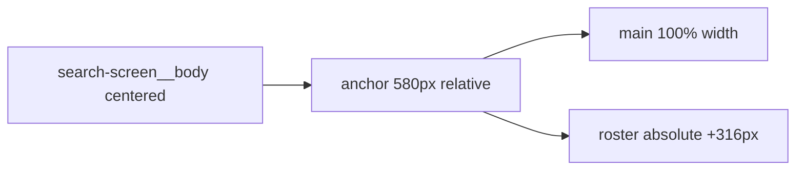

# SearchScreen Layout Parity with LobbyScreen

## Problem

[`SearchScreen.css`](src/components/SearchScreen/SearchScreen.css) currently uses a **flex row** layout with a custom `1280px` breakpoint. [`LobbyScreen.css`](src/components/LobbyScreen/LobbyScreen.css) uses a simpler, consistent pattern:

```17:88:src/components/LobbyScreen/LobbyScreen.css
.lobby-screen__anchor {
  position: relative;
  width: 292px;
}

.lobby-screen__main {
  display: flex;
  flex-direction: column;
  gap: 60px;
  width: 100%;
}

.lobby-screen__roster {
  position: absolute;
  left: calc(100% + 316px);
  top: 0;
}
```

Search should follow this exact structure, with `580px` anchor width (Figma main column width) instead of `292px`.

---

## Changes

### 1. Align layout rules in [`SearchScreen.css`](src/components/SearchScreen/SearchScreen.css)

Replace the flex-based anchor/roster block with lobby-equivalent rules:

| Selector | Lobby | Search (new) |
|----------|-------|--------------|
| `__anchor` | `position: relative; width: 292px` | `position: relative; width: 580px` |
| `__main` | `flex column; gap: 60px; width: 100%` | same |
| `__roster` | `position: absolute; left: calc(100% + 316px); top: 0` | same |

**Remove** the `1280px` media query entirely.

**Update** the `720px` breakpoint to match lobby exactly:

```css
@media (max-width: 720px) {
  .search-screen__body {
    padding: 40px var(--size-20);
  }

  .search-screen__anchor {
    width: 100%;
    max-width: 580px;
  }

  .search-screen__roster {
    position: static;
    left: auto;
    top: auto;
    width: 100%;
    margin-top: 40px;
  }

  /* keep existing search-bar mobile rules */
}
```

Keep all search-specific styles unchanged (`--search-accent`, search bar, results, waiting message, etc.).

---

### 2. Match DOM structure in [`SearchScreen.tsx`](src/components/SearchScreen/SearchScreen.tsx)

Lobby always nests content inside `__main`, then places `LobbyRoster` as a sibling inside `__anchor`:

```
anchor
├── main (content)
└── roster (absolute)
```

Player view currently renders `search-screen__waiting` directly inside `anchor` (no `__main` wrapper). Wrap the player waiting block in `<section className="search-screen__main">` so both host and player paths share the same layout skeleton.

---

## Result



Desktop: centered 580px main column, roster pinned 316px to its right (same as lobby).
Mobile (≤720px): roster stacks below main with `margin-top: 40px` (same as lobby).

No new components or shared abstractions needed — this is a straight CSS + minor markup alignment.

---

## Test

1. Host `/search` at desktop width — roster visible to the right of search UI, not clipped awkwardly vs lobby
2. Player `/search` — waiting message + roster use same layout
3. Resize to ≤720px — roster moves below main content on both screens
4. Compare side-by-side with lobby — same body padding, anchor/roster relationship, and breakpoint behavior
