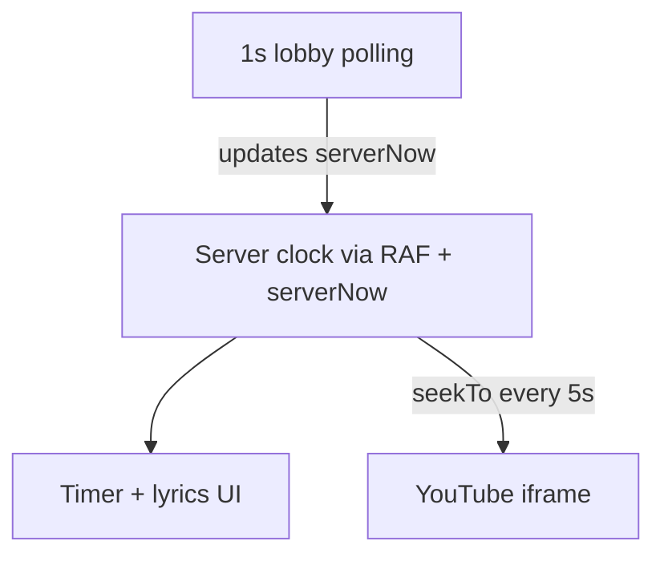
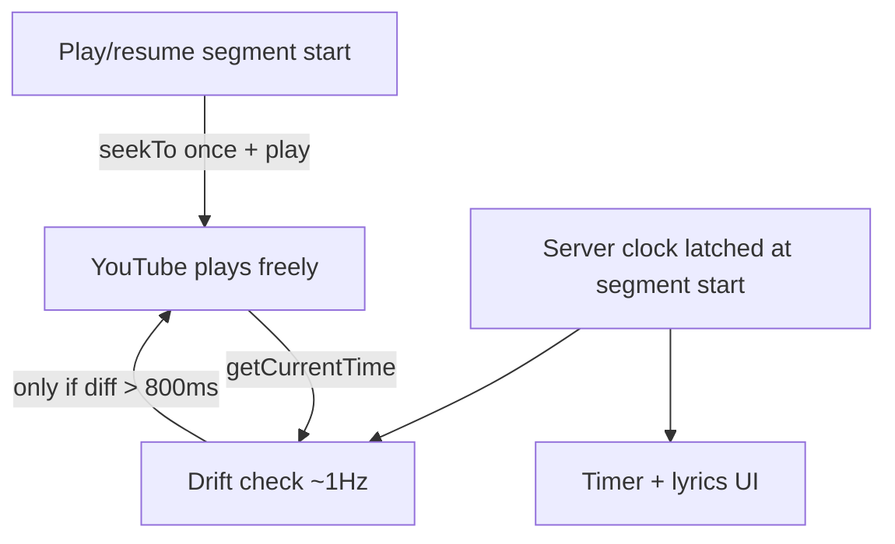

# Smooth Playback Sync

## Problem

Playback feels choppy because the app runs **two clocks** and forces YouTube to re-sync on a timer:



Current code in [`usePlaybackSync.ts`](src/lib/game/usePlaybackSync.ts):

- Calls `onSeek()` every **5 seconds** unconditionally (`RESYNC_INTERVAL_MS = 5000`)
- Updates `serverOffsetRef` on **every** `serverNow` poll, causing small elapsed-time jumps
- Calls `setElapsedMs()` on **every animation frame** (~60 React re-renders/sec)

Sites like [typeaoke](https://type.pauwee.com/game/youtube/Bon%20Iver%20-%20Topic%20-%20Skinny%20Love) play smoothly because YouTube is allowed to run continuously; sync is applied sparingly, not on a fixed timer.

## Target architecture



- **Server clock** remains authoritative for lyrics/timer across multiplayer clients.
- **YouTube** plays without interruption unless drift exceeds **800ms** (your choice).
- **One seek** on play/resume/countdown end (keep existing transition logic in [`GameScreen.tsx`](src/components/GameScreen/GameScreen.tsx)).

## Changes

### 1. Refactor [`usePlaybackSync.ts`](src/lib/game/usePlaybackSync.ts)

**Remove timer-based seeks**
- Delete `RESYNC_INTERVAL_MS` and the `onSeek` call inside the RAF loop.
- Remove `onSeek` from the hook API (or replace with optional drift helper — see step 3).

**Latch server offset at segment boundaries**
- Recompute `serverOffsetRef` only when the playback segment changes (`playbackStartAt` or `playbackElapsedMs`), not on every `serverNow` poll.
- Read the latest `serverNow` at that moment for an accurate anchor.

```tsx
useEffect(() => {
  if (!enabled || !playbackStartAt || !serverNow) return;
  serverOffsetRef.current = new Date(serverNow).getTime() - Date.now();
}, [enabled, playbackStartAt, playbackElapsedMs, serverNow]);
// Effect re-runs on segment change; during steady playback polls won't retrigger it
```

**Reduce React re-renders**
- Track `elapsedMs` in a ref during RAF.
- Call `setElapsedMs` / `setActivePhraseIndex` only when:
  - `activePhraseIndex` changes, or
  - the displayed timer second changes (`Math.floor(elapsedMs / 1000)`)

This keeps lyrics responsive while avoiding 60 renders/sec.

### 2. Extend [`YouTubePlayer.tsx`](src/components/YouTubePlayer/YouTubePlayer.tsx)

Add `getCurrentTime` to the player handle:

```tsx
type YouTubePlayerHandle = {
  seekTo: (seconds: number) => void;
  play: () => void;
  pause: () => void;
  getCurrentTime: () => number;
};
```

Wire to `event.target.getCurrentTime()` on the YT player (add to `YTPlayer` type). This lets drift checks read the actual audio position instead of guessing.

### 3. Add drift correction in [`GameScreen.tsx`](src/components/GameScreen/GameScreen.tsx)

Add constants:

```tsx
const DRIFT_THRESHOLD_MS = 800;
const DRIFT_CHECK_INTERVAL_MS = 1000;
```

While `isPlaying`:
- Run a `setInterval` (or low-frequency check inside existing sync) every 1s.
- Compute `serverElapsedSec` from latched server clock (same formula as today).
- Read `playerHandle.getCurrentTime()`.
- **Only if** `Math.abs(serverElapsedSec - ytSec) * 1000 > 800`, call `seekTo(serverElapsedSec)`.

Keep existing **one-time** seek+play on:
- `lobbyStatus` transition to `playing` (lines 190–197)
- `handlePlayerReady` when already playing (lines 209–216)

Remove the old `handleSeek` passed to `usePlaybackSync`.

### 4. No backend or polling changes required

[`GameFlow.tsx`](src/components/GameFlow/GameFlow.tsx) can keep 1s polling for roster/status. With offset latching, poll updates to `serverNow` during steady playback will no longer jitter the clock.

## Files touched

| File | Change |
|---|---|
| [`src/lib/game/usePlaybackSync.ts`](src/lib/game/usePlaybackSync.ts) | Remove 5s seeks, latch offset, sparse setState |
| [`src/components/YouTubePlayer/YouTubePlayer.tsx`](src/components/YouTubePlayer/YouTubePlayer.tsx) | Expose `getCurrentTime()` |
| [`src/components/GameScreen/GameScreen.tsx`](src/components/GameScreen/GameScreen.tsx) | 800ms drift correction, remove periodic seek callback |

## Test plan

1. Host starts song → audio begins smoothly after countdown with no immediate stutter loop.
2. Let song play 30+ seconds → no periodic hitches every 5 seconds (main regression check).
3. Timer and lyrics still advance in sync with audio.
4. Pause and resume → one seek at resume, then smooth playback again.
5. Non-host device → same smooth behavior after countdown (autoplay permitting).
6. Simulate slow network (DevTools throttling) → drift correction may seek occasionally, but not continuously.
7. Confirm React render count feels lighter (timer updates once per second, phrases only on phrase change).

## Out of scope

- Replacing YouTube iframe with another audio source
- Changing Edge Function timing logic
- Autoplay fallback UI for blocked browsers (noted in existing plan as follow-up)
