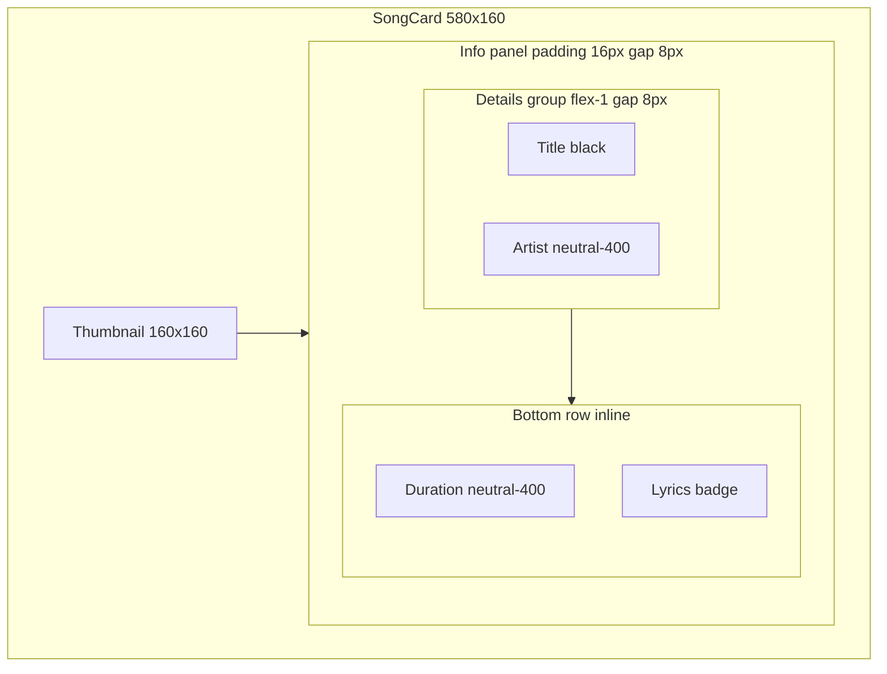

# Song Card — Figma 2083:1712 Parity

## Design spec (2083:1712)

[Figma Song Card Default](https://www.figma.com/design/xvOrhZZAqLqapwAtYD5GEq/kara-no-key?node-id=2083-1712)

| Element | Value |
|---|---|
| Card size | 580×160px (full width in search results list) |
| Border | 1px `--neutral-200` |
| Thumbnail | 160×160px square, `object-fit: cover` |
| Info panel | `flex: 1`, `padding: 16px`, full card height |
| Typography | All text **16px medium** (`text-button-label`) — not 20px heading / 18px body |

### Grouping (critical)



- **Top group** (`flex: 1`): title + artist/channel, 8px apart
- **Bottom row**: duration pinned to bottom; **lyrics badge inline next to duration** (your decision)
- Outer info column uses `gap: 8px`; the `flex: 1` on the details group pushes the meta row down

### List context (host search page 2082:1635)

- Single-column stack, **20px** gap between cards ([`SearchScreen.css`](src/components/SearchScreen/SearchScreen.css) already `grid-template-columns: 1fr; gap: 20px`)

## Gaps vs current code

[`SongCard.tsx`](src/components/SongCard/SongCard.tsx) / [`.css`](src/components/SongCard/SongCard.css):

1. **Typography** — title uses `text-heading-3` (20px semibold); subtitle/meta use `text-body` (18px). Figma uses 16px button-label for all three lines.
2. **Grouping** — title, subtitle, and meta are flat siblings with 8px gap; duration does not sit at the bottom of the 160px info area.
3. **Meta layout** — `flex-wrap` + 12px gap; badge should sit **inline beside duration** in a single bottom row.
4. **Duration format** — Figma shows `03:48`; [`formatDuration`](src/components/SearchScreen/SearchScreen.tsx) zero-pads seconds only (`3:48`). Pad minutes to 2 digits.

**Keep unchanged:** selection border (`song-card--selected`), hover, click/keyboard behavior, thumbnail fallback.

## Implementation

### 1. Restructure JSX — [`SongCard.tsx`](src/components/SongCard/SongCard.tsx)

```tsx
<div className="song-card__info">
  <div className="song-card__details">
    <p className="song-card__title text-button-label">{song.title}</p>
    {subtitle ? (
      <p className="song-card__subtitle text-button-label">{subtitle}</p>
    ) : null}
  </div>
  <div className="song-card__meta">
    {durationLabel ? (
      <span className="song-card__duration text-button-label">{durationLabel}</span>
    ) : null}
    {lyricsStatus ? (
      <span className="song-card__lyrics-badge text-button-label ...">...</span>
    ) : null}
  </div>
</div>
```

### 2. CSS — [`SongCard.css`](src/components/SongCard/SongCard.css)

- `.song-card`: add `min-height: 160px`; ensure info column stretches (`align-items: stretch` on card, `align-self: stretch` on info)
- `.song-card__info`: `display: flex; flex-direction: column; gap: 8px; padding: 16px; flex: 1; min-height: 160px` (or `height: 100%`)
- `.song-card__details`: `flex: 1; display: flex; flex-direction: column; gap: 8px; min-width: 0`
- `.song-card__meta`: `display: flex; flex-wrap: nowrap; gap: 12px; align-items: center` — duration + badge on one line
- Title/subtitle/duration: use existing color tokens (`--color-text-primary` / `--color-text-muted`)
- **Remove** local `.text-heading-3` block from `SongCard.css` (no longer needed here)

### 3. Duration formatting — [`SearchScreen.tsx`](src/components/SearchScreen/SearchScreen.tsx)

Update `formatDuration` to zero-pad minutes:

```ts
return `${minutes.toString().padStart(2, "0")}:${remainingSeconds.toString().padStart(2, "0")}`;
```

### 4. No changes required

- [`SearchScreen.css`](src/components/SearchScreen/SearchScreen.css) — grid gap/columns already match
- [`SearchFlow.tsx`](src/components/SearchFlow/SearchFlow.tsx) — keep passing `lyricsStatusBySongId`

## Test plan

1. Host `/search` → song cards are 160px tall, 160px thumbnails, 16px padded info
2. Long titles wrap; artist below title with 8px gap
3. Duration sits at bottom-left; lyrics badge appears **beside** duration (not below title)
4. Duration displays as `03:48` style
5. Selection/hover still work; badge colors unchanged (available = black, unavailable = red)
