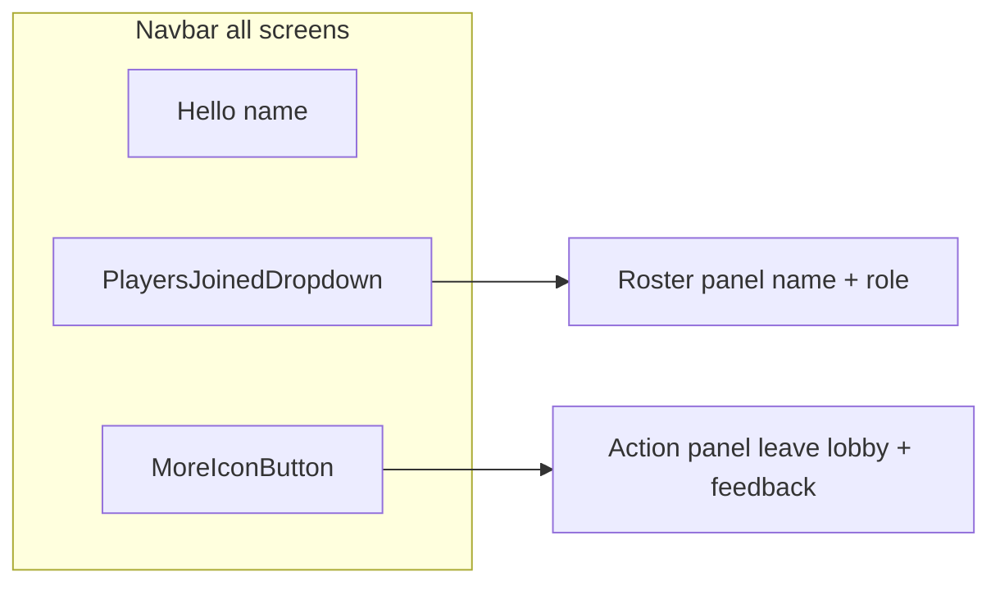

# Song Selection Screen Redesign

## Scope (confirmed)

- **Navbar redesign applies to all in-lobby screens**: Lobby, Search, Game
- **Load more**: real API pagination (not client-only stub)
- **Feedback**: no-op stub (moved into more menu)
- **Non-host search view**: keep current waiting message; only navbar/layout chrome updates

## Design summary (Figma)

| Area | Current | New |
|------|---------|-----|
| Navbar | exit lobby · greeting · feedback | greeting (left) · players-joined dropdown · more icon |
| More menu | n/a | leave lobby + feedback (reuse dropdown panel styling) |
| Players roster | Sidebar [`LobbyRoster`](src/components/LobbyRoster/LobbyRoster.tsx) on Search + Lobby | Navbar dropdown panel (name + host/player role) |
| Search hero | "SEARCH A SONG" | "Song?" + subtitle "Your frens are waiting for you to select a song." |
| Song grid | 1 column | **2 columns**, 20px gap |
| Song title color | black (`--color-text-primary`) | accent green (`--color-accent-green`) |
| Search button | 216px wide | 90px wide |
| Song list footer | none | secondary **load more** button |

Reference nodes: main screen `2154:4416`, dropdown trigger `2168:5126`, open roster `2168:5476`, more icon `2041:14` (secondary variant).



---

## 1. New shared UI components

### [`src/components/Dropdown/Dropdown.tsx`](src/components/Dropdown/Dropdown.tsx) + CSS (new)

Build a reusable dropdown primitive matching Figma `2168:5126`:

- **Trigger**: optional count badge (24×24 green square, 12px label), label text, 20×20 arrow-down icon
- **States**: default / hover / active / disabled via CSS (`:hover`, `[aria-expanded=true]`, `:disabled`)
- **Panel**: absolutely positioned below trigger; 16px padding, 16px row gap, `--neutral-100` background
- **A11y**: `<button aria-expanded>` + `aria-haspopup="menu"`; close on outside click + Escape; focus trap not required for short menus

Expose props roughly like:

```tsx
type DropdownProps = {
  label: string;
  countBadge?: string;        // e.g. "02"
  disabled?: boolean;
  isOpen: boolean;
  onOpenChange: (open: boolean) => void;
  children: React.ReactNode;    // panel content
};
```

### Panel content variants (inside Navbar, not separate files unless they grow)

1. **Players panel** (Figma `2168:5515`): reuse [`sortLobbyPlayers`](src/lib/lobby/sortLobbyPlayers.ts); each row = name (black) + role (green). Show loading/error inline inside panel.
2. **More menu panel**: two clickable rows — `leave lobby` → existing `onExitLobby`, `feedback` → no-op stub.

Only one navbar menu open at a time (players OR more).

### Icons

Add committed SVGs under [`public/icons/`](public/icons/):

- `arrow-down.svg`
- `ellipsis-vertical.svg`

Source from Figma Desktop export during implementation (localhost assets expire). Wire through existing [`IconButton`](src/components/IconButton/IconButton.tsx) for the more trigger (secondary variant, 24px icon, 16px padding — already matches Figma).

---

## 2. Navbar overhaul (all screens)

Update [`src/components/Navbar/Navbar.tsx`](src/components/Navbar/Navbar.tsx) + [`Navbar.css`](src/components/Navbar/Navbar.css):

**New props** (extend, don’t break call sites silently):

```tsx
type NavbarProps = {
  displayName: string;
  players: LobbyPlayer[];
  isRosterLoading?: boolean;
  rosterError?: string | null;
  onExitLobby: () => void;
};
```

**Layout changes**:

- Remove visible exit lobby + feedback buttons
- Left: greeting (`hello, {name}.`) — left-aligned, muted 18px medium
- Right: players dropdown + more icon (12px gap)
- Add bottom border: `1px solid var(--neutral-100)` (Figma navbar)

**Thread `players` props** from:

- [`SearchScreen.tsx`](src/components/SearchScreen/SearchScreen.tsx) — already has roster props; pass through to Navbar, remove sidebar `<LobbyRoster>`
- [`LobbyScreen.tsx`](src/components/LobbyScreen/LobbyScreen.tsx) — pass `players`, remove absolute-positioned sidebar roster ([`LobbyScreen.css`](src/components/LobbyScreen/LobbyScreen.css) `.lobby-screen__roster` rules)
- [`GameScreen.tsx`](src/components/GameScreen/GameScreen.tsx) — pass `players` for navbar dropdown; **keep** existing game-variant [`LobbyRoster`](src/components/LobbyRoster/LobbyRoster.tsx) score sidebar (scores must stay visible during play; dropdown remains a name/role peek per Figma)

---

## 3. SearchScreen layout + copy

Update [`SearchScreen.tsx`](src/components/SearchScreen/SearchScreen.tsx) + [`SearchScreen.css`](src/components/SearchScreen/SearchScreen.css):

### Copy / typography

- Title: `Song?` using `text-heading-1` (32px semibold)
- Subtitle: new helper class or local CSS — 18px **regular** (`--weight-regular`), black/default body color
- Search placeholder: `search for artists or songs`
- Search button width: `90px`

### Layout

- Drop two-column body layout (`gap: 120px` + sidebar); main content spans full `--layout-content-width`
- Song grid: `grid-template-columns: repeat(2, minmax(0, 1fr))`; gap 20px
- Below grid: secondary `load more` button (40px gap above, centered)
- Hide load more when `hasMore === false` or list empty
- Non-host: keep `"WAITING FOR THE HOST TO SELECT A SONG..."`; still render new navbar with live roster dropdown

### Load-more UX

- Disable load more while fetching; show loading state on button (reuse [`AnimatedEllipsis`](src/components/AnimatedEllipsis/AnimatedEllipsis.tsx) pattern from search button)
- Append fetched songs to existing list (dedupe by `song.id`)
- Reset pagination when user runs a new search (new query replaces list, offset/token reset)

New props from SearchFlow:

```tsx
hasMoreSongs: boolean;
isLoadingMore: boolean;
loadMoreError: string | null;
onLoadMore: () => void;
```

---

## 4. SongCard title color

Minimal change in [`SongCard.css`](src/components/SongCard/SongCard.css):

```css
.song-card__title {
  color: var(--color-accent-green); /* was --color-text-primary */
}
```

Keep lyrics badge + hover/select behavior unchanged.

---

## 5. API pagination (backend + client)

### API contract

Both endpoints return **`has_more`** so the UI knows whether to show the button.

| Endpoint | New request fields | Response |
|----------|-------------------|----------|
| `get-recommended-songs` | `offset?` (default 0), `limit?` (default 6, max 25) | `{ songs, has_more }` |
| `search-songs` | `limit?` (default 6), `offset?` (mock), `page_token?` (YouTube) | `{ songs, has_more, next_page_token? }` |

**Page size**: 6 (matches Figma 3×2 grid).

### Provider layer ([`supabase/functions/_shared/song-providers/`](supabase/functions/_shared/song-providers/))

- **Mock recommended**: slice `MOCK_SONGS` by offset/limit; expand mock list if needed so load-more is testable beyond 6 items
- **YouTube recommended**: slice `RECOMMENDED_VIDEO_IDS` by offset, fetch metadata for that slice only
- **Mock search**: slice filtered results by offset
- **YouTube search**: pass `pageToken` to YouTube Data API `search` endpoint; return `nextPageToken` as `next_page_token`

Update [`types.ts`](supabase/functions/_shared/song-providers/types.ts) signatures and [`index.ts`](supabase/functions/_shared/song-providers/index.ts) exports accordingly.

### Edge functions

- [`get-recommended-songs/index.ts`](supabase/functions/get-recommended-songs/index.ts): validate offset/limit, return `has_more`
- [`search-songs/index.ts`](supabase/functions/search-songs/index.ts): validate offset/page_token, return `has_more` + optional `next_page_token`

### Client wrappers

- [`src/lib/supabase/functions.ts`](src/lib/supabase/functions.ts): extend invoke payloads + result types
- [`src/lib/songs/getRecommendedSongs.ts`](src/lib/songs/getRecommendedSongs.ts): accept `{ offset, limit }`
- [`src/lib/songs/searchSongs.ts`](src/lib/songs/searchSongs.ts): accept `{ limit, offset?, pageToken? }`, return `{ songs, hasMore, nextPageToken? }`

### SearchFlow state ([`SearchFlow.tsx`](src/components/SearchFlow/SearchFlow.tsx))

Track separately for recommendations vs search results:

- `offset` (recommendations + mock search)
- `nextPageToken` (YouTube search)
- `hasMore`, `isLoadingMore`, `loadMoreError`

Handlers:

- Initial recommendation fetch: `offset=0, limit=6`
- `handleLoadMore`: call appropriate API with current cursor, append results
- `handleSearch`: reset cursors, fetch first page only

---

## 6. Responsive behavior

In [`SearchScreen.css`](src/components/SearchScreen/SearchScreen.css) mobile rules:

- Collapse grid to 1 column (keep existing `@media (max-width: 720px)` pattern)
- Navbar dropdown panel: constrain width / align to viewport edge on small screens
- Stack search bar vertically (already exists)

---

## 7. Testing checklist

1. **Lobby**: roster visible via navbar dropdown; sidebar roster gone; more menu exit lobby still works
2. **Search (host)**: Figma copy, 2-col grid, green titles, load more appends songs until `has_more=false`
3. **Search (host)**: new search resets list + pagination
4. **Search (non-host)**: waiting message + navbar dropdown still shows live players
5. **Game**: new navbar + existing score sidebar coexist
6. **Dropdown UX**: hover/active states, outside click + Escape close, only one menu open
7. **Mock + YouTube providers**: pagination paths both return sensible `has_more`

---

## Key files

| Action | Files |
|--------|-------|
| New | `src/components/Dropdown/Dropdown.tsx`, `Dropdown.css`, `public/icons/arrow-down.svg`, `public/icons/ellipsis-vertical.svg` |
| Navbar | `src/components/Navbar/Navbar.tsx`, `Navbar.css` |
| Search UI | `src/components/SearchScreen/SearchScreen.tsx`, `SearchScreen.css`, `SearchFlow.tsx` |
| Song card | `src/components/SongCard/SongCard.css` |
| Lobby layout | `src/components/LobbyScreen/LobbyScreen.tsx`, `LobbyScreen.css` |
| Game wiring | `src/components/GameScreen/GameScreen.tsx` |
| API | `supabase/functions/get-recommended-songs/`, `search-songs/`, `_shared/song-providers/*`, `src/lib/songs/*`, `src/lib/supabase/functions.ts` |
