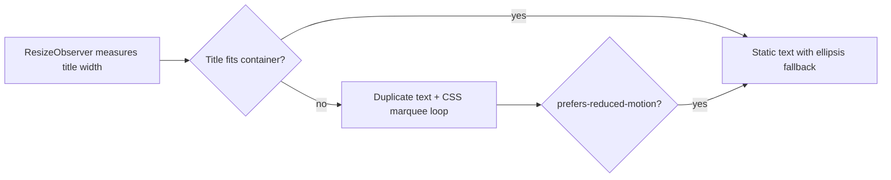

# Game Screen Song Title Marquee

## Current state

In [`GameScreen.tsx`](src/components/GameScreen/GameScreen.tsx), the title is a single static line:

```208:208:src/components/GameScreen/GameScreen.tsx
<p className="game-screen__song-title text-heading-3">{song.title}</p>
```

[`GameScreen.css`](src/components/GameScreen/GameScreen.css) clips overflow with ellipsis:

```61:69:src/components/GameScreen/GameScreen.css
.game-screen__song-title {
  margin: 0;
  padding: var(--size-16);
  min-width: 0;
  overflow: hidden;
  text-overflow: ellipsis;
  white-space: nowrap;
  color: var(--color-text-primary);
}
```

## Target behavior



- **Overflow only** (your choice): short titles stay static; long titles scroll.
- **Seamless loop**: duplicate the title with a gap, animate the track left by one copy width.
- **Brief pause** at loop start/end so the title is readable before scrolling again.
- **Reduced motion**: disable animation and fall back to ellipsis (matches existing app patterns in `AnimatedEllipsis.css`).

## Implementation

### 1. Update markup in [`GameScreen.tsx`](src/components/GameScreen/GameScreen.tsx)

Replace the `<p>` with a viewport + track structure:

```tsx
<div
  ref={titleContainerRef}
  className="game-screen__song-title"
  title={song.title}
>
  <div
    className={[
      "game-screen__song-title-track",
      isMarqueeActive ? "game-screen__song-title-track--marquee" : "",
    ].filter(Boolean).join(" ")}
    style={
      isMarqueeActive
        ? {
            "--marquee-distance": `${marqueeDistance}px`,
            "--marquee-duration": `${marqueeDuration}s`,
          }
        : undefined
    }
  >
    <span ref={titleTextRef} className="game-screen__song-title-text text-heading-3">
      {song.title}
    </span>
    {isMarqueeActive ? (
      <>
        <span className="game-screen__song-title-gap" aria-hidden="true" />
        <span className="game-screen__song-title-text text-heading-3" aria-hidden="true">
          {song.title}
        </span>
      </>
    ) : null}
  </div>
</div>
```

Add local state/refs + a `useEffect` keyed on `song.title`:

- Measure `textRef.scrollWidth` vs `containerRef.clientWidth`.
- When overflowing, set:
  - `marqueeDistance = textWidth + gap` (gap ~40px in CSS)
  - `marqueeDuration = Math.max(6, marqueeDistance / 40)` for ~40px/s scroll speed
- Use `ResizeObserver` on the container to re-measure on layout changes (window resize, control bar reflow on mobile).

No new component file needed — logic stays scoped to `GameScreen`.

### 2. Update styles in [`GameScreen.css`](src/components/GameScreen/GameScreen.css)

**Viewport** (`.game-screen__song-title`):
- Keep `flex: 1`, `min-width: 0`, `overflow: hidden`, padding, color.
- Remove `text-overflow: ellipsis` from the viewport (move to static track fallback).

**Track** (`.game-screen__song-title-track`):
- `display: inline-flex`, `align-items: center`, `white-space: nowrap`, `max-width: 100%`.
- Static mode: `overflow: hidden`, `text-overflow: ellipsis`.

**Marquee modifier** (`.game-screen__song-title-track--marquee`):
- `animation: game-screen-song-title-marquee var(--marquee-duration, 10s) linear infinite`.

**Gap** (`.game-screen__song-title-gap`):
- Fixed width (~40px) between duplicated copies.

**Keyframes**:

```css
@keyframes game-screen-song-title-marquee {
  0%, 12% { transform: translateX(0); }
  88%, 100% { transform: translateX(calc(-1 * var(--marquee-distance))); }
}
```

The 12% / 88% keyframe stops give a readable pause before/after each scroll cycle.

**Reduced motion**:

```css
@media (prefers-reduced-motion: reduce) {
  .game-screen__song-title-track--marquee {
    animation: none;
  }

  .game-screen__song-title-track {
    overflow: hidden;
    text-overflow: ellipsis;
  }
}
```

## Files touched

| File | Change |
|---|---|
| [`GameScreen.tsx`](src/components/GameScreen/GameScreen.tsx) | Marquee markup, overflow measurement, ResizeObserver |
| [`GameScreen.css`](src/components/GameScreen/GameScreen.css) | Viewport/track/gap styles, keyframes, reduced-motion fallback |

## Test plan

1. Short song title → text stays static, no animation.
2. Long song title → smooth left scroll with duplicated text looping seamlessly.
3. Resize browser / switch to mobile layout → marquee toggles correctly when space changes.
4. Enable `prefers-reduced-motion: reduce` → animation stops, ellipsis clipping remains.
5. Hover title → `title` attribute shows full string via native tooltip.
