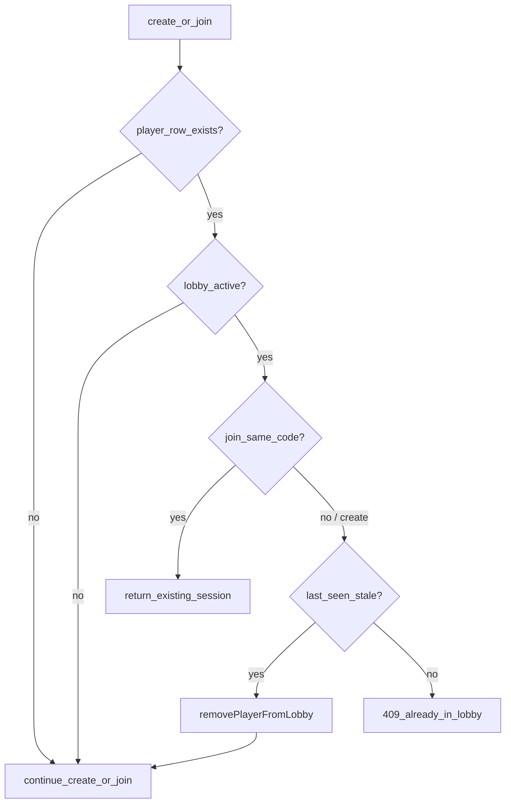

# Stale reclaim on create/join

Implements the preferred NIM-42 fix (not full `expires_at` cron).

## Problem

After tab close with no other pollers, the `players` row lingers. [`create-lobby`](supabase/functions/create-lobby/index.ts) / [`join-lobby`](supabase/functions/join-lobby/index.ts) always 409 if an active lobby membership exists — even when `last_seen_at` is old.

## Approach



- **Stale** = `last_seen_at` older than [`PLAYER_STALE_MS`](supabase/functions/_shared/player-leave.ts) (15s), or missing.
- **Fresh** = still 409 (real second session).
- **Join same lobby code** = keep today’s idempotent reconnect (no reclaim needed).

## Safety: idle players in-app are not removed by this change

**This reclaim only runs on `create-lobby` / `join-lobby`.** Sitting idle on lobby, search, game, or results does **not** trigger reclaim.

While the tab is open in those flows, existing ~3s polls already stamp `last_seen_at` (even with no clicks). Idle ≠ stale.

| Situation | Effect of this change |
|---|---|
| In lobby/game, not clicking, tab open | None — polls keep you fresh |
| Close tab, come back later, get started | Reclaim if stale, then create succeeds |
| Still actively in lobby A, try create/join lobby B | Still 409 (fresh) |
| Join same lobby code after refresh | Unchanged idempotent reconnect |

**Already shipped (NIM-41), not new here:** if another player is polling and *your* tab stops checking in for 15s+ (closed tab, sleep, heavily throttled background), *their* poll can prune you from the roster. That behavior already exists; reclaim does not add mid-session idle kicks.

## Implementation

### 1. Shared helper in [`player-leave.ts`](supabase/functions/_shared/player-leave.ts)

Add:

```ts
export function isPresenceStale(
  lastSeenAt: string | null | undefined,
  now: Date = new Date(),
  staleMs: number = PLAYER_STALE_MS,
): boolean
```

### 2. [`create-lobby/index.ts`](supabase/functions/create-lobby/index.ts)

Where membership is checked (~77–105):

- Select `id, lobby_id, last_seen_at` (not just `id, lobby_id`).
- If active lobby and `isPresenceStale(last_seen_at)` → `removePlayerFromLobby(...)`; on success treat player as gone (so later insert path runs); on helper error → 500.
- If active and **not** stale → keep 409.

### 3. [`join-lobby/index.ts`](supabase/functions/join-lobby/index.ts)

Where membership is checked (~87–141):

- Select `last_seen_at` too.
- Same-code active lobby → unchanged idempotent 200.
- Different active lobby + stale → reclaim, then continue join.
- Different active lobby + fresh → 409.

### 4. Deploy + Linear

- Deploy Edge Functions: `create-lobby`, `join-lobby` (shared `player-leave` ships with them).
- Update [NIM-42](https://linear.app/nimeshs-company/issue/NIM-42/be-lobby-expiration-and-cleanup): check off stale-reclaim ACs; leave `expires_at` cron as follow-on (issue can stay open or note partial ship).

## Out of scope

- Unload / `beforeunload` leave
- Lobby `expires_at` scheduled cleanup

## Verify

- Alone in lobby → close tab → wait >15s → get started succeeds.
- Two tabs / still polling → create/join elsewhere still 409.
- Join same lobby code after brief disconnect still reconnects.
