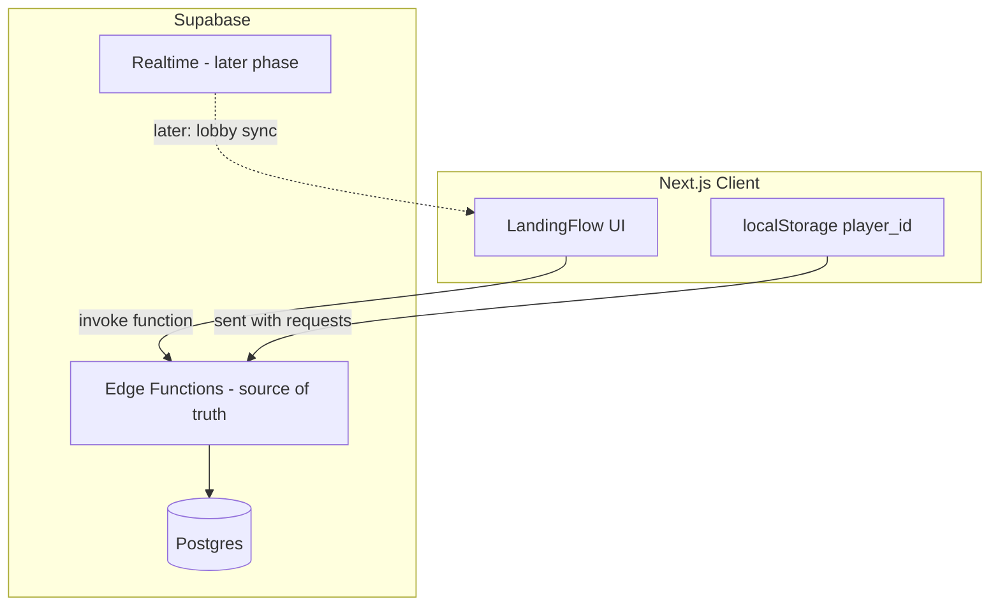
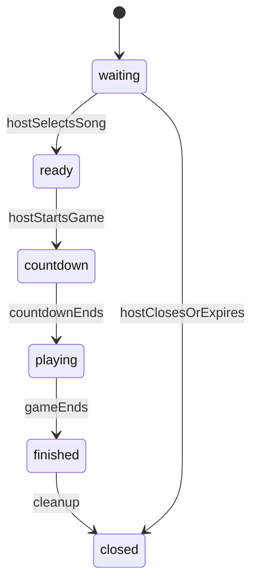

# Supabase Backend Plan (Module-by-Module)

## What You Are Building

From [`plan/backend-overview.md`](plan/backend-overview.md), the backend must own:

- Anonymous multiplayer (no accounts)
- Unique lobby invite codes (e.g. `ABX92K`)
- Lobby membership, host role, lifecycle, reconnects, and concurrency
- **Frontend is never trusted** — all validation and state changes happen server-side

Current codebase is **frontend-only** ([`src/app/page.tsx`](src/app/page.tsx) has a static name input + button with no handlers). No Supabase, API routes, or game logic exist yet.



**Your chosen architecture:** Supabase Edge Functions hold authoritative logic; Postgres stores state; the Next.js client invokes functions (not direct DB writes).

---

## Module Roadmap

| Module | Scope | Status |
|--------|-------|--------|
| **1 — Foundation** | Supabase project, client SDK, env, folder structure | **Start here** |
| **2 — Invite code logic** | Generate, format-validate, uniqueness-check codes | **Start here** |
| **3 — Display name validation** | Shared validation rules (profanity, length, duplicates) | Next |
| **4 — Anonymous player identity** | Client UUID + server-side player records | Next |
| **5 — Lobby creation** | Create lobby, assign host, return code | Deferred |
| **6 — Join lobby** | Validate + add player to lobby | Deferred |
| **7 — Lobby lifecycle** | State machine: Waiting → Ready → Countdown → Playing → Finished → Closed | Deferred |
| **8 — Reconnect + host migration** | Session restore, host promotion | Deferred |
| **9 — Realtime sync** | Supabase Realtime channels per lobby | Deferred |
| **10 — Cleanup** | Expiration, empty-lobby destruction, code reuse | Deferred |

Modules 1–2 are the immediate focus per your request.

---

## Phase 1: Foundation (Module 1)

### 1.1 Supabase project setup

- Create a Supabase project (dashboard)
- Note three keys: `SUPABASE_URL`, `SUPABASE_ANON_KEY`, `SUPABASE_SERVICE_ROLE_KEY`
- Enable local dev with Supabase CLI (`supabase init`, `supabase start`)

### 1.2 Repo structure

```
supabase/
├── config.toml
├── migrations/
│   └── 001_initial_schema.sql
└── functions/
    ├── _shared/           # shared utilities (CORS, errors, code gen)
    ├── validate-lobby-code/
    └── generate-lobby-code/  # Phase 1; create-lobby comes in Module 5
src/
├── lib/
│   ├── supabase/
│   │   ├── client.ts      # browser client (anon key, read-only later)
│   │   └── functions.ts   # invoke Edge Functions from client
│   └── player/
│       └── identity.ts    # Module 4: localStorage UUID
```

### 1.3 Dependencies

- `@supabase/supabase-js` — client SDK + Edge Function invocation
- `supabase` CLI (dev dependency) — migrations, local functions

### 1.4 Environment variables

```
NEXT_PUBLIC_SUPABASE_URL=
NEXT_PUBLIC_SUPABASE_ANON_KEY=
```

Service role key stays **only** in Supabase Edge Function secrets (never in Next.js client).

### 1.5 Minimal schema (supports code uniqueness now, lobby creation later)

```sql
-- Lobby lifecycle enum
create type lobby_status as enum (
  'waiting', 'ready', 'countdown', 'playing', 'finished', 'closed'
);

create table lobbies (
  id          uuid primary key default gen_random_uuid(),
  code        text not null,
  status      lobby_status not null default 'waiting',
  host_player_id uuid,          -- populated in Module 5
  max_players int not null default 10,
  created_at  timestamptz not null default now(),
  updated_at  timestamptz not null default now(),
  expires_at  timestamptz,
  constraint lobbies_code_format check (code ~ '^[A-Z2-9]{6}$')
);

create unique index lobbies_code_unique on lobbies (code);

-- Reserved for Module 4+
create table players (
  id           uuid primary key,  -- matches client localStorage UUID
  display_name text not null,
  lobby_id     uuid references lobbies(id) on delete cascade,
  is_host      boolean not null default false,
  is_connected boolean not null default true,
  joined_at    timestamptz not null default now(),
  last_seen_at timestamptz not null default now()
);
```

**RLS strategy:** Enable RLS on all tables; default deny for `anon` and `authenticated` roles. Edge Functions use the service role key to bypass RLS. Clients never write directly to Postgres in early phases.

---

## Phase 1: Invite Code Logic (Module 2)

This is the core of your "code part" request — everything needed to generate and validate lobby codes before wiring up full lobby creation.

### 2.1 Code format rules (from spec)

- **6 characters**, uppercase letters + digits
- **Easy to read:** exclude ambiguous chars `0`, `O`, `I`, `1`, `L` → use alphabet `ABCDEFGHJKMNPQRSTUVWXYZ23456789` (32 chars)
- Example valid code: `ABX92K`
- Regex: `^[A-HJ-NP-Z2-9]{6}$`

### 2.2 Shared utility: `supabase/functions/_shared/lobby-code.ts`

```typescript
const CODE_ALPHABET = "ABCDEFGHJKMNPQRSTUVWXYZ23456789";
const CODE_LENGTH = 6;

export function generateLobbyCode(): string { /* crypto-random pick */ }
export function isValidLobbyCodeFormat(code: string): boolean { /* regex */ }
export async function isCodeAvailable(supabase, code: string): Promise<boolean> { /* SELECT */ }
export async function generateUniqueCode(supabase, maxRetries = 5): Promise<string> { /* loop + collision retry */ }
```

Collision handling (spec requirement): generate → check DB → retry up to N times → return error if exhausted.

### 2.3 Edge Function: `validate-lobby-code`

**Purpose:** Format-check a code and report whether it exists (for join flow later; useful now for testing).

```
POST /functions/v1/validate-lobby-code
Body: { "code": "ABX92K" }

Responses:
  200 { valid: true,  exists: true,  status: "waiting" }
  200 { valid: true,  exists: false }
  400 { valid: false, error: "Invalid lobby code format" }
  404 { valid: true,  exists: false, error: "Lobby not found" }  // for join context
```

Logic:
1. Normalize input (`trim`, `toUpperCase`)
2. Validate format → 400 if invalid
3. Query `lobbies` by code → return existence + status

### 2.4 Edge Function: `generate-lobby-code` (code-only, no lobby row yet)

**Purpose:** Prove end-to-end code generation + uniqueness without creating a full lobby (Module 5 will merge this into `create-lobby`).

```
POST /functions/v1/generate-lobby-code
Body: {} 

Response:
  200 { code: "ABX92K" }
  500 { error: "Could not generate unique code" }
```

This function only generates and returns a unique code — it does **not** insert a lobby row yet. That keeps Phase 1 scoped to code logic. When Module 5 lands, this becomes an internal helper inside `create-lobby`, which inserts the row atomically.

### 2.5 Client helper: `src/lib/supabase/functions.ts`

Thin wrapper to invoke Edge Functions from the Next.js client:

```typescript
export async function validateLobbyCode(code: string) { ... }
export async function generateLobbyCode() { ... }
```

Wire to the "generate code" button in a future `LandingFlow` step (UI work is out of scope for this backend phase, but the hook point is clear).

### 2.6 Testing strategy (Module 2)

- Unit-test `generateLobbyCode`, `isValidLobbyCodeFormat` locally
- Integration-test Edge Functions against local Supabase (`supabase functions serve`)
- Manual checks:
  - Generated codes match format regex
  - Duplicate collision retry works (seed DB with a code, verify new generation skips it)
  - Invalid inputs (`abc`, `ABX92`, `AAAAAA`, empty) return 400

---

## Phase 2 Preview (Modules 3–4, not started yet)

Brief context so you see how Module 2 fits the larger picture:

### Module 3 — Display name validation (`_shared/display-name.ts`)

Rules from spec:
- Trim whitespace; min 2 / max 20 chars (tune as needed)
- Reject empty, profanity (e.g. `bad-words` npm package or curated list), repeated chars (e.g. same char > 5 times)
- Reject reserved names: `Admin`, `Host`
- Uniqueness checked per-lobby at join time (DB query), not globally

### Module 4 — Anonymous player identity

Client-side ([`src/lib/player/identity.ts`](src/lib/player/identity.ts)):
```typescript
// On first visit: crypto.randomUUID() → localStorage("player_id")
// On return: reuse existing ID
```

Server-side: `players` table row created on first lobby interaction; `player_id` sent in every Edge Function request body; backend uses it for reconnect and duplicate-tab detection.

---

## Phase 3+ Preview (deferred modules)



Key Edge Functions to build later:

| Function | Module | Responsibility |
|----------|--------|----------------|
| `create-lobby` | 5 | Insert lobby row, set host, return code |
| `join-lobby` | 6 | Validate capacity, name, status; add player |
| `leave-lobby` | 6 | Remove player, host migration if needed |
| `update-lobby-state` | 7 | Authoritative state transitions |
| `reconnect` | 8 | Restore session by `player_id` |
| `heartbeat` | 8 | `last_seen_at` updates, disconnect detection |

Realtime (Module 9): subscribe to `lobbies` and `players` changes filtered by `lobby_id` — clients receive state updates; mutations still go through Edge Functions only.

---

## Key Design Decisions

1. **Edge Functions over Next.js API routes** — per your preference; keeps all authoritative logic in Supabase, portable if the frontend changes.
2. **Service role in Edge Functions only** — clients use anon key solely to invoke functions; no direct table writes.
3. **Code generation is isolated first** — `generate-lobby-code` returns a code without creating a lobby, so you can test and integrate the "generate code" button before building full lobby creation.
4. **Ambiguous character exclusion** — improves readability per spec; document the alphabet choice.
5. **Postgres unique index on `code`** — final safety net against race conditions; Edge Function retries on unique-violation error (Module 5 `create-lobby` will use `INSERT` with conflict handling).

---

## Files to Create in Phase 1

| File | Purpose |
|------|---------|
| `supabase/config.toml` | Local Supabase config |
| `supabase/migrations/001_initial_schema.sql` | Tables + enums + RLS |
| `supabase/functions/_shared/cors.ts` | CORS headers for functions |
| `supabase/functions/_shared/lobby-code.ts` | Code gen + validation |
| `supabase/functions/validate-lobby-code/index.ts` | Format + existence check |
| `supabase/functions/generate-lobby-code/index.ts` | Unique code generation |
| `src/lib/supabase/client.ts` | Browser Supabase client |
| `src/lib/supabase/functions.ts` | Function invocation helpers |
| `.env.local.example` | Document required env vars |

---

## What Is Explicitly Out of Scope for Phase 1

- Full lobby creation (`create-lobby` Edge Function)
- Join flow, player membership, host assignment
- Realtime subscriptions
- Landing page UI wiring (generate code button handler)
- Song selection, game state, countdown logic
- Lobby expiration cron jobs

These come in later modules once code logic and foundation are solid.
