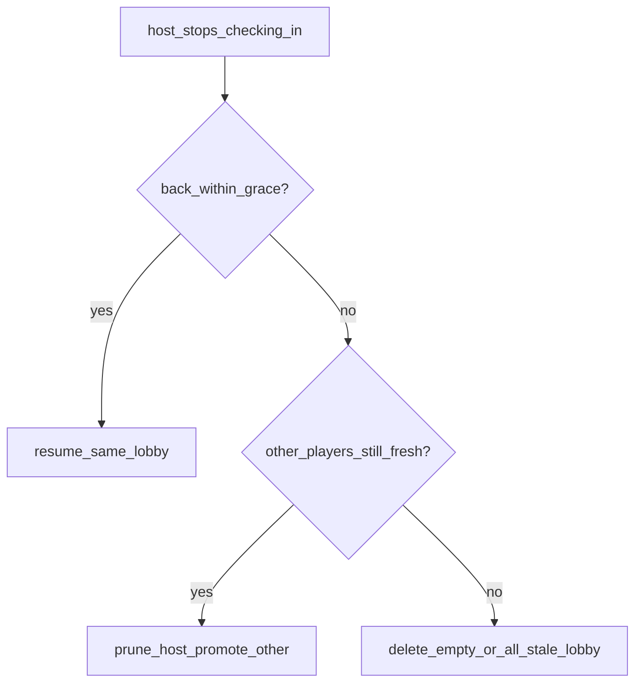

# Host closes the tab — edge cases and fix options

Simple notes for when the host closes the browser tab instead of clicking **Leave game**.

## Quick words

- **Stale** — We have not heard from this player for the grace window (their tab probably closed or went to sleep).
- **Grace** — ~15s while waiting / song selection; ~45s during `countdown` | `playing` | `ready`.
- **Resume** — Within grace, “get started” reconnects to the **same** lobby (still host if still host). No 409.
- **Reclaim** — After grace, create/join clears the abandoned seat, then continues.
- **Promote** — Make another player in the lobby the new host.
- **Cleanup cron** — `cleanup-stale-lobbies` every minute prunes stale players and deletes empty lobbies.

---

## Implemented behavior (Option C — hybrid)

**Status: implemented.** Closing the tab does not show a custom exit dialog. Presence + grace + cron cleanup own the rules.

| Situation | What happens |
|---|---|
| Host closes tab, **friends still there** | After grace, friends’ polls prune the old host and **promote** the earliest remaining player. Lobby **stays**. |
| Host closes tab, **alone** | Cron (or a later poll) prunes the stale host; empty lobby is **deleted**. |
| Host back **within grace** via get started | **Resume** same lobby/code (`resumed: true`, `is_host` from row). No new lobby, no 409. |
| Host back **after grace**, lobby deleted | New lobby / new code. Old invite → `"Lobby not found or has closed"`. |
| Host back **after promote** | Join with invite code as a **normal player** (not auto-host). |
| Mid-race brief background | 45s grace; less likely to eject / promote on a short sleep. |
| Refresh with session | Client restores lobby; presence touch keeps them fresh. |

### Grace windows

- `PLAYER_STALE_MS = 15_000` — waiting / song selection / default.
- `PLAYER_STALE_IN_RACE_MS = 45_000` — `countdown` | `playing` | `ready`.
- Prune re-reads `last_seen_at` before remove so a reconnect at the boundary wins.

### Resume on create

`create-lobby`: active membership + presence not stale → touch presence, mint session for that lobby, return success with `is_host` + `resumed: true`. Stale → reclaim then create new.

### Empty / all-stale cleanup

Edge function `cleanup-stale-lobbies` (service-role bearer, `--no-verify-jwt`):

1. For each lobby, status-aware `pruneStalePlayers`.
2. `deleteEmptyLobbies`.

Schedule in Supabase Dashboard: every minute (`* * * * *`), `Authorization: Bearer <SUPABASE_SERVICE_ROLE_KEY>`. See [`supabase/functions/cleanup-stale-lobbies/README.md`](../supabase/functions/cleanup-stale-lobbies/README.md).

### Join copy

Missing or `closed` lobby → `"Lobby not found or has closed"`. Validate treats closed as `exists: false`.

---

## The problem (context)

Most people will not click **Leave game**. They close the tab or the window.

Without presence + cleanup:

- The host can still look “in the lobby” on the server.
- Friends can be stuck waiting.
- Empty lobbies can sit in the database for a long time.
- The host may see “already in an active lobby” when they come back.

---

## Edge cases (product rules)

### Host comes back within grace

- Rejoin the **same** lobby and stay host if still host.
- Do not delete the lobby.
- Do not 409 if we can resume.

### Host comes back after grace

- Lobby empty and deleted → start fresh. Old code fails clearly.
- Friends still there and someone was promoted → old host joins as a **normal player**.

### Host invited a friend, then host accidentally closes the tab

- Friend stays if lobby still exists.
- After grace, friend can be promoted to host.

### Host only refreshed the page

- Treat as reconnect within grace (resume / session restore).

### Host’s laptop sleeps or the phone backgrounds the tab

- Longer **45s** grace during an active race.

### Host closes tab in the middle of a race

- Keep the race; promote another player after grace so someone can pause/end.

### Host has two tabs open

- One tab still checking in → not stale.

### Timing race at the grace boundary

- Only remove if still stale when cleanup runs.

### Everyone closed their tabs

- Cron deletes empty / all-stale lobbies.

### Old invite code after delete

- `"Lobby not found or has closed"`.

---

## Fix options (history)

### Option A — Always delete after grace if host gone

Harsh for friends already in the room.

### Option B — Never delete; always promote

Alone-host empty lobbies linger without a separate cleanup job.

### Option C — Hybrid (**chosen / implemented**)

- Friends remain → keep lobby, promote.
- Empty / all stale → delete (poll prune + cron).
- Within grace → resume same lobby.

### What not to rely on

Custom `beforeunload` “exit game?” dialogs — unreliable; not the leave path.

---

## Out of scope / later nice-to-haves

- Full `expires_at` TTL policy beyond all-stale/empty cleanup.
- UI announcing “you are the new host.”

---

## One-line summary

**Wait a short time for the host. If they come back, restore them. If not: keep the lobby for friends (new host), or delete it when the room is empty.**
